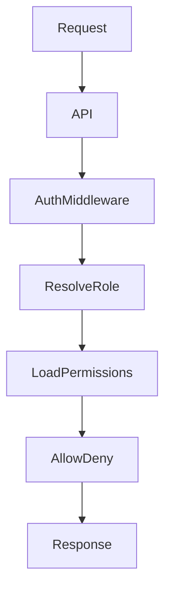
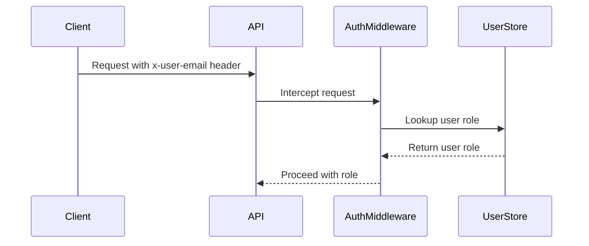
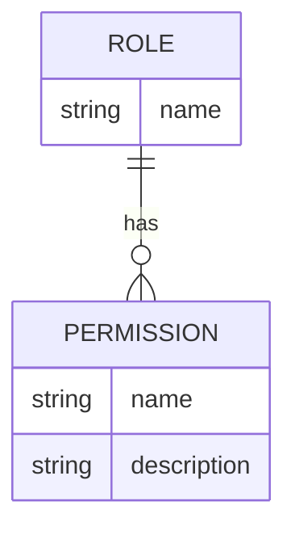
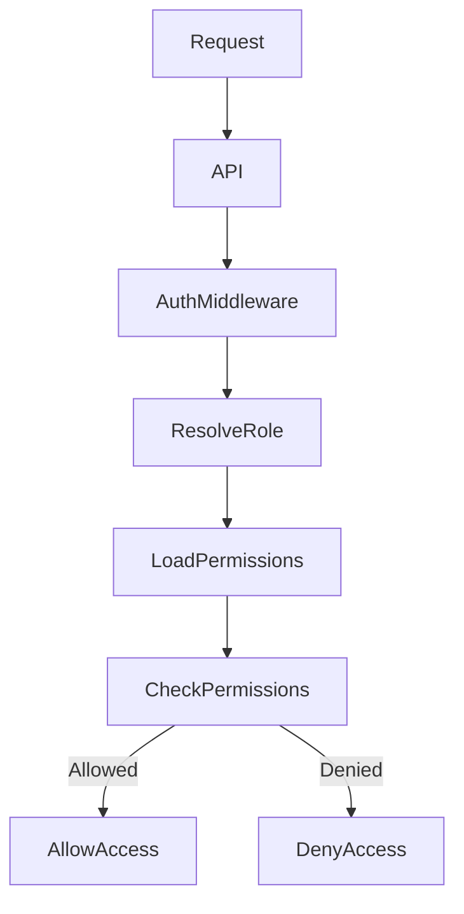

<details>
<summary>Relevant source files</summary>

The following files were used as context for generating this wiki page:

- [README.md](https://github.com/agattani123/access-control-service/blob/main/README.md)
- [docs/one-pager.md](https://github.com/agattani123/access-control-service/blob/main/docs/one-pager.md)

</details>

# Introduction

The Access Control Service is an internal Role-Based Access Control (RBAC) microservice that provides centralized permission enforcement for internal tools, APIs, and services within the organization. Its primary purpose is to manage user-role assignments, role-permission mappings, and enforce access controls at runtime, eliminating the need for hardcoded permission logic across various internal systems. By centralizing access control decisions, the service ensures consistent, auditable permission enforcement and decouples role logic from application code.

Sources: [docs/one-pager.md](https://github.com/agattani123/access-control-service/blob/main/docs/one-pager.md)

## Architecture Overview

The Access Control Service follows a flat RBAC model without hierarchies or scopes. It utilizes a declarative approach for role-to-permission mappings, which are defined in a JSON configuration file. The service provides middleware-based permission enforcement, allowing it to integrate with various internal systems and APIs.

The high-level workflow for access control is as follows:



1. A request is made to an internal API endpoint (`/api/*`).
2. The authentication middleware (`authMiddleware`) intercepts the request.
3. The user's role is resolved based on their identity (typically provided via an `x-user-email` HTTP header) by looking up the `db.users` map.
4. The permissions associated with the user's role are loaded from the `config/roles.json` configuration file.
5. The requested API endpoint is checked against the loaded permissions to determine if access should be allowed or denied.
6. The appropriate response is sent back to the client.

Sources: [docs/one-pager.md](https://github.com/agattani123/access-control-service/blob/main/docs/one-pager.md)

## Key Components

### Authentication Middleware

The authentication middleware (`authMiddleware`) is responsible for intercepting incoming requests and extracting the user's identity, typically from the `x-user-email` HTTP header. It then resolves the user's role by looking up the `db.users` map.



Sources: [docs/one-pager.md](https://github.com/agattani123/access-control-service/blob/main/docs/one-pager.md)

### Role-Permission Mapping

The role-permission mappings are defined in a JSON configuration file (`config/roles.json`). This file declaratively specifies the permissions granted to each role within the system.



Sources: [docs/one-pager.md](https://github.com/agattani123/access-control-service/blob/main/docs/one-pager.md)

### Permission Enforcement

The Access Control Service enforces permissions at runtime by annotating API routes with the required permissions. When a request is made to a protected endpoint, the service checks if the user's role has the necessary permissions to access the resource.



Sources: [docs/one-pager.md](https://github.com/agattani123/access-control-service/blob/main/docs/one-pager.md)

## CLI and API

The Access Control Service provides a command-line interface (CLI) and a RESTful API for managing roles, users, and permissions.

### CLI

The CLI tool, `cli/manage.js`, allows administrators to perform tasks such as assigning roles to users:

```bash
node cli/manage.js assign-role alice@company.com engineer
```

Sources: [docs/one-pager.md](https://github.com/agattani123/access-control-service/blob/main/docs/one-pager.md)

### API

The service exposes a RESTful API for managing users, roles, and permissions. The following table summarizes the available endpoints:

| Method | Endpoint         | Description                   | Permission         |
|--------|------------------|-------------------------------|--------------------|
| GET    | /api/users       | List all users and roles      | `view_users`       |
| POST   | /api/roles       | Create a new role             | `create_role`      |
| GET    | /api/permissions | View all role definitions     | `view_permissions` |
| POST   | /api/tokens      | Assign user to a role         | *None (bootstrap)* |

All API requests must include the `x-user-email` header to provide the user's identity.

Sources: [docs/one-pager.md](https://github.com/agattani123/access-control-service/blob/main/docs/one-pager.md)

## Deployment and Persistence

The Access Control Service is designed to be stateless, with no persistent database. Instead, the configuration is stored in memory. This makes it suitable for internal-only usage behind an API gateway.

For persistent storage of configuration data, the service can be integrated with an external configuration store, such as etcd or Consul.

Sources: [docs/one-pager.md](https://github.com/agattani123/access-control-service/blob/main/docs/one-pager.md)

## Summary

The Access Control Service provides a centralized solution for managing user roles, permissions, and enforcing access controls across internal systems within the organization. By decoupling permission logic from application code and ensuring consistent, auditable enforcement, the service simplifies access control management and enhances security across the organization's internal tools, APIs, and services.