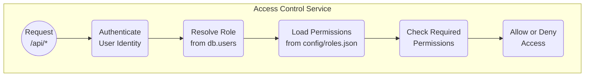

<details>
<summary>Relevant source files</summary>

The following files were used as context for generating this wiki page:

- [README.md](https://github.com/agattani123/access-control-service/blob/main/README.md)
- [docs/one-pager.md](https://github.com/agattani123/access-control-service/blob/main/docs/one-pager.md)

</details>

# Introduction

The Access Control Service is an internal Role-Based Access Control (RBAC) microservice that provides centralized permission enforcement for internal tools, APIs, and services within a company or organization. Its primary purpose is to manage user-role assignments, role-permission mappings, and enforce access controls at runtime, eliminating the need for hardcoded permission logic across various internal systems. This service ensures consistent, auditable permission enforcement and decouples role logic from application code.

Sources: [docs/one-pager.md](https://github.com/agattani123/access-control-service/blob/main/docs/one-pager.md)

## Architecture Overview

The Access Control Service follows a flat RBAC model without hierarchies or scopes. It operates based on declarative role-to-permission mappings defined in a JSON configuration file. The service provides middleware-based permission enforcement, where incoming requests are intercepted, and the user's role is resolved based on the provided identity (typically an email address). The corresponding permissions for the user's role are then loaded from the configuration, and access is granted or denied based on the required permissions annotated on the requested routes or resources.



Sources: [docs/one-pager.md](https://github.com/agattani123/access-control-service/blob/main/docs/one-pager.md)

## Service Components

### Authentication Middleware

The authentication middleware is responsible for extracting the user's identity from the incoming request, typically via an `x-user-email` HTTP header. This identity is then used to resolve the user's assigned role.

Sources: [docs/one-pager.md](https://github.com/agattani123/access-control-service/blob/main/docs/one-pager.md)

### Role Resolution

The user's role is resolved by looking up the user's identity (email) in an in-memory `db.users` map or data structure. This map associates user identities with their assigned roles.

Sources: [docs/one-pager.md](https://github.com/agattani123/access-control-service/blob/main/docs/one-pager.md)

### Permission Loading

Once the user's role is determined, the corresponding permissions for that role are loaded from a JSON configuration file (`config/roles.json`). This file defines the role-to-permission mappings in a declarative manner.

Sources: [docs/one-pager.md](https://github.com/agattani123/access-control-service/blob/main/docs/one-pager.md)

### Access Enforcement

The requested routes or resources are annotated with the required permissions. The access enforcement component checks if the user's loaded permissions match the required permissions for the requested resource. Based on this check, access is either granted or denied.

Sources: [docs/one-pager.md](https://github.com/agattani123/access-control-service/blob/main/docs/one-pager.md)

## Service Setup and Usage

### Setup

To set up the Access Control Service, follow these steps:

1. Copy the example environment file: `cp .env.example .env`
2. Install dependencies: `npm install`
3. Start the service: `npm run start`

Sources: [docs/one-pager.md](https://github.com/agattani123/access-control-service/blob/main/docs/one-pager.md)

### CLI Usage

The service provides a command-line interface (CLI) tool for managing user-role assignments. For example, to assign the `engineer` role to the user `alice@company.com`, run:

```bash
node cli/manage.js assign-role alice@company.com engineer
```

Sources: [docs/one-pager.md](https://github.com/agattani123/access-control-service/blob/main/docs/one-pager.md)

## API Overview

The Access Control Service exposes a REST API for managing users, roles, and permissions. Here's an overview of the available endpoints:

| Method | Endpoint         | Description                   | Required Permission |
|--------|------------------|-------------------------------|--------------------|
| GET    | /api/users       | List all users and roles      | `view_users`       |
| POST   | /api/roles       | Create a new role             | `create_role`      |
| GET    | /api/permissions | View all role definitions     | `view_permissions` |
| POST   | /api/tokens      | Assign user to a role         | *None (bootstrap)* |

All API requests must include the `x-user-email` HTTP header to provide the user's identity.

Sources: [docs/one-pager.md](https://github.com/agattani123/access-control-service/blob/main/docs/one-pager.md)

## Deployment Considerations

The Access Control Service is designed to be stateless, with no persistent database. The configuration is loaded and stored in memory. This makes it suitable for internal-only usage behind an API gateway.

For persistent configuration storage, the service can be integrated with an external configuration store like etcd or Consul.

Sources: [docs/one-pager.md](https://github.com/agattani123/access-control-service/blob/main/docs/one-pager.md)

## Related Documentation

- [`docs/permissions.md`](docs/permissions.md): Detailed documentation on role definitions and structure.
- [`docs/api.md`](docs/api.md): Complete API contract and specification.

Sources: [docs/one-pager.md](https://github.com/agattani123/access-control-service/blob/main/docs/one-pager.md)