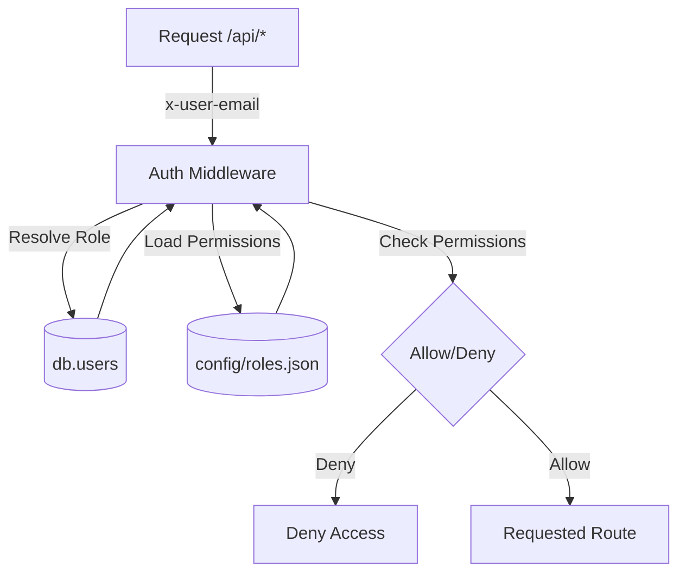

<details>
<summary>Relevant source files</summary>

The following files were used as context for generating this wiki page:

- [README.md](https://github.com/agattani123/access-control-service/blob/main/README.md)
- [docs/one-pager.md](https://github.com/agattani123/access-control-service/blob/main/docs/one-pager.md)
</details>

# Introduction

The Access Control Service is an internal Role-Based Access Control (RBAC) microservice that provides centralized permission enforcement for internal tools, APIs, and services within an organization. Its primary purpose is to manage user-role assignments, role-permission mappings, and enforce access controls at runtime, eliminating the need for hardcoded permission logic across various internal systems.

By centralizing access control decisions, this service ensures consistent and auditable permission enforcement while decoupling role logic from application code. It follows a flat RBAC model without hierarchies or scopes, allowing for declarative role-to-permission mappings defined in a JSON configuration file.

## Architecture Overview

The Access Control Service follows a middleware-based architecture for permission enforcement. The high-level flow is as follows:



1. Incoming requests to the `/api/*` routes include the `x-user-email` header for user identification.
2. The authentication middleware resolves the user's role from the `db.users` map.
3. The middleware loads the required permissions for the user's role from the `config/roles.json` file.
4. Based on the requested route's permission annotations and the user's permissions, access is either allowed or denied.

Sources: [docs/one-pager.md:18-22]()

## Service Setup and Usage

### Setup

To set up the Access Control Service, follow these steps:

```bash
cp .env.example .env # Create environment file
npm install # Install dependencies
npm run start # Start the service
```

Sources: [docs/one-pager.md:26-29]()

### CLI Usage

The service provides a command-line interface (CLI) tool for managing user-role assignments. For example, to assign the `engineer` role to the user `alice@company.com`, run:

```bash
node cli/manage.js assign-role alice@company.com engineer
```

Sources: [docs/one-pager.md:32-33]()

## API Overview

The Access Control Service exposes a RESTful API for managing users, roles, and permissions. All API requests must include the `x-user-email` header for authentication.

| Method | Endpoint         | Description                   | Required Permission |
|--------|------------------|-------------------------------|----------------------|
| GET    | `/api/users`     | List all users and roles      | `view_users`        |
| POST   | `/api/roles`     | Create a new role             | `create_role`       |
| GET    | `/api/permissions` | View all role definitions     | `view_permissions`  |
| POST   | `/api/tokens`    | Assign user to a role         | *None (bootstrap)*  |

Sources: [docs/one-pager.md:37-43]()

## Deployment Considerations

The Access Control Service is designed to be stateless, with no persistent database. Instead, the configuration is stored in memory. This makes it suitable for internal-only usage behind an API gateway.

For persistence and scalability, the service can be integrated with an external configuration store, such as etcd or Consul, to store and retrieve role definitions and user-role mappings.

Sources: [docs/one-pager.md:47-49]()

## Related Documentation

- [`docs/permissions.md`](docs/permissions.md): Detailed documentation on role definitions and their structure.
- [`docs/api.md`](docs/api.md): Complete API contract and endpoint specifications.

Sources: [docs/one-pager.md:52-54]()