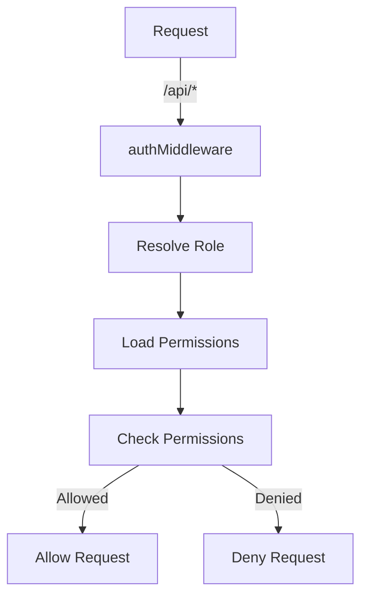

Relevant source files

The following files were used as context for generating this wiki page:

- [README.md](https://github.com/agattani123/access-control-service/blob/main/README.md)
- [docs/one-pager.md](https://github.com/agattani123/access-control-service/blob/main/docs/one-pager.md)

# Introduction

The Access Control Service is an internal Role-Based Access Control (RBAC) microservice that provides centralized permission enforcement for internal tools, APIs, and services within the organization. It manages user-role assignments, role-permission mappings, and enforces access controls at runtime, ensuring consistent and auditable permission enforcement across various systems.

Sources: [docs/one-pager.md](https://github.com/agattani123/access-control-service/blob/main/docs/one-pager.md:1-4)

## Purpose and Benefits

The primary purpose of the Access Control Service is to eliminate hardcoded permission logic across internal systems by centralizing access control decisions. By decoupling role logic from application code, it ensures consistent and auditable permission enforcement, making it easier to manage and maintain access controls across the organization.

Sources: [docs/one-pager.md](https://github.com/agattani123/access-control-service/blob/main/docs/one-pager.md:7-9)

## Key Features

### RBAC Model

The Access Control Service follows a flat RBAC model, where roles are assigned permissions directly, without any hierarchies or scopes. This simplifies the permission management process and makes it easier to understand and maintain the access control rules.

Sources: [docs/one-pager.md](https://github.com/agattani123/access-control-service/blob/main/docs/one-pager.md:12)

### Role-Permission Mapping

The service allows for declarative role-to-permission mappings, which are defined in a JSON configuration file. This approach separates the permission definitions from the application code, making it easier to manage and update permissions without modifying the codebase.

Sources: [docs/one-pager.md](https://github.com/agattani123/access-control-service/blob/main/docs/one-pager.md:13)

### Middleware-based Enforcement

The Access Control Service provides a middleware component that can be integrated into various internal systems and APIs. This middleware is responsible for enforcing access controls at runtime, ensuring that only authorized users with the required permissions can access protected resources or perform specific actions.

Sources: [docs/one-pager.md](https://github.com/agattani123/access-control-service/blob/main/docs/one-pager.md:14)

### CLI Tools and REST API

The service includes command-line interface (CLI) tools for bootstrapping and assigning roles to users. Additionally, it provides a REST API for managing roles, users, and permissions, allowing for programmatic interaction with the access control system.

Sources: [docs/one-pager.md](https://github.com/agattani123/access-control-service/blob/main/docs/one-pager.md:15-16)

## Access Control Flow

The following diagram illustrates the high-level flow of how the Access Control Service enforces permissions:

1. A request is made to an API endpoint (`/api/*`).
2. The `authMiddleware` component is invoked, which resolves the user's role based on the provided identity (e.g., `x-user-email` HTTP header).
3. The user's role is used to load the associated permissions from the configuration file (`config/roles.json`).
4. The required permissions for the requested API endpoint are checked against the user's permissions.
5. If the user has the required permissions, the request is allowed; otherwise, it is denied.

Sources: [docs/one-pager.md](https://github.com/agattani123/access-control-service/blob/main/docs/one-pager.md:20-24)

## API Overview

The Access Control Service provides a REST API for managing users, roles, and permissions. Here's an overview of the available endpoints:

| Method | Endpoint         | Description                   | Required Permission |
|--------|------------------|-------------------------------|----------------------|
| GET    | `/api/users`     | List all users and roles      | `view_users`        |
| POST   | `/api/roles`     | Create a new role             | `create_role`       |
| GET    | `/api/permissions` | View all role definitions     | `view_permissions`  |
| POST   | `/api/tokens`    | Assign a user to a role       | *None (bootstrap)*  |

All API requests must include the `x-user-email` HTTP header to provide the user's identity.

Sources: [docs/one-pager.md](https://github.com/agattani123/access-control-service/blob/main/docs/one-pager.md:30-38)

## Deployment and Integration

The Access Control Service is designed to be stateless, with no persistent database. Instead, the configuration is loaded into memory at runtime. This makes it suitable for internal-only usage behind an API gateway.

For persistent configuration storage, the service can be integrated with an external configuration store, such as etcd or Consul.

Sources: [docs/one-pager.md](https://github.com/agattani123/access-control-service/blob/main/docs/one-pager.md:41-43)

## Related Documentation

- [`docs/permissions.md`](docs/permissions.md): Detailed documentation on the role definitions and structure.
- [`docs/api.md`](docs/api.md): Complete API contract and specification.

Sources: [docs/one-pager.md](https://github.com/agattani123/access-control-service/blob/main/docs/one-pager.md:46-47)