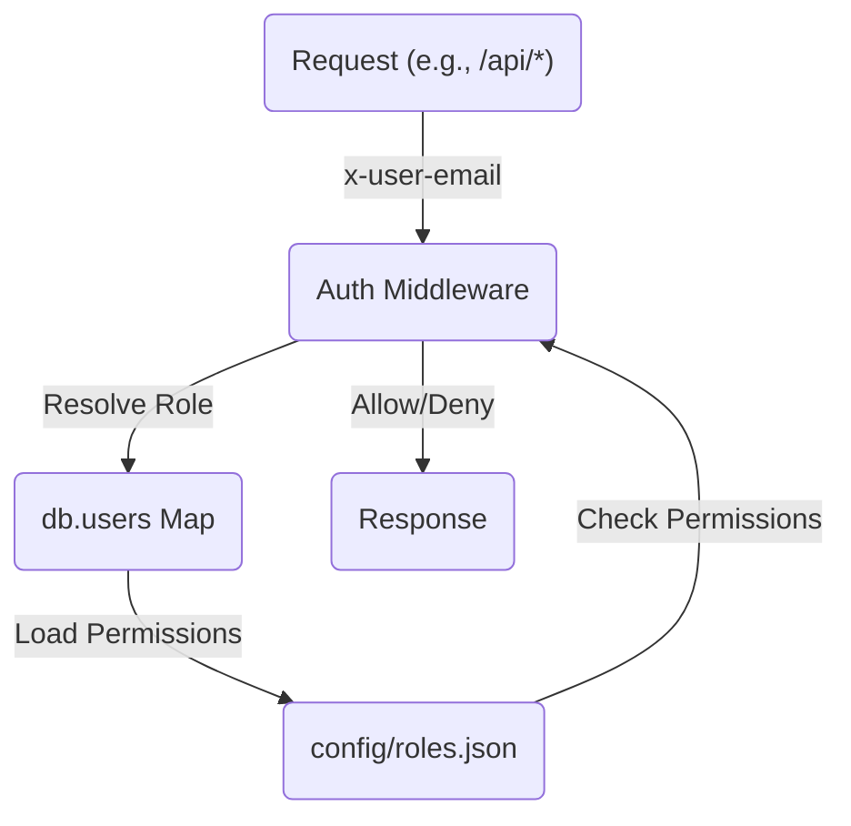

<details>
<summary>Relevant source files</summary>

The following files were used as context for generating this wiki page:

- [README.md](https://github.com/agattani123/access-control-service/blob/main/README.md)
- [docs/one-pager.md](https://github.com/agattani123/access-control-service/blob/main/docs/one-pager.md)

</details>

# Introduction

The Access Control Service is an internal Role-Based Access Control (RBAC) microservice that provides centralized permission enforcement for internal tools, APIs, and services within the organization. It manages user-role assignments, role-permission mappings, and enforces access controls at runtime, ensuring consistent and auditable permission enforcement across various systems.

Sources: [docs/one-pager.md](https://github.com/agattani123/access-control-service/blob/main/docs/one-pager.md)

## Purpose and Overview

The primary purpose of the Access Control Service is to eliminate hardcoded permission logic across internal systems by centralizing access control decisions. By decoupling role logic from application code, it ensures consistent, auditable permission enforcement and simplifies the management of user roles and permissions.

The service follows a flat RBAC model, where roles are directly mapped to permissions without any hierarchies or scopes. The role-to-permission mappings are defined declaratively in a JSON configuration file, allowing for easy management and updates.

Sources: [docs/one-pager.md](https://github.com/agattani123/access-control-service/blob/main/docs/one-pager.md)

## Architecture and Data Flow

The Access Control Service follows a middleware-based architecture for permission enforcement. The high-level data flow is as follows:



1. Incoming requests to the `/api/*` routes include the `x-user-email` HTTP header for user identification.
2. The authentication middleware resolves the user's role from the `db.users` map, which stores user-to-role mappings.
3. The middleware loads the permissions associated with the user's role from the `config/roles.json` configuration file.
4. Based on the required permissions annotated on the requested route, the middleware allows or denies access.
5. The response is sent back to the client.

Sources: [docs/one-pager.md](https://github.com/agattani123/access-control-service/blob/main/docs/one-pager.md)

## Key Components

### Authentication Middleware

The authentication middleware is a crucial component responsible for enforcing access control based on user roles and permissions. It performs the following tasks:

1. Extracts the user's email from the `x-user-email` HTTP header.
2. Resolves the user's role from the `db.users` map.
3. Loads the permissions associated with the user's role from the `config/roles.json` configuration file.
4. Checks if the user has the required permissions for the requested route.
5. Allows or denies access based on the permission check.

Sources: [docs/one-pager.md](https://github.com/agattani123/access-control-service/blob/main/docs/one-pager.md)

### User-Role Mapping

The `db.users` map is an in-memory data structure that stores the mapping between user emails and their assigned roles. This mapping is likely managed through the CLI tools or API endpoints provided by the service.

Sources: [docs/one-pager.md](https://github.com/agattani123/access-control-service/blob/main/docs/one-pager.md)

### Role-Permission Configuration

The `config/roles.json` file is a JSON configuration file that defines the role-to-permission mappings. It specifies the permissions associated with each role, allowing for declarative and centralized management of access control rules.

Sources: [docs/one-pager.md](https://github.com/agattani123/access-control-service/blob/main/docs/one-pager.md)

## API and CLI Tools

The Access Control Service provides a REST API and CLI tools for managing users, roles, and permissions.

### API Endpoints

The following table summarizes the available API endpoints and their respective permissions:

| Method | Endpoint         | Description                   | Permission         |
|--------|------------------|-------------------------------|--------------------|
| GET    | /api/users       | List all users and roles      | `view_users`       |
| POST   | /api/roles       | Create a new role             | `create_role`      |
| GET    | /api/permissions | View all role definitions     | `view_permissions` |
| POST   | /api/tokens      | Assign user to a role         | *None (bootstrap)* |

All API requests must include the `x-user-email` HTTP header for user identification.

Sources: [docs/one-pager.md](https://github.com/agattani123/access-control-service/blob/main/docs/one-pager.md)

### CLI Tools

The service provides a CLI tool (`cli/manage.js`) for managing user-role assignments. For example, to assign the `engineer` role to the user `alice@company.com`, you can run:

```bash
node cli/manage.js assign-role alice@company.com engineer
```

Sources: [docs/one-pager.md](https://github.com/agattani123/access-control-service/blob/main/docs/one-pager.md)

## Deployment and Persistence

The Access Control Service is designed to be stateless, with no persistent database. The configuration is stored in memory, making it suitable for internal-only usage behind an API gateway.

For persistence and scalability, the service can be integrated with an external configuration store, such as etcd or Consul, to store and manage the role-permission mappings and user-role assignments.

Sources: [docs/one-pager.md](https://github.com/agattani123/access-control-service/blob/main/docs/one-pager.md)

## Related Documentation

- [`docs/permissions.md`](docs/permissions.md): Detailed documentation on the role definitions and structure.
- [`docs/api.md`](docs/api.md): Complete API contract and specification.

Sources: [docs/one-pager.md](https://github.com/agattani123/access-control-service/blob/main/docs/one-pager.md)

In summary, the Access Control Service provides a centralized and consistent approach to managing user roles and permissions across internal systems. By decoupling access control logic from application code, it simplifies permission enforcement and ensures auditable and consistent access control decisions.