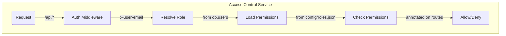
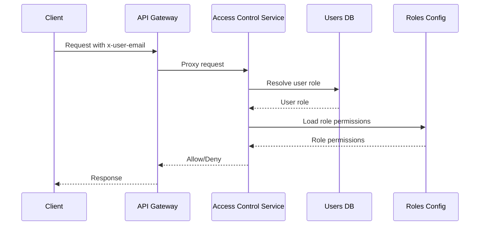

<details>
<summary>Relevant source files</summary>

The following files were used as context for generating this wiki page:

- [README.md](https://github.com/agattani123/access-control-service/blob/main/README.md)
- [docs/one-pager.md](https://github.com/agattani123/access-control-service/blob/main/docs/one-pager.md)
</details>

# Introduction

The Access Control Service is an internal Role-Based Access Control (RBAC) microservice that provides centralized permission enforcement for internal tools, APIs, and services within the organization. Its primary purpose is to manage user-role assignments, role-permission mappings, and enforce access controls at runtime, ensuring consistent and auditable permission handling across various systems.

By centralizing access control decisions, this service eliminates the need for hardcoded permission logic within individual applications, promoting code decoupling and maintainability. It acts as a single source of truth for role-based access control, facilitating consistent enforcement across the organization's internal ecosystem.

## Architecture Overview

The Access Control Service follows a flat RBAC model without hierarchies or scopes. It operates based on the following high-level flow:



Sources: [docs/one-pager.md:17-21]()

1. Incoming requests to the `/api/*` endpoints are intercepted by an authentication middleware.
2. The middleware resolves the user's role based on the `x-user-email` HTTP header and a mapping in the `db.users` data store.
3. The user's role is used to load the associated permissions from the `config/roles.json` configuration file.
4. The requested route is checked against the user's permissions, which are annotated on the routes.
5. Based on the permission evaluation, the request is either allowed or denied.

## Key Components

### Authentication Middleware

The authentication middleware is responsible for extracting the user's identity from the `x-user-email` HTTP header and resolving the associated role from the `db.users` mapping.

Sources: [docs/one-pager.md:19]()

### Role-Permission Mapping

The role-permission mappings are defined in a declarative JSON configuration file (`config/roles.json`). This file maps roles to their respective permissions, enabling easy management and updates without modifying the application code.

Sources: [docs/one-pager.md:20]()

### Route Annotation

Routes within the application are annotated with the required permissions for access. The authentication middleware checks the user's permissions against these annotations to determine whether the request should be allowed or denied.

Sources: [docs/one-pager.md:21]()

## Data Flow

The following sequence diagram illustrates the data flow and interactions within the Access Control Service:



Sources: [docs/one-pager.md:17-21]()

1. The client sends a request to the API Gateway, including the `x-user-email` header.
2. The API Gateway proxies the request to the Access Control Service.
3. The Access Control Service resolves the user's role from the Users DB based on the provided email.
4. The Access Control Service loads the permissions associated with the user's role from the Roles Config file.
5. The Access Control Service evaluates the requested route against the user's permissions and sends an allow/deny decision to the API Gateway.
6. The API Gateway responds to the client accordingly.

## CLI and API

The Access Control Service provides a command-line interface (CLI) and a RESTful API for managing roles and user assignments.

### CLI Usage

The CLI tool, `cli/manage.js`, allows administrators to assign roles to users. For example:

```bash
node cli/manage.js assign-role alice@company.com engineer
```

This command assigns the `engineer` role to the user with the email `alice@company.com`.

Sources: [docs/one-pager.md:28-30]()

### API Overview

The Access Control Service exposes the following API endpoints:

| Method | Endpoint         | Description                   | Permission         |
|--------|------------------|-------------------------------|--------------------|
| GET    | /api/users       | List all users and roles      | `view_users`       |
| POST   | /api/roles       | Create a new role             | `create_role`      |
| GET    | /api/permissions | View all role definitions     | `view_permissions` |
| POST   | /api/tokens      | Assign user to a role         | *None (bootstrap)* |

All API requests must include the `x-user-email` header to identify the user making the request.

Sources: [docs/one-pager.md:32-41]()

## Deployment and Integration

The Access Control Service is designed to be stateless, with no persistent database. The configuration is loaded into memory at runtime, making it suitable for internal-only usage behind an API Gateway.

For persistent configuration storage, the service can be integrated with an external configuration store like etcd or Consul.

Sources: [docs/one-pager.md:43-46]()

## Related Documentation

- [`docs/permissions.md`](docs/permissions.md): Detailed documentation on role definitions and structure.
- [`docs/api.md`](docs/api.md): Complete API contract and endpoint specifications.

Sources: [docs/one-pager.md:48-49]()