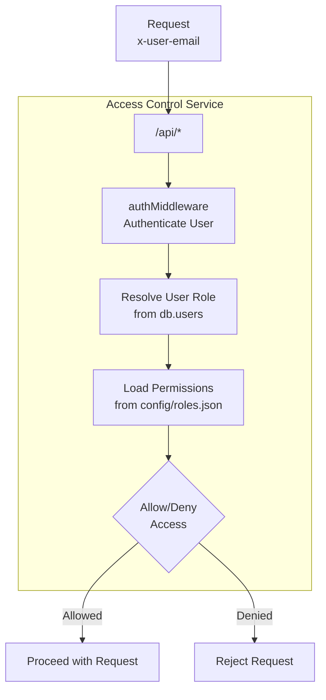
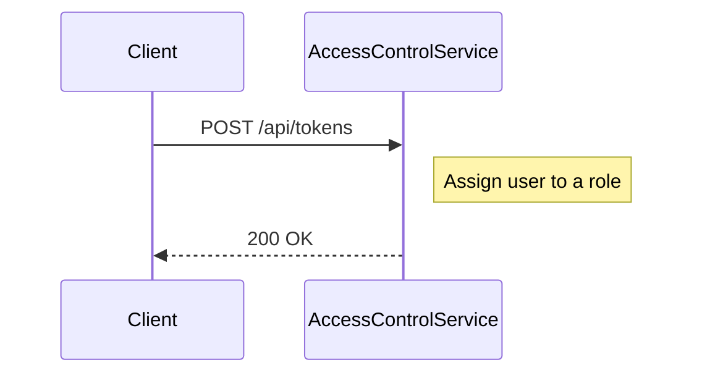

<details>
<summary>Relevant source files</summary>

The following files were used as context for generating this wiki page:

- [README.md](https://github.com/agattani123/access-control-service/blob/main/README.md)
- [docs/one-pager.md](https://github.com/agattani123/access-control-service/blob/main/docs/one-pager.md)
</details>

# Introduction

The Access Control Service is an internal Role-Based Access Control (RBAC) microservice that provides centralized permission enforcement for internal tools, APIs, and services within a company or organization. It manages user-role assignments, role-permission mappings, and enforces access controls at runtime, ensuring consistent and auditable permission enforcement across various systems.

The service eliminates the need for hardcoded permission logic across internal systems by centralizing access control decisions. It decouples role logic from application code, promoting better separation of concerns and maintainability.

## Purpose and Overview

The primary purpose of the Access Control Service is to provide a centralized and consistent mechanism for managing user roles and permissions within an organization. It acts as a gatekeeper, ensuring that users are granted access to specific resources or functionalities based on their assigned roles and the corresponding permissions defined for those roles.

The service follows a flat RBAC model, where roles are directly mapped to permissions without any hierarchies or scopes. This simplifies the permission management process and makes it easier to understand and maintain the access control rules.

Sources: [docs/one-pager.md:3-8](https://github.com/agattani123/access-control-service/blob/main/docs/one-pager.md#L3-L8), [README.md:1-2](https://github.com/agattani123/access-control-service/blob/main/README.md#L1-L2)

## Architecture and Data Flow

The Access Control Service follows a middleware-based architecture, where incoming requests are intercepted and evaluated against the user's assigned role and the required permissions for the requested resource or operation.



1. Incoming requests to the `/api/*` endpoints are intercepted by the `authMiddleware`.
2. The middleware authenticates the user based on the provided `x-user-email` HTTP header.
3. The user's role is resolved by looking up the `db.users` map.
4. The permissions associated with the user's role are loaded from the `config/roles.json` configuration file.
5. The requested resource or operation is evaluated against the loaded permissions.
6. Based on the evaluation, access is either granted or denied, and the request is allowed to proceed or rejected accordingly.

Sources: [docs/one-pager.md:17-22](https://github.com/agattani123/access-control-service/blob/main/docs/one-pager.md#L17-L22)

## Role and Permission Management

The Access Control Service provides mechanisms for managing roles and permissions through a combination of declarative configuration files and API endpoints.

### Role Definitions

The role-to-permission mappings are defined in a JSON configuration file (`config/roles.json`). This file specifies the available roles and the permissions associated with each role.

```json
{
  "engineer": ["create_resource", "update_resource", "view_resource"],
  "manager": ["create_resource", "update_resource", "view_resource", "delete_resource"],
  "admin": ["*"]
}
```

In the example above, the `engineer` role has permissions to create, update, and view resources, while the `manager` role has additional permission to delete resources. The `admin` role has a wildcard (`*`) permission, granting access to all operations.

Sources: [docs/one-pager.md:10](https://github.com/agattani123/access-control-service/blob/main/docs/one-pager.md#L10)

### User-Role Assignments

User-role assignments are managed through a combination of a CLI tool and an API endpoint.

#### CLI Tool

The CLI tool (`cli/manage.js`) provides a command for assigning roles to users:

```bash
node cli/manage.js assign-role alice@company.com engineer
```

This command assigns the `engineer` role to the user with the email `alice@company.com`.

Sources: [docs/one-pager.md:26-28](https://github.com/agattani123/access-control-service/blob/main/docs/one-pager.md#L26-L28)

#### API Endpoint

The service also exposes a `/api/tokens` endpoint that allows assigning users to roles. This endpoint is likely used for bootstrapping or initial user-role assignments, as it does not require any specific permissions.



Sources: [docs/one-pager.md:33](https://github.com/agattani123/access-control-service/blob/main/docs/one-pager.md#L33)

### API Overview

The Access Control Service exposes a set of API endpoints for managing users, roles, and permissions. Here's an overview of the available endpoints:

| Method | Endpoint         | Description                   | Permission         |
|--------|------------------|-------------------------------|--------------------|
| GET    | /api/users       | List all users and roles      | `view_users`       |
| POST   | /api/roles       | Create a new role             | `create_role`      |
| GET    | /api/permissions | View all role definitions     | `view_permissions` |
| POST   | /api/tokens      | Assign user to a role         | *None (bootstrap)* |

All API requests must include the `x-user-email` HTTP header to identify the authenticated user.

Sources: [docs/one-pager.md:29-35](https://github.com/agattani123/access-control-service/blob/main/docs/one-pager.md#L29-L35)

## Deployment and Integration

The Access Control Service is designed to be stateless, with no persistent database. The configuration and user-role mappings are stored in memory, making it suitable for internal-only usage behind an API gateway.

For persistent storage and integration with external systems, the service can be integrated with a distributed configuration store like etcd or Consul.

Sources: [docs/one-pager.md:38-40](https://github.com/agattani123/access-control-service/blob/main/docs/one-pager.md#L38-L40)

## Conclusion

The Access Control Service provides a centralized and consistent approach to managing user roles and permissions within an organization. By decoupling permission logic from application code and enforcing access controls at runtime, it promotes better separation of concerns, maintainability, and audibility. The service's flat RBAC model, declarative role-permission mappings, and middleware-based architecture make it a valuable component for ensuring secure and controlled access to internal tools, APIs, and services.