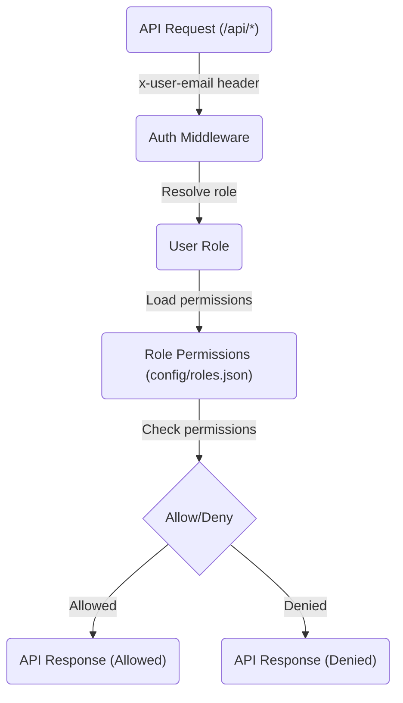
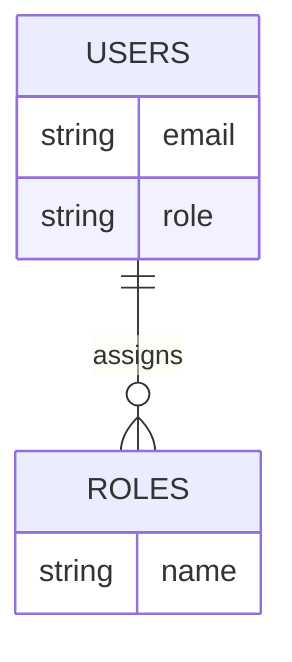
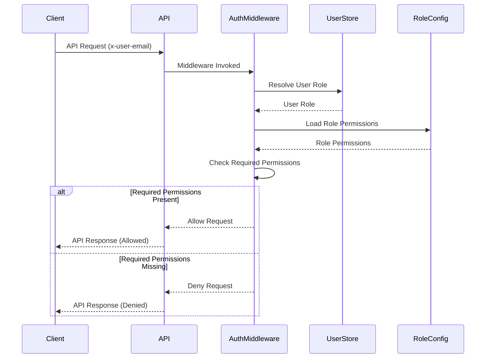

<details>
<summary>Relevant source files</summary>

The following files were used as context for generating this wiki page:

- [README.md](https://github.com/agattani123/access-control-service/blob/main/README.md)
- [docs/one-pager.md](https://github.com/agattani123/access-control-service/blob/main/docs/one-pager.md)

</details>

# Introduction

The Access Control Service is an internal Role-Based Access Control (RBAC) microservice that provides centralized permission enforcement for internal tools, APIs, and services within a company or organization. Its primary purpose is to manage user-role assignments, role-permission mappings, and enforce access controls at runtime, ensuring consistent and auditable permission enforcement across various internal systems.

Sources: [docs/one-pager.md](https://github.com/agattani123/access-control-service/blob/main/docs/one-pager.md)

## Key Features

1. **Flat RBAC Model**: The service follows a flat RBAC model, without support for hierarchies or scopes. This simplifies the role-permission mapping and enforcement logic.

2. **Declarative Role-Permission Mapping**: Role-to-permission mappings are defined declaratively in a JSON configuration file, decoupling the access control logic from the application code.

3. **Middleware-Based Permission Enforcement**: The service provides a middleware component that can be integrated into internal APIs and services to enforce access controls based on the user's assigned role and the required permissions for each route or endpoint.

4. **CLI Tools**: The service includes command-line interface (CLI) tools for bootstrapping the system and assigning roles to users.

5. **REST API**: A RESTful API is provided for managing users, roles, and permissions, allowing integration with other systems and tools.

Sources: [docs/one-pager.md](https://github.com/agattani123/access-control-service/blob/main/docs/one-pager.md)

## Architecture Overview

The high-level architecture of the Access Control Service can be represented by the following flow:



1. Incoming API requests to the `/api/*` routes include the user's identity in the `x-user-email` HTTP header.
2. The authentication middleware resolves the user's role from the `db.users` mapping.
3. The middleware loads the permissions associated with the user's role from the `config/roles.json` configuration file.
4. Based on the required permissions annotated on the API route, the middleware allows or denies the request.

Sources: [docs/one-pager.md](https://github.com/agattani123/access-control-service/blob/main/docs/one-pager.md)

## Detailed Sections

### User Management

The Access Control Service maintains a mapping of users to their assigned roles. This mapping is stored in the `db.users` data structure, which is likely an in-memory data store or configuration file.



Users are identified by their email addresses, and each user can be assigned to a single role. The `cli/manage.js` script provides a command-line interface for assigning roles to users:

```bash
node cli/manage.js assign-role alice@company.com engineer
```

This command assigns the `engineer` role to the user with the email `alice@company.com`.

Sources: [docs/one-pager.md](https://github.com/agattani123/access-control-service/blob/main/docs/one-pager.md)

### Role Management

Roles are defined in the `config/roles.json` configuration file, which maps role names to their associated permissions. The structure of this file is likely a JSON object, where the keys represent role names, and the values are arrays of permission strings.

```json
{
  "engineer": ["create_project", "update_project", "view_metrics"],
  "manager": ["view_users", "create_role", "view_permissions"],
  "admin": ["*"]
}
```

In this example, the `engineer` role has permissions to create and update projects, as well as view metrics. The `manager` role can view users, create new roles, and view permission definitions. The `admin` role has a wildcard `*` permission, granting access to all resources and actions.

The service provides a REST API endpoint (`POST /api/roles`) for creating new roles, which requires the `create_role` permission.

Sources: [docs/one-pager.md](https://github.com/agattani123/access-control-service/blob/main/docs/one-pager.md)

### Permission Enforcement

The Access Control Service enforces permissions through a middleware component that integrates with internal APIs and services. This middleware follows the sequence shown in the architecture diagram:



1. The client sends an API request with the `x-user-email` header containing the user's identity.
2. The API invokes the authentication middleware.
3. The middleware resolves the user's role from the user store (e.g., `db.users`).
4. The middleware loads the permissions associated with the user's role from the role configuration (`config/roles.json`).
5. The middleware checks if the required permissions for the API route are present in the user's role permissions.
6. If the required permissions are present, the middleware allows the request to proceed, and the API responds with the requested data.
7. If the required permissions are missing, the middleware denies the request, and the API responds with an appropriate error or access denied message.

API routes are annotated with the required permissions, likely using a middleware or decorator function that checks the user's permissions before allowing access to the route handler.

Sources: [docs/one-pager.md](https://github.com/agattani123/access-control-service/blob/main/docs/one-pager.md)

### API Overview

The Access Control Service provides a RESTful API for managing users, roles, and permissions. The following table summarizes the available endpoints and their required permissions:

| Method | Endpoint         | Description                   | Permission         |
|--------|------------------|-------------------------------|--------------------|
| GET    | /api/users       | List all users and roles      | `view_users`       |
| POST   | /api/roles       | Create a new role             | `create_role`      |
| GET    | /api/permissions | View all role definitions     | `view_permissions` |
| POST   | /api/tokens      | Assign user to a role         | *None (bootstrap)* |

All API requests must include the `x-user-email` header with the user's email address for authentication and authorization purposes.

Sources: [docs/one-pager.md](https://github.com/agattani123/access-control-service/blob/main/docs/one-pager.md)

### Deployment and Persistence

The Access Control Service is designed to be stateless, with no persistent database. The user-role mapping and role-permission configurations are stored in memory, making the service suitable for internal-only usage behind an API gateway.

For persistent storage and configuration management, the service can be integrated with an external configuration store like etcd or Consul, where the user-role mapping and role-permission configurations can be stored and retrieved.

Sources: [docs/one-pager.md](https://github.com/agattani123/access-control-service/blob/main/docs/one-pager.md)

## Conclusion

The Access Control Service provides a centralized and consistent approach to managing user roles, permissions, and access control enforcement across internal tools, APIs, and services. By decoupling the access control logic from application code and following a declarative role-permission mapping approach, the service simplifies the management and auditing of access controls within an organization.

Sources: [docs/one-pager.md](https://github.com/agattani123/access-control-service/blob/main/docs/one-pager.md)