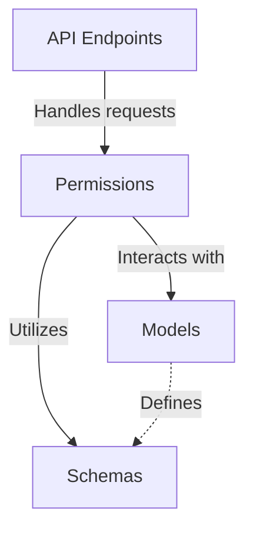
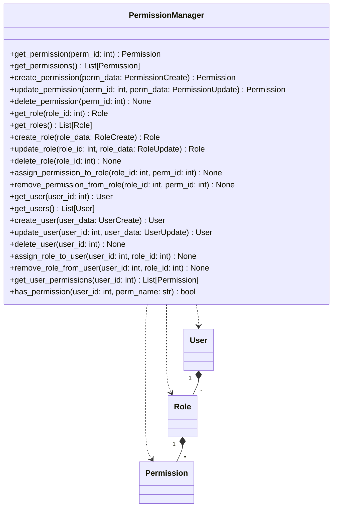

<details>
<summary>Relevant source files</summary>

The following files were used as context for generating this wiki page:

- [README.md](https://github.com/agattani123/access-control-service/blob/main/README.md)
- [access_control/app.py](https://github.com/agattani123/access-control-service/blob/main/access_control/app.py)
- [access_control/models.py](https://github.com/agattani123/access-control-service/blob/main/access_control/models.py)
- [access_control/permissions.py](https://github.com/agattani123/access-control-service/blob/main/access_control/permissions.py)
- [access_control/schemas.py](https://github.com/agattani123/access-control-service/blob/main/access_control/schemas.py)
</details>

# Introduction

The Access Control Service is a Python-based application built with FastAPI that provides role-based access control (RBAC) functionality for managing user permissions within an organization. It allows administrators to define roles, assign permissions to those roles, and associate users with specific roles, thereby controlling their access to various resources or actions within the system.

Sources: [README.md](https://github.com/agattani123/access-control-service/blob/main/README.md)

## Architecture Overview

The Access Control Service follows a modular architecture, with the main components being:

1. **Models**: Defines the data models for `User`, `Role`, and `Permission` entities using Pydantic.
2. **Schemas**: Provides serialization schemas for data transfer objects (DTOs) used in API requests and responses.
3. **Permissions**: Implements the core logic for managing permissions, roles, and their associations.
4. **API**: Exposes RESTful endpoints for CRUD operations on users, roles, and permissions, as well as for checking user permissions.



Sources: [access_control/app.py](https://github.com/agattani123/access-control-service/blob/main/access_control/app.py), [access_control/models.py](https://github.com/agattani123/access-control-service/blob/main/access_control/models.py), [access_control/permissions.py](https://github.com/agattani123/access-control-service/blob/main/access_control/permissions.py), [access_control/schemas.py](https://github.com/agattani123/access-control-service/blob/main/access_control/schemas.py)

## Data Models

The Access Control Service defines the following data models using Pydantic:

| Model       | Description                                                  |
|-------------|--------------------------------------------------------------|
| `User`      | Represents a user with fields like `id`, `name`, and `roles`|
| `Role`      | Defines a role with a `name` and associated `permissions`   |
| `Permission`| Represents a permission with a `name` and `description`     |

Sources: [access_control/models.py](https://github.com/agattani123/access-control-service/blob/main/access_control/models.py)

## API Endpoints

The service exposes the following RESTful API endpoints:

### User Management

| Endpoint                 | Method | Description                                |
|--------------------------|--------|----------------------------------------------|
| `/users`                 | GET    | Retrieve a list of all users                |
| `/users`                 | POST   | Create a new user                           |
| `/users/{user_id}`       | GET    | Retrieve a specific user by ID              |
| `/users/{user_id}`       | PUT    | Update a user's information                 |
| `/users/{user_id}`       | DELETE | Delete a user                               |
| `/users/{user_id}/roles` | POST   | Assign a role to a user                     |
| `/users/{user_id}/roles` | DELETE | Remove a role from a user                   |

### Role Management

| Endpoint           | Method | Description                           |
|---------------------|--------|---------------------------------------|
| `/roles`            | GET    | Retrieve a list of all roles          |
| `/roles`            | POST   | Create a new role                     |
| `/roles/{role_id}`  | GET    | Retrieve a specific role by ID        |
| `/roles/{role_id}`  | PUT    | Update a role's information           |
| `/roles/{role_id}`  | DELETE | Delete a role                         |
| `/roles/{role_id}/permissions` | POST   | Assign a permission to a role |
| `/roles/{role_id}/permissions` | DELETE | Remove a permission from a role|

### Permission Management

| Endpoint                  | Method | Description                           |
|----------------------------|--------|---------------------------------------|
| `/permissions`             | GET    | Retrieve a list of all permissions    |
| `/permissions`             | POST   | Create a new permission               |
| `/permissions/{perm_id}`   | GET    | Retrieve a specific permission by ID  |
| `/permissions/{perm_id}`   | PUT    | Update a permission's information     |
| `/permissions/{perm_id}`   | DELETE | Delete a permission                   |

### Permission Checking

| Endpoint                       | Method | Description                                    |
|---------------------------------|--------|------------------------------------------------|
| `/users/{user_id}/permissions`  | GET    | Retrieve all permissions for a specific user  |
| `/users/{user_id}/permissions/{perm_name}` | GET | Check if a user has a specific permission |

Sources: [access_control/app.py](https://github.com/agattani123/access-control-service/blob/main/access_control/app.py)

## Permission Management

The `PermissionManager` class in the `permissions.py` module handles the core logic for managing permissions, roles, and their associations.



The `PermissionManager` class provides methods for:

- **Permission CRUD**: Creating, retrieving, updating, and deleting permissions.
- **Role CRUD**: Creating, retrieving, updating, and deleting roles.
- **Role-Permission Association**: Assigning permissions to roles and removing permissions from roles.
- **User CRUD**: Creating, retrieving, updating, and deleting users.
- **User-Role Association**: Assigning roles to users and removing roles from users.
- **Permission Checking**: Retrieving all permissions for a user and checking if a user has a specific permission.

Sources: [access_control/permissions.py](https://github.com/agattani123/access-control-service/blob/main/access_control/permissions.py)

## Permission Checking

To check if a user has a specific permission, the `has_permission` method in the `PermissionManager` class is used. It follows these steps:

1. Retrieve the user object based on the provided `user_id`.
2. Get the list of roles associated with the user.
3. For each role, retrieve the list of permissions associated with that role.
4. Check if the requested `perm_name` exists in the combined list of permissions across all roles.
5. Return `True` if the permission is found, `False` otherwise.

```mermaid
sequenceDiagram
    participant API
    participant PermissionManager
    participant User
    participant Role
    participant Permission

    API->>PermissionManager: has_permission(user_id, perm_name)
    PermissionManager->>User: get_user(user_id)
    User-->>PermissionManager: user_obj
    PermissionManager->>Role: get_roles_for_user(user_obj)
    Role-->>PermissionManager: user_roles
    loop for each role in user_roles
        PermissionManager->>Role: get_permissions_for_role(role)
        Role-->>PermissionManager: role_permissions
        PermissionManager->>Permission: check_permission_exists(role_permissions, perm_name)
        Permission-->>PermissionManager: permission_exists
        opt permission_exists
            PermissionManager-->>API: True
            return
        end
    end
    PermissionManager-->>API: False
```

Sources: [access_control/permissions.py](https://github.com/agattani123/access-control-service/blob/main/access_control/permissions.py)

## Conclusion

The Access Control Service provides a comprehensive solution for managing user permissions within an organization using a role-based access control (RBAC) model. It allows administrators to define roles, assign permissions to those roles, and associate users with specific roles, thereby controlling their access to various resources or actions within the system. The service follows a modular architecture and exposes RESTful API endpoints for CRUD operations on users, roles, and permissions, as well as for checking user permissions.