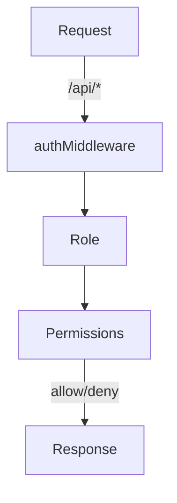

<details>
<summary>Relevant source files</summary>

The following files were used as context for generating this wiki page:

- [README.md](https://github.com/agattani123/access-control-service/blob/main/README.md)
- [docs/one-pager.md](https://github.com/agattani123/access-control-service/blob/main/docs/one-pager.md)
</details>

# Introduction

The Access Control Service is an internal Role-Based Access Control (RBAC) microservice that provides centralized permission enforcement for internal tools, APIs, and services within the organization. It manages user-role assignments, role-permission mappings, and enforces access controls at runtime, ensuring consistent and auditable permission enforcement across various internal systems.

The service aims to eliminate hardcoded permission logic across internal systems by decoupling role logic from application code, thereby promoting code reusability and maintainability.

## Features

The Access Control Service offers the following key features:

- Flat RBAC model (no scopes or hierarchies)
- Declarative role-to-permission mappings (via JSON config)
- Middleware-based permission enforcement
- CLI tools for bootstrapping and role assignment
- REST API for role and user management

Sources: [docs/one-pager.md](https://github.com/agattani123/access-control-service/blob/main/docs/one-pager.md)

## Architecture Overview

The Access Control Service follows a simple architecture, as illustrated by the following flow:



1. Incoming requests to the `/api/*` endpoints are intercepted by the `authMiddleware`.
2. The user's identity is extracted from the `x-user-email` HTTP header.
3. The user's role is resolved from the `db.users` map.
4. The permissions associated with the user's role are loaded from the `config/roles.json` configuration file.
5. The requested route is checked against the user's permissions, and the request is either allowed or denied based on the result.

Sources: [docs/one-pager.md](https://github.com/agattani123/access-control-service/blob/main/docs/one-pager.md)

## Role and Permission Management

The Access Control Service provides a CLI tool and a REST API for managing roles and user-role assignments.

### CLI Tool

The CLI tool, located in `cli/manage.js`, allows administrators to assign roles to users. For example:

```bash
node cli/manage.js assign-role alice@company.com engineer
```

This command assigns the `engineer` role to the user with the email `alice@company.com`.

Sources: [docs/one-pager.md](https://github.com/agattani123/access-control-service/blob/main/docs/one-pager.md)

### REST API

The Access Control Service exposes a REST API for managing users, roles, and permissions. The following table summarizes the available endpoints:

| Method | Endpoint         | Description                   | Permission         |
|--------|------------------|-------------------------------|--------------------|
| GET    | /api/users       | List all users and roles      | `view_users`       |
| POST   | /api/roles       | Create a new role             | `create_role`      |
| GET    | /api/permissions | View all role definitions     | `view_permissions` |
| POST   | /api/tokens      | Assign user to a role         | *None (bootstrap)* |

All API requests must include the `x-user-email` header to identify the authenticated user.

Sources: [docs/one-pager.md](https://github.com/agattani123/access-control-service/blob/main/docs/one-pager.md)

## Deployment and Integration

The Access Control Service is designed to be stateless, with no persistent database. The configuration is stored in memory, making it suitable for internal-only usage behind an API gateway.

For persistent configuration storage, the service can be integrated with an external configuration store, such as etcd or Consul.

Sources: [docs/one-pager.md](https://github.com/agattani123/access-control-service/blob/main/docs/one-pager.md)

## Related Documentation

- [`docs/permissions.md`](docs/permissions.md): Role definitions and structure
- [`docs/api.md`](docs/api.md): Complete API contract

Sources: [docs/one-pager.md](https://github.com/agattani123/access-control-service/blob/main/docs/one-pager.md)

In summary, the Access Control Service provides a centralized and consistent way to manage and enforce permissions across internal systems, promoting code reusability, maintainability, and auditability. It offers a flat RBAC model, declarative role-permission mappings, middleware-based enforcement, and tools for managing roles and user assignments.