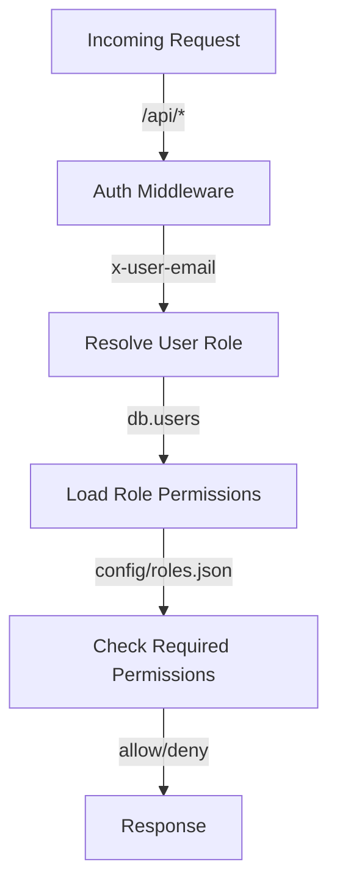

Relevant source files

The following files were used as context for generating this wiki page:

- [README.md](https://github.com/agattani123/access-control-service/blob/main/README.md)
- [docs/one-pager.md](https://github.com/agattani123/access-control-service/blob/main/docs/one-pager.md)

# Introduction

The Access Control Service is an internal Role-Based Access Control (RBAC) microservice that provides centralized permission enforcement for internal tools, APIs, and services within a company or organization. Its primary purpose is to manage user-role assignments, role-permission mappings, and enforce access controls at runtime, eliminating the need for hardcoded permission logic across various internal systems. By centralizing access control decisions, the service ensures consistent, auditable permission enforcement and decouples role logic from application code.

Sources: [docs/one-pager.md](https://github.com/agattani123/access-control-service/blob/main/docs/one-pager.md)

## Architecture Overview

The Access Control Service follows a flat RBAC model without hierarchies or scopes. It relies on declarative role-to-permission mappings defined in a JSON configuration file. The service acts as middleware, intercepting incoming requests and enforcing permissions based on the user's assigned role and the required permissions for the requested resource or operation.

The high-level flow of the service is as follows:

1. Incoming requests to the `/api/*` routes are intercepted by the authentication middleware.
2. The middleware resolves the user's role based on the `x-user-email` HTTP header and the `db.users` mapping.
3. The user's role permissions are loaded from the `config/roles.json` configuration file.
4. The required permissions for the requested route are checked against the user's role permissions.
5. Based on the permission check, the request is either allowed or denied, and the appropriate response is sent.

Sources: [docs/one-pager.md](https://github.com/agattani123/access-control-service/blob/main/docs/one-pager.md)

## Key Components

### Authentication Middleware

The authentication middleware is responsible for intercepting incoming requests, extracting the user's identity from the `x-user-email` HTTP header, and resolving the user's assigned role. It acts as the entry point for permission enforcement.

### Role-Permission Mapping

The role-permission mappings are defined in a JSON configuration file (`config/roles.json`). This file declaratively maps roles to their respective permissions, allowing for easy management and updates without modifying the application code.

### User-Role Assignment

The service maintains a mapping of users to their assigned roles, likely stored in a data structure such as `db.users`. This mapping is used by the authentication middleware to resolve a user's role based on their email address.

### CLI Tools

The service provides command-line interface (CLI) tools for bootstrapping and managing user-role assignments. For example, the `assign-role` command allows administrators to assign a specific role to a user.

### REST API

The Access Control Service exposes a REST API for managing users, roles, and permissions. This API allows authorized users or systems to perform operations such as listing users and roles, creating new roles, viewing role definitions, and assigning users to roles.

Sources: [README.md](https://github.com/agattani123/access-control-service/blob/main/README.md), [docs/one-pager.md](https://github.com/agattani123/access-control-service/blob/main/docs/one-pager.md)

## API Endpoints

The following table summarizes the API endpoints exposed by the Access Control Service:

| Method | Endpoint         | Description                   | Permission         |
|--------|------------------|-------------------------------|--------------------|
| GET    | /api/users       | List all users and roles      | `view_users`       |
| POST   | /api/roles       | Create a new role             | `create_role`      |
| GET    | /api/permissions | View all role definitions     | `view_permissions` |
| POST   | /api/tokens      | Assign user to a role         | *None (bootstrap)* |

All API requests must include the `x-user-email` HTTP header to identify the user making the request.

Sources: [docs/one-pager.md](https://github.com/agattani123/access-control-service/blob/main/docs/one-pager.md)

## Deployment Considerations

The Access Control Service is designed to be stateless, with no persistent database. Instead, the configuration and user-role mappings are stored in memory. This design makes the service suitable for internal-only usage behind an API gateway.

For persistent storage and configuration management, the service can be integrated with an external configuration store, such as etcd or Consul.

Sources: [docs/one-pager.md](https://github.com/agattani123/access-control-service/blob/main/docs/one-pager.md)

## Conclusion

The Access Control Service provides a centralized and consistent approach to managing permissions and enforcing access controls across internal tools, APIs, and services within an organization. By decoupling permission logic from application code and relying on a declarative role-permission mapping, the service promotes maintainability, auditability, and scalability of access control management.

Sources: [docs/one-pager.md](https://github.com/agattani123/access-control-service/blob/main/docs/one-pager.md)