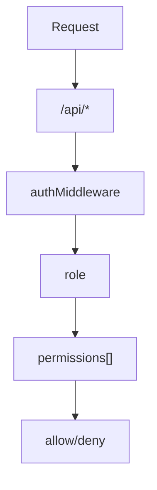

<details>
<summary>Relevant source files</summary>

The following files were used as context for generating this wiki page:

- [README.md](https://github.com/agattani123/access-control-service/blob/main/README.md)
- [docs/one-pager.md](https://github.com/agattani123/access-control-service/blob/main/docs/one-pager.md)

</details>

# Introduction

The Access Control Service is an internal Role-Based Access Control (RBAC) microservice that provides centralized permission enforcement for internal tools, APIs, and services within an organization. Its primary purpose is to eliminate hardcoded permission logic across various internal systems by centralizing access control decisions, ensuring consistent and auditable permission enforcement, and decoupling role logic from application code.

Sources: [docs/one-pager.md:3-5](), [docs/one-pager.md:9-11]()

## Features

The Access Control Service offers the following key features:

- **Flat RBAC Model**: It implements a flat Role-Based Access Control model without support for hierarchies or scopes.
- **Declarative Role-Permission Mappings**: Role-to-permission mappings are defined declaratively in a JSON configuration file.
- **Middleware-based Permission Enforcement**: Permission enforcement is implemented as middleware, allowing seamless integration with other services.
- **CLI Tools**: Command-line interface (CLI) tools are provided for bootstrapping and assigning roles to users.
- **REST API**: A RESTful API is available for managing roles and users.

Sources: [docs/one-pager.md:14-18]()

## Architecture Overview

The Access Control Service follows a straightforward architecture:



1. Requests are made to API endpoints under `/api/*`.
2. The `authMiddleware` component is responsible for authenticating the request and extracting the user's identity from the `x-user-email` HTTP header.
3. The user's role is resolved by looking up the user in the `db.users` map.
4. The permissions associated with the user's role are loaded from the `config/roles.json` configuration file.
5. Based on the required permissions annotated on the API route, access is either allowed or denied.

Sources: [docs/one-pager.md:22-27]()

## Setup and Usage

### Setup

To set up the Access Control Service, follow these steps:

1. Copy the example environment file: `cp .env.example .env`
2. Install dependencies: `npm install`
3. Start the service: `npm run start`

Sources: [docs/one-pager.md:30-33]()

### CLI Usage

The Access Control Service provides a command-line interface (CLI) tool for assigning roles to users. Here's an example usage:

```bash
node cli/manage.js assign-role alice@company.com engineer
```

This command assigns the `engineer` role to the user with the email `alice@company.com`.

Sources: [docs/one-pager.md:36-38]()

## API Overview

The Access Control Service exposes a RESTful API for managing users, roles, and permissions. Here's an overview of the available endpoints:

| Method | Endpoint         | Description                   | Required Permission |
|--------|------------------|-------------------------------|----------------------|
| GET    | `/api/users`     | List all users and roles      | `view_users`        |
| POST   | `/api/roles`     | Create a new role             | `create_role`       |
| GET    | `/api/permissions` | View all role definitions     | `view_permissions`  |
| POST   | `/api/tokens`    | Assign a user to a role       | *None (bootstrap)*  |

All API requests must include the `x-user-email` HTTP header with the authenticated user's email address.

Sources: [docs/one-pager.md:41-49]()

## Deployment Notes

- **Stateless Design**: The Access Control Service is designed to be stateless, with no persistent database. The configuration is stored in memory.
- **Internal Usage**: The service is suitable for internal-only usage behind an API gateway.
- **External Configuration Store**: For persistence, the service can be integrated with an external configuration store like etcd or Consul.

Sources: [docs/one-pager.md:52-55]()

## Related Documentation

- [`docs/permissions.md`](docs/permissions.md): Provides details on the role definitions and structure.
- [`docs/api.md`](docs/api.md): Covers the complete API contract for the Access Control Service.

Sources: [docs/one-pager.md:58-59]()