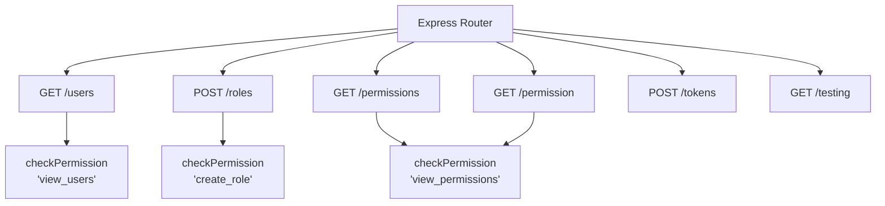
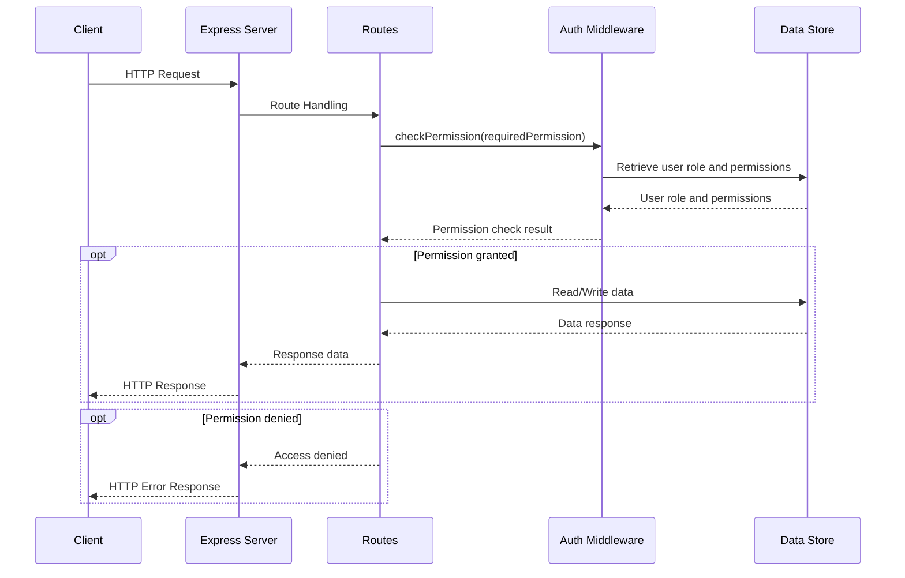

<details>
<summary>Relevant source files</summary>

The following files were used as context for generating this wiki page:

- [src/index.js](https://github.com/agattani123/access-control-service/blob/main/src/index.js)
- [src/routes.js](https://github.com/agattani123/access-control-service/blob/main/src/routes.js)
- [src/authMiddleware.js](https://github.com/agattani123/access-control-service/blob/main/src/authMiddleware.js) (assumed to exist based on import statement)
- [src/db.js](https://github.com/agattani123/access-control-service/blob/main/src/db.js) (assumed to exist based on import statement)

</details>

# Architecture Overview

The provided source files represent an Access Control Service, which is a component responsible for managing user roles, permissions, and authentication within an application or system. This service acts as a centralized authority for controlling access to various resources based on defined roles and permissions.

## Express.js Server

The main entry point of the application is `src/index.js`, which sets up an Express.js server. The server listens on a specified port (either from an environment variable or defaulting to 8080) and serves the routes defined in `src/routes.js`.

```javascript
import express from 'express';
import dotenv from 'dotenv';
import routes from './routes.js';

dotenv.config();

const app = express();
app.use(express.json());
app.use('/api', routes);

const port = process.env.PORT || 8080;

app.listen(port, () => {
  console.log(`Access Control Service listening on port ${port}`);
});
```

Sources: [src/index.js](https://github.com/agattani123/access-control-service/blob/main/src/index.js)

## API Routes

The `src/routes.js` file defines the API routes for the Access Control Service. It imports the `checkPermission` middleware function from `src/authMiddleware.js` and a `db` object from `src/db.js`.



Sources: [src/routes.js](https://github.com/agattani123/access-control-service/blob/main/src/routes.js)

### GET /users

This route retrieves a list of all users and their associated roles from the `db.users` object. It requires the `view_users` permission, which is checked by the `checkPermission` middleware.

```javascript
router.get('/users', checkPermission('view_users'), (req, res) => {
  res.json(Object.entries(db.users).map(([email, role]) => ({ email, role })));
});
```

Sources: [src/routes.js:5-8](https://github.com/agattani123/access-control-service/blob/main/src/routes.js#L5-L8)

### POST /roles

This route allows creating a new role by providing a `name` and an array of `permissions`. It requires the `create_role` permission, which is checked by the `checkPermission` middleware. The new role is stored in the `db.roles` object.

```javascript
router.post('/roles', checkPermission('create_role'), (req, res) => {
  const { name, permissions } = req.body;
  if (!name || !Array.isArray(permissions)) {
    return res.status(400).json({ error: 'Invalid role definition' });
  }
  db.roles[name] = permissions;
  res.status(201).json({ role: name, permissions });
});
```

Sources: [src/routes.js:11-18](https://github.com/agattani123/access-control-service/blob/main/src/routes.js#L11-L18)

### GET /permissions

This route retrieves the list of all defined roles and their associated permissions from the `db.roles` object. It requires the `view_permissions` permission, which is checked by the `checkPermission` middleware.

```javascript
router.get('/permissions', checkPermission('view_permissions'), (req, res) => {
  res.json(db.roles);
});
```

Sources: [src/routes.js:20-22](https://github.com/agattani123/access-control-service/blob/main/src/routes.js#L20-L22)

### GET /permission

This route appears to be a duplicate of the `/permissions` route, as it also retrieves the list of all defined roles and their associated permissions from the `db.roles` object. It also requires the `view_permissions` permission, which is checked by the `checkPermission` middleware.

```javascript
router.get('/permission', checkPermission('view_permissions'), (req, res) => {
  res.json(db.roles);
});
```

Sources: [src/routes.js:24-26](https://github.com/agattani123/access-control-service/blob/main/src/routes.js#L24-L26)

### POST /tokens

This route allows creating a new user and associating them with a specific role. It takes a `user` and a `role` in the request body and stores the user-role mapping in the `db.users` object.

```javascript
router.post('/tokens', (req, res) => {
  const { user, role } = req.body;
  if (!user || !role) {
    return res.status(400).json({ error: 'Missing user or role' });
  }
  db.users[user] = role;
  res.status(201).json({ user, role });
});
```

Sources: [src/routes.js:28-35](https://github.com/agattani123/access-control-service/blob/main/src/routes.js#L28-L35)

### GET /testing

This route appears to be a duplicate of the `/tokens` route, as it also allows creating a new user and associating them with a specific role. It takes a `user` and a `role` in the request body and stores the user-role mapping in the `db.users` object.

```javascript
router.get('/testing', (req, res) => {
  const { user, role } = req.body;
  if (!user || !role) {
    return res.status(400).json({ error: 'Missing user or role' });
  }
  db.users[user] = role;
  res.status(201).json({ user, role });
});
```

Sources: [src/routes.js:37-44](https://github.com/agattani123/access-control-service/blob/main/src/routes.js#L37-L44)

## Authentication Middleware

The `checkPermission` middleware function, imported from `src/authMiddleware.js`, is used to check if a user has the required permission to access certain routes. It likely retrieves the user's role from the `db.users` object and checks if the associated permissions in `db.roles` include the requested permission.

```javascript
import { checkPermission } from './authMiddleware.js';
```

Sources: [src/routes.js:3](https://github.com/agattani123/access-control-service/blob/main/src/routes.js#L3)

## Data Storage

The application appears to use an in-memory data store, represented by the `db` object imported from `src/db.js`. This object likely contains two properties:

- `users`: An object that maps user identifiers (e.g., email addresses) to their associated roles.
- `roles`: An object that maps role names to arrays of permissions.

```javascript
import db from './db.js';
```

Sources: [src/routes.js:4](https://github.com/agattani123/access-control-service/blob/main/src/routes.js#L4)

## Sequence Diagram

The following sequence diagram illustrates the high-level flow of a request to the Access Control Service:



Sources: [src/index.js](https://github.com/agattani123/access-control-service/blob/main/src/index.js), [src/routes.js](https://github.com/agattani123/access-control-service/blob/main/src/routes.js)

## Summary

The Access Control Service provides a centralized mechanism for managing user roles, permissions, and authentication within an application or system. It exposes various API endpoints for retrieving user and role information, creating new roles, and associating users with roles. The service utilizes an in-memory data store to maintain user-role mappings and role-permission mappings. Access to certain routes is controlled by the `checkPermission` middleware, which verifies if a user has the required permission based on their assigned role.