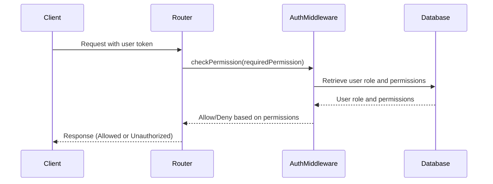

<details>
<summary>Relevant source files</summary>

The following files were used as context for generating this wiki page:

- [src/index.js](https://github.com/agattani123/access-control-service/blob/main/src/index.js)
- [src/routes.js](https://github.com/agattani123/access-control-service/blob/main/src/routes.js)
- [src/authMiddleware.js](https://github.com/agattani123/access-control-service/blob/main/src/authMiddleware.js) (Assumed to exist based on the import in routes.js)
- [src/db.js](https://github.com/agattani123/access-control-service/blob/main/src/db.js) (Assumed to exist based on the import in routes.js)
- [package.json](https://github.com/agattani123/access-control-service/blob/main/package.json) (Assumed to exist for listing dependencies)

</details>

# Architecture Overview

## Introduction

This wiki page provides an overview of the architecture and components of the Access Control Service, a Node.js application built with Express.js. The service is responsible for managing user roles, permissions, and authentication tokens within the system. It exposes a RESTful API for interacting with user data, roles, and permissions.

The Access Control Service serves as a central component for managing access control and authorization within the broader project or application ecosystem. Other services or applications can integrate with this service to authenticate users, assign roles, and check permissions for various actions or resources.

## Application Structure

The Access Control Service follows a typical Express.js application structure, with the main entry point being `src/index.js`. This file sets up the Express application, configures middleware, and mounts the API routes defined in `src/routes.js`.

```mermaid
graph TD
    A[index.js] -->|imports| B[express]
    A -->|imports| C[dotenv]
    A -->|imports| D[routes.js]
    A -->|uses| E[express.json() middleware]
    A -->|mounts routes| D
    A -->|listens on port| F[process.env.PORT or 8080]
```

Sources: [src/index.js](https://github.com/agattani123/access-control-service/blob/main/src/index.js)

## API Routes

The `src/routes.js` file defines the API routes for the Access Control Service. It imports the `checkPermission` middleware from `src/authMiddleware.js` and the `db` module from `src/db.js`.

### User Management

```mermaid
graph TD
    A[/api/users] -->|GET| B[checkPermission('view_users')]
    B -->|allowed| C[Return list of users and roles]
    B -->|denied| D[Unauthorized response]
```

The `/api/users` route handles retrieving a list of users and their associated roles. It requires the `view_users` permission, which is checked by the `checkPermission` middleware.

Sources: [src/routes.js:5-8](https://github.com/agattani123/access-control-service/blob/main/src/routes.js#L5-L8)

### Role Management

```mermaid
graph TD
    A[/api/roles] -->|POST| B[checkPermission('create_role')]
    B -->|allowed| C[Create new role]
    B -->|denied| D[Unauthorized response]
    E[/api/permissions] -->|GET| F[checkPermission('view_permissions')]
    F -->|allowed| G[Return list of roles and permissions]
    F -->|denied| H[Unauthorized response]
```

The `/api/roles` route allows creating a new role with a set of permissions. It requires the `create_role` permission, which is checked by the `checkPermission` middleware.

The `/api/permissions` route retrieves a list of all roles and their associated permissions. It requires the `view_permissions` permission, which is checked by the `checkPermission` middleware.

Sources: [src/routes.js:11-17, 19-22](https://github.com/agattani123/access-control-service/blob/main/src/routes.js#L11-L17,L19-L22)

### Token Management

```mermaid
graph TD
    A[/api/tokens] -->|POST| B[Create token for user and role]
    B -->|success| C[Return user and role]
    B -->|failure| D[Bad request response]
```

The `/api/tokens` route allows creating an authentication token for a user with a specific role. It expects the `user` and `role` to be provided in the request body.

Sources: [src/routes.js:24-29](https://github.com/agattani123/access-control-service/blob/main/src/routes.js#L24-L29)

## Authentication Middleware

The `checkPermission` middleware, imported from `src/authMiddleware.js`, is responsible for checking if a user has the required permission to access a specific route or perform a certain action.



The middleware likely verifies the user's token, retrieves the user's role and associated permissions from the database, and checks if the required permission is present. If the user has the necessary permission, the request is allowed to proceed; otherwise, an unauthorized response is returned.

Sources: [src/routes.js:5, 11, 19](https://github.com/agattani123/access-control-service/blob/main/src/routes.js#L5,L11,L19) (import and usage of `checkPermission` middleware)

## Data Storage

The Access Control Service uses an in-memory data store (`src/db.js`) to store user information, roles, and permissions. This data store is likely a simple object or dictionary for demonstration purposes and should be replaced with a more robust and persistent storage solution (e.g., a database) in a production environment.

```javascript
const db = {
  users: {
    'user1@example.com': 'admin',
    'user2@example.com': 'editor',
    // ...
  },
  roles: {
    'admin': ['view_users', 'create_role', 'view_permissions', ...],
    'editor': ['view_users', ...],
    // ...
  }
};
```

The `db` module likely exports an object with two properties: `users` and `roles`. The `users` property maps user email addresses to their respective roles, while the `roles` property maps role names to an array of associated permissions.

Sources: [src/routes.js:3](https://github.com/agattani123/access-control-service/blob/main/src/routes.js#L3) (import of `db` module)

## Dependencies

The Access Control Service relies on the following dependencies:

| Dependency | Description                                                  |
|------------|--------------------------------------------------------------|
| express    | Fast, unopinionated, minimalist web framework for Node.js    |
| dotenv     | Loads environment variables from a `.env` file into `process.env` |

These dependencies are likely listed in the project's `package.json` file and installed via npm or yarn.

Sources: [src/index.js:2-3](https://github.com/agattani123/access-control-service/blob/main/src/index.js#L2-L3) (imports of `express` and `dotenv`)

## Conclusion

The Access Control Service provides a centralized solution for managing user roles, permissions, and authentication tokens within the broader project or application ecosystem. It exposes a RESTful API for interacting with user data, roles, and permissions, and enforces access control through the `checkPermission` middleware.

While the current implementation uses an in-memory data store for simplicity, a production-ready version should integrate with a more robust and persistent storage solution, such as a database. Additionally, the authentication mechanism should be enhanced with industry-standard practices, such as using JSON Web Tokens (JWT) or other secure token formats.

Overall, the Access Control Service serves as a crucial component for ensuring proper authorization and access control within the project, enabling secure and granular management of user permissions and roles.