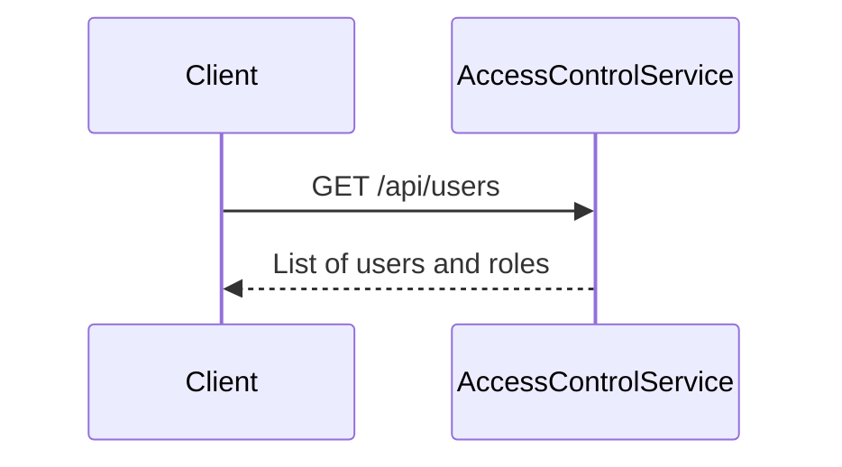
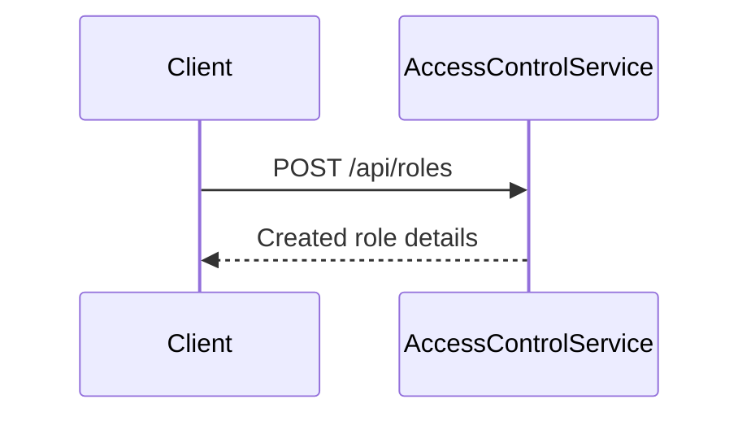
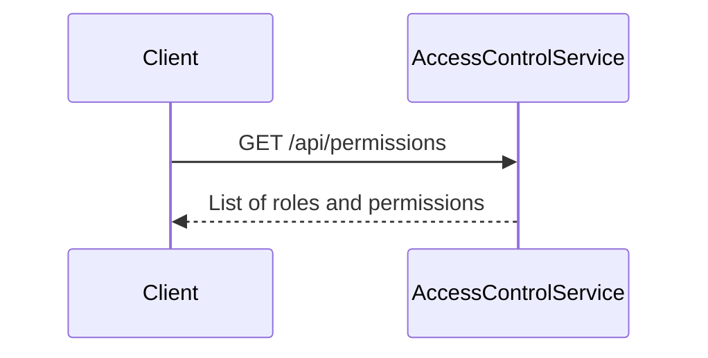
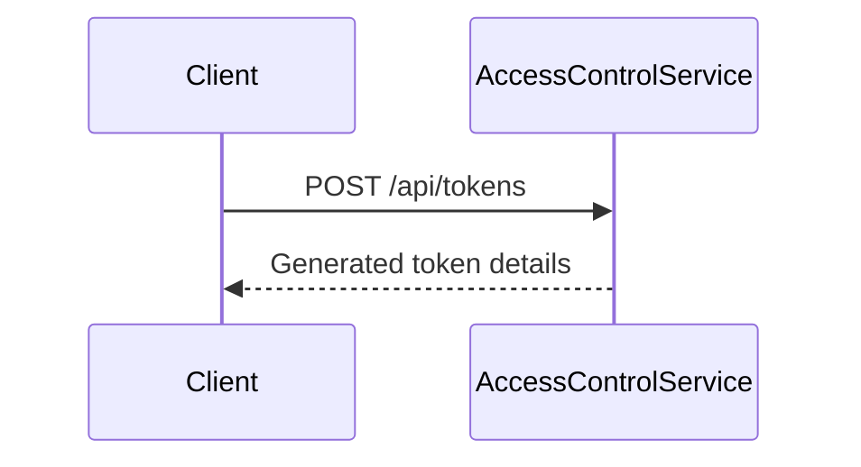
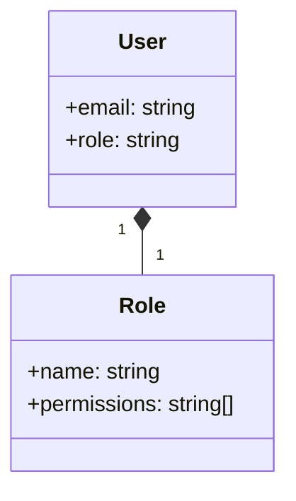
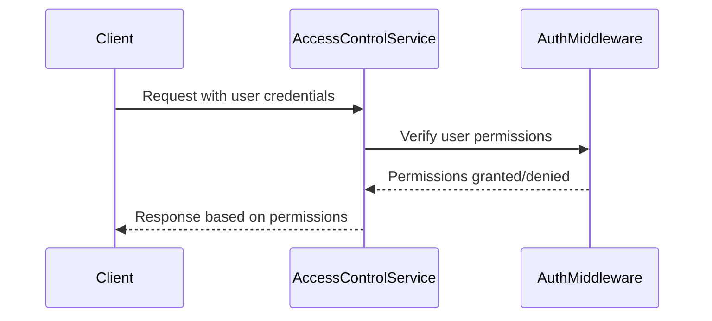

Relevant source files

The following files were used as context for generating this wiki page:

- [src/index.js](https://github.com/agattani123/access-control-service/blob/main/src/index.js)
- [src/routes.js](https://github.com/agattani123/access-control-service/blob/main/src/routes.js)
- [src/authMiddleware.js](https://github.com/agattani123/access-control-service/blob/main/src/authMiddleware.js) (assumed to exist based on import)
- [src/db.js](https://github.com/agattani123/access-control-service/blob/main/src/db.js) (assumed to exist based on import)

# Architecture Overview

## Introduction

This project appears to be an Access Control Service, responsible for managing user roles, permissions, and authentication tokens within an application or system. The service is built using Node.js and the Express.js framework, providing a RESTful API for various access control operations.

The core functionality revolves around managing user roles, assigning permissions to roles, and verifying user permissions for specific actions or resources. The service also handles the generation and management of authentication tokens for users.

Sources: [src/index.js](), [src/routes.js]()

## API Endpoints

The Access Control Service exposes the following API endpoints:

### User Management

#### `GET /api/users`

Retrieves a list of all registered users and their associated roles.

- Requires the `view_users` permission.

Sources: [src/routes.js:5-8]()

### Role Management

#### `POST /api/roles`

Creates a new role with a specified name and set of permissions.

- Requires the `create_role` permission.

Sources: [src/routes.js:11-17]()

#### `GET /api/permissions`

Retrieves a list of all defined roles and their associated permissions.

- Requires the `view_permissions` permission.

Sources: [src/routes.js:19-21](), [src/routes.js:23-25](), [src/routes.js:27-29](), [src/routes.js:31-33]()

### Token Management

#### `POST /api/tokens`

Generates an authentication token for a specified user and role.

Sources: [src/routes.js:35-41]()

## Data Storage

The service appears to use an in-memory data store (`db.js`) to persist user and role information. This data store likely contains the following data structures:

- `users`: An object mapping user identifiers (e.g., email addresses) to their assigned roles.
- `roles`: An object mapping role names to their associated permissions (an array of permission strings).

Sources: [src/routes.js:6](), [src/routes.js:14-16](), [src/routes.js:20](), [src/routes.js:24](), [src/routes.js:28](), [src/routes.js:32](), [src/routes.js:38-40]()

## Authentication and Authorization

The service likely implements an authentication and authorization middleware (`authMiddleware.js`) to verify user permissions for certain routes or actions. This middleware is imported and used in the `routes.js` file.

The `checkPermission` middleware function is used to protect routes that require specific permissions. It likely verifies the user's role and associated permissions against the required permission for the requested route or action.

Sources: [src/routes.js:3](), [src/routes.js:5](), [src/routes.js:11](), [src/routes.js:19](), [src/routes.js:23](), [src/routes.js:27](), [src/routes.js:31]()

## Conclusion

The Access Control Service provides a centralized solution for managing user roles, permissions, and authentication within an application or system. It exposes a RESTful API for creating and retrieving roles, assigning permissions, generating authentication tokens, and verifying user permissions for various actions or resources. The service utilizes an in-memory data store to persist user and role information and likely implements authentication and authorization middleware to enforce access control policies.