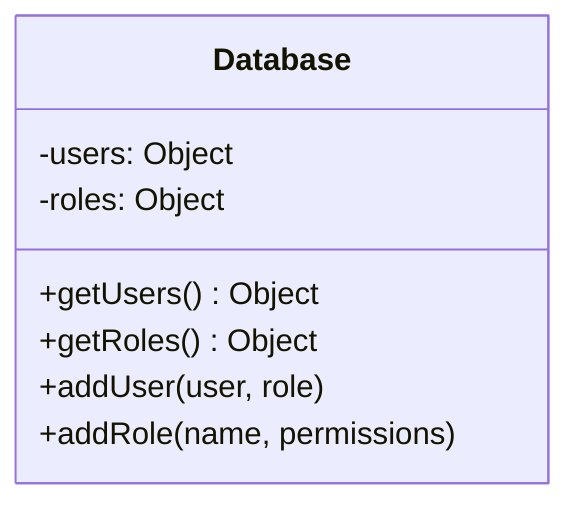
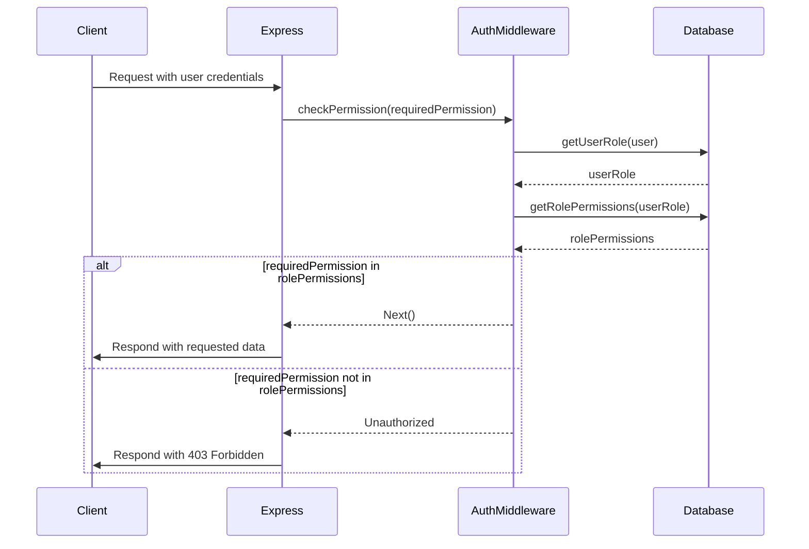

<details>
<summary>Relevant source files</summary>

The following files were used as context for generating this wiki page:

- [src/index.js](https://github.com/agattani123/access-control-service/blob/main/src/index.js)
- [src/routes.js](https://github.com/agattani123/access-control-service/blob/main/src/routes.js)
- [src/authMiddleware.js](https://github.com/agattani123/access-control-service/blob/main/src/authMiddleware.js) (assumed to exist based on import)
- [src/db.js](https://github.com/agattani123/access-control-service/blob/main/src/db.js) (assumed to exist based on import)

</details>

# Architecture Overview

The Access Control Service is a Node.js application built with Express.js that provides role-based access control functionality. It allows managing users, roles, permissions, and authentication tokens within an application or system.

## Application Setup

The application entry point is `src/index.js`, which sets up the Express.js server and loads environment variables using `dotenv`. It imports the routes from `src/routes.js` and mounts them under the `/api` path.

```mermaid
graph TD
    A[index.js] -->|imports| B[express]
    A -->|imports| C[dotenv]
    A -->|imports| D[routes.js]
    A -->|uses| E[express.json()]
    A -->|mounts| F["/api" path]
    F -->|routes| D
    A -->|listens on| G[PORT]
```

Sources: [src/index.js](https://github.com/agattani123/access-control-service/blob/main/src/index.js)

## Routes and Endpoints

The `src/routes.js` file defines the API routes and their corresponding handlers. It imports the `checkPermission` middleware from `src/authMiddleware.js` and the `db` module from `src/db.js`.

### User Management

```mermaid
graph TD
    A[/api/users] -->|GET| B[Get all users]
    B -->|checkPermission| C["view_users"]
    B -->|responds with| D[User email and role]
    D -->|from| E[db.users]
```

The `/api/users` endpoint (GET) retrieves a list of all users and their roles from the `db.users` object. It requires the `view_users` permission, which is checked by the `checkPermission` middleware.

Sources: [src/routes.js:5-8](https://github.com/agattani123/access-control-service/blob/main/src/routes.js#L5-L8)

### Role Management

```mermaid
graph TD
    A[/api/roles] -->|POST| B[Create new role]
    B -->|checkPermission| C["create_role"]
    B -->|validates| D[name and permissions]
    D -->|stores in| E[db.roles]
    B -->|responds with| F[role and permissions]
```

The `/api/roles` endpoint (POST) creates a new role by storing its name and associated permissions in the `db.roles` object. It requires the `create_role` permission, which is checked by the `checkPermission` middleware.

Sources: [src/routes.js:11-17](https://github.com/agattani123/access-control-service/blob/main/src/routes.js#L11-L17)

```mermaid
graph TD
    A[/api/permissions] -->|GET| B[Get all roles and permissions]
    B -->|checkPermission| C["view_permissions"]
    B -->|responds with| D[db.roles]
```

The `/api/permissions` endpoint (GET) retrieves all roles and their associated permissions from the `db.roles` object. It requires the `view_permissions` permission, which is checked by the `checkPermission` middleware.

Sources: [src/routes.js:19-21](https://github.com/agattani123/access-control-service/blob/main/src/routes.js#L19-L21)

### Token Management

```mermaid
graph TD
    A[/api/tokens] -->|POST| B[Create new token]
    B -->|validates| C[user and role]
    C -->|stores in| D[db.users]
    B -->|responds with| E[user and role]
```

The `/api/tokens` endpoint (POST) creates a new authentication token by associating a user with a role in the `db.users` object. It does not require any specific permission.

Sources: [src/routes.js:24-29](https://github.com/agattani123/access-control-service/blob/main/src/routes.js#L24-L29)

## Data Storage

The application uses an in-memory data store (`db.js`) to store user roles, permissions, and authentication tokens. This is likely a simplified implementation for demonstration purposes, and a production system would typically use a more robust and persistent data storage solution.



The `db` module likely exposes methods to interact with the `users` and `roles` objects, such as retrieving user roles, retrieving role permissions, adding new users, and adding new roles.

Sources: [src/routes.js](https://github.com/agattani123/access-control-service/blob/main/src/routes.js) (based on usage)

## Authentication and Authorization

The `checkPermission` middleware from `src/authMiddleware.js` is responsible for enforcing role-based access control. It likely checks the user's role and associated permissions against the required permission for a given route.



The `checkPermission` middleware likely follows these steps:

1. Retrieve the user's role from the `db.users` object.
2. Retrieve the permissions associated with the user's role from the `db.roles` object.
3. Check if the required permission is included in the user's role permissions.
4. If the permission is granted, allow the request to proceed; otherwise, return an unauthorized response.

Sources: [src/routes.js](https://github.com/agattani123/access-control-service/blob/main/src/routes.js) (based on usage of `checkPermission`)

## Summary

The Access Control Service provides a role-based access control system for managing users, roles, permissions, and authentication tokens. It exposes API endpoints for CRUD operations on these entities and enforces access control using a middleware that checks the user's role and associated permissions. The service uses an in-memory data store for simplicity, but a production implementation would likely use a more robust and persistent storage solution.