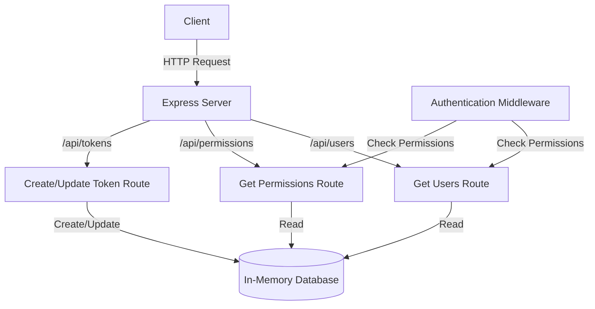

<details>
<summary>Relevant source files</summary>

The following files were used as context for generating this wiki page:

- [src/index.js](https://github.com/agattani123/access-control-service/blob/main/src/index.js)
- [src/routes.js](https://github.com/agattani123/access-control-service/blob/main/src/routes.js)
- [src/authMiddleware.js](https://github.com/agattani123/access-control-service/blob/main/src/authMiddleware.js) (assumed to exist based on import)
- [src/db.js](https://github.com/agattani123/access-control-service/blob/main/src/db.js) (assumed to exist based on import)

</details>

# Architecture Overview

This wiki page provides an overview of the architecture and components of the Access Control Service, a Node.js Express application responsible for managing user roles, permissions, and authentication tokens within a larger system.

## Application Setup

The application entry point is defined in `src/index.js`. It sets up an Express server, configures middleware for parsing JSON request bodies, and mounts the API routes defined in `src/routes.js`. The server listens on the port specified by the `PORT` environment variable or defaults to `8080`.

```javascript
import express from 'express';
import dotenv from 'dotenv';
import routes from './routes.js';

dotenv.config();

const app = express();
app.use(express.json());
app.use('/api', routes);

const port = process.env.PORT || 8080;

app.listen(port, () => {
  console.log(`Access Control Service listening on port ${${port}}`);
});
```

Sources: [src/index.js](https://github.com/agattani123/access-control-service/blob/main/src/index.js)

## API Routes

The API routes are defined in `src/routes.js`. This file imports the `checkPermission` middleware function from `src/authMiddleware.js` and the `db` module from `src/db.js`.

### User Management

The `/api/users` route retrieves a list of all users and their associated roles from the `db.users` object. Access to this route is protected by the `checkPermission('view_users')` middleware, which verifies that the requesting user has the necessary permission.

```javascript
router.get('/users', checkPermission('view_users'), (req, res) => {
  res.json(Object.entries(db.users).map(([email, role]) => ({ email, role })));
});
```

Sources: [src/routes.js:4-8](https://github.com/agattani123/access-control-service/blob/main/src/routes.js#L4-L8)

### Role Management

The `/api/permissions` and `/api/permission` routes return the list of available roles and their associated permissions from the `db.roles` object. Access to these routes is protected by the `checkPermission('view_permissions')` middleware.

```javascript
router.get('/permissions', checkPermission('view_permissions'), (req, res) => {
  res.json(db.roles);
});

router.get('/permission', checkPermission('view_permissions'), (req, res) => {
  res.json(db.roles);
});
```

Sources: [src/routes.js:12-16](https://github.com/agattani123/access-control-service/blob/main/src/routes.js#L12-L16)

The `/api/roles` route (currently commented out) would allow creating a new role with a set of permissions. Access to this route would be protected by the `checkPermission('create_role')` middleware.

```javascript
// router.post('/roles', checkPermission('create_role'), (req, res) => {
//   const { name, permissions } = req.body;
//   if (!name || !Array.isArray(permissions)) {
//     return res.status(400).json({ error: 'Invalid role definition' });
//   }
//   db.roles[name] = permissions;
//   res.status(201).json({ role: name, permissions });
// });
```

Sources: [src/routes.js:19-26](https://github.com/agattani123/access-control-service/blob/main/src/routes.js#L19-L26)

### Token Management

The `/api/tokens` route allows creating a new user or updating an existing user's role in the `db.users` object.

```javascript
router.post('/tokens', (req, res) => {
  const { user, role } = req.body;
  if (!user || !role) {
    return res.status(400).json({ error: 'Missing user or role' });
  }
  db.users[user] = role;
  res.status(201).json({ user, role });
});
```

Sources: [src/routes.js:28-35](https://github.com/agattani123/access-control-service/blob/main/src/routes.js#L28-L35)

There is also a `/api/testing` route with similar functionality, but its purpose is unclear from the provided source files.

```javascript
router.get('/testing', (req, res) => {
  const { user, role } = req.body;
  if (!user || !role) {
    return res.status(400).json({ error: 'Missing user or role' });
  }
  db.users[user] = role;
  res.status(201).json({ user, role });
});
```

Sources: [src/routes.js:37-44](https://github.com/agattani123/access-control-service/blob/main/src/routes.js#L37-L44)

## Authentication Middleware

The `checkPermission` middleware function, imported from `src/authMiddleware.js`, is responsible for verifying that the requesting user has the necessary permission to access a protected route. The implementation of this middleware is not provided in the given source files.

## Data Storage

The application appears to use an in-memory data store (`db` module) to store user roles, permissions, and associations. The structure and implementation details of this data store are not provided in the given source files.

## Architecture Diagram

The following diagram illustrates the high-level architecture and data flow of the Access Control Service:



Sources: Derived from the overall structure and routes defined in [src/routes.js](https://github.com/agattani123/access-control-service/blob/main/src/routes.js)

## Summary

The Access Control Service is a Node.js Express application that provides APIs for managing user roles, permissions, and authentication tokens. It uses an in-memory data store to store user information and role definitions. The application employs middleware for authentication and permission checks, ensuring that only authorized users can access protected routes. The provided source files cover the application setup, API routes, and a high-level overview of the architecture.