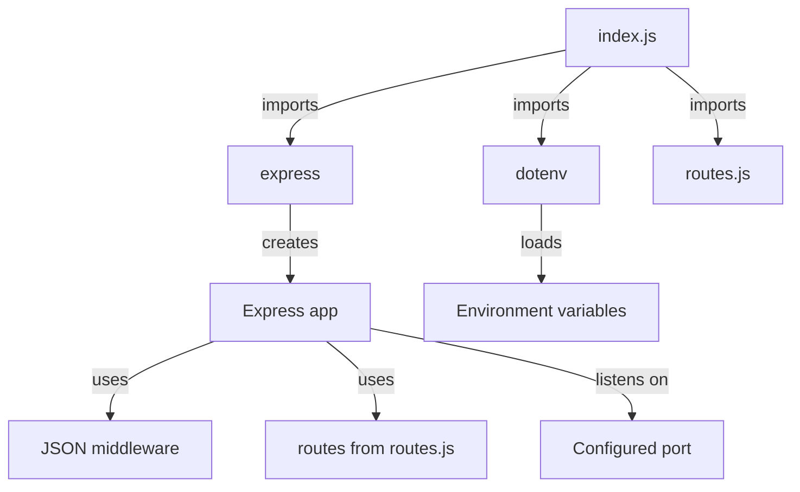
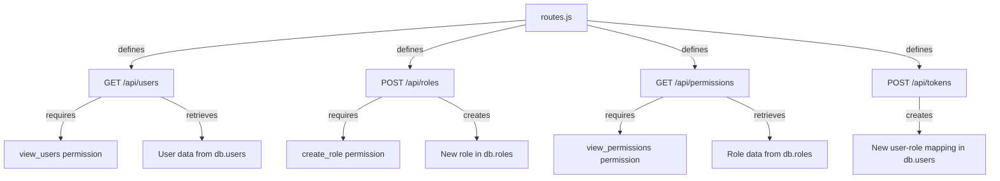
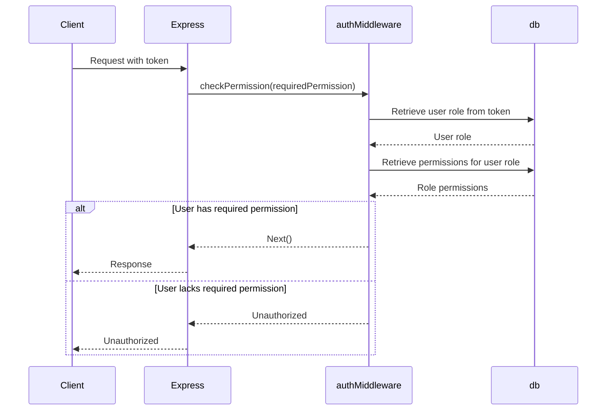
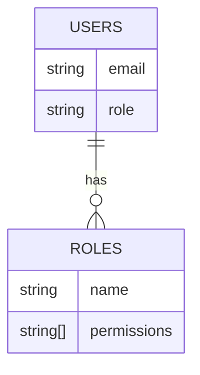

Relevant source files

The following files were used as context for generating this wiki page:

- [src/index.js](https://github.com/agattani123/access-control-service/blob/main/src/index.js)
- [src/routes.js](https://github.com/agattani123/access-control-service/blob/main/src/routes.js)
- [src/authMiddleware.js](https://github.com/agattani123/access-control-service/blob/main/src/authMiddleware.js)
- [src/db.js](https://github.com/agattani123/access-control-service/blob/main/src/db.js)

# Architecture Overview

The Access Control Service is a Node.js application built with Express.js that provides role-based access control (RBAC) functionality. It allows managing users, roles, and permissions, as well as generating access tokens for authenticated users based on their assigned roles. The service utilizes an in-memory data store to persist user, role, and permission data.

## Application Entry Point

The `index.js` file serves as the entry point for the application. It imports the necessary dependencies, configures the Express application, and sets up the API routes defined in `routes.js`. The application listens on the specified port, which can be configured via an environment variable.

Sources: [src/index.js]()

## API Routes

The `routes.js` file defines the API endpoints for the Access Control Service. It imports the necessary dependencies, including the `checkPermission` middleware function from `authMiddleware.js` and the in-memory data store `db.js`.

- `GET /api/users`: Retrieves a list of user emails and their associated roles. Requires the `view_users` permission.
- `POST /api/roles`: Creates a new role with the specified name and permissions. Requires the `create_role` permission.
- `GET /api/permissions`: Retrieves the list of defined roles and their associated permissions. Requires the `view_permissions` permission.
- `POST /api/tokens`: Assigns a role to a user, creating a new user-role mapping in the data store.

Sources: [src/routes.js]()

## Authentication Middleware

The `authMiddleware.js` module provides a `checkPermission` middleware function that validates if the authenticated user has the required permission based on their assigned role. It retrieves the user's role from the provided token, fetches the associated permissions from the data store, and checks if the required permission is present. If the user has the necessary permission, the request is allowed to proceed; otherwise, an unauthorized response is sent.

Sources: [src/authMiddleware.js](), [src/routes.js:4,9,13]()

## Data Store

The in-memory data store, defined in `db.js`, consists of two main entities: `users` and `roles`.

- `users`: An object that maps user emails to their assigned role names.
- `roles`: An object that maps role names to an array of associated permissions.

This data structure allows for efficient retrieval of user roles, role permissions, and user-role mappings.

Sources: [src/db.js]()

## Conclusion

The Access Control Service provides a simple yet effective role-based access control system for managing users, roles, and permissions. It exposes a RESTful API for performing CRUD operations on roles, retrieving user and permission data, and assigning roles to users. The service utilizes an in-memory data store for persistence and includes authentication middleware to enforce permission-based access control. This architecture allows for easy integration with other applications or services that require role-based access management.