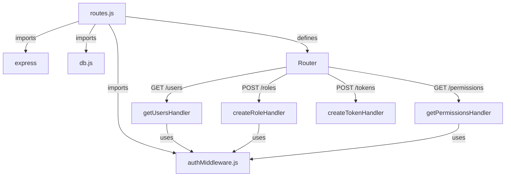
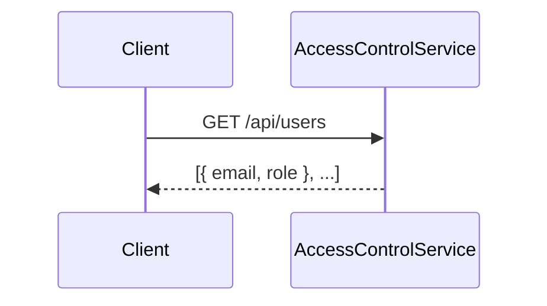
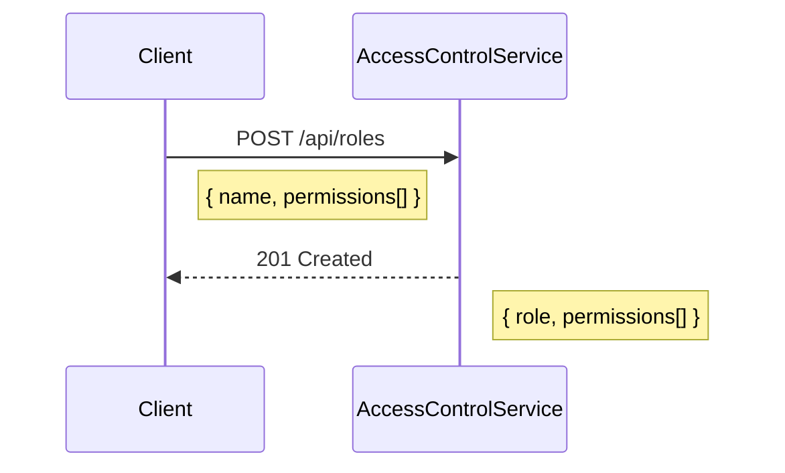
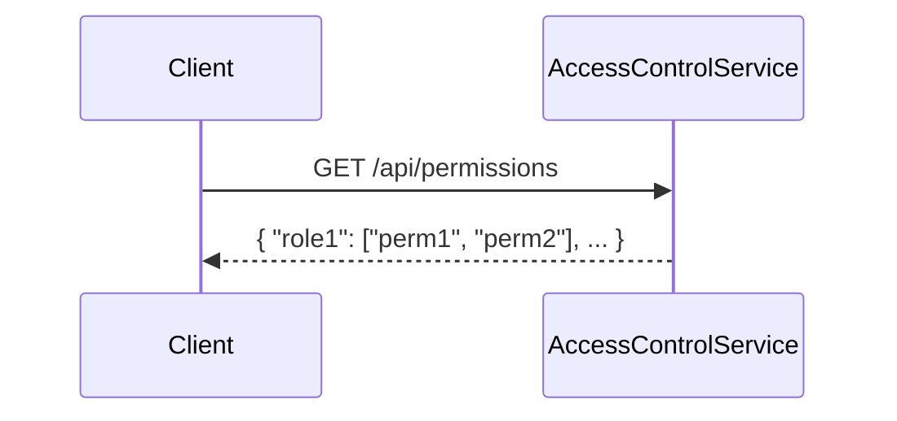
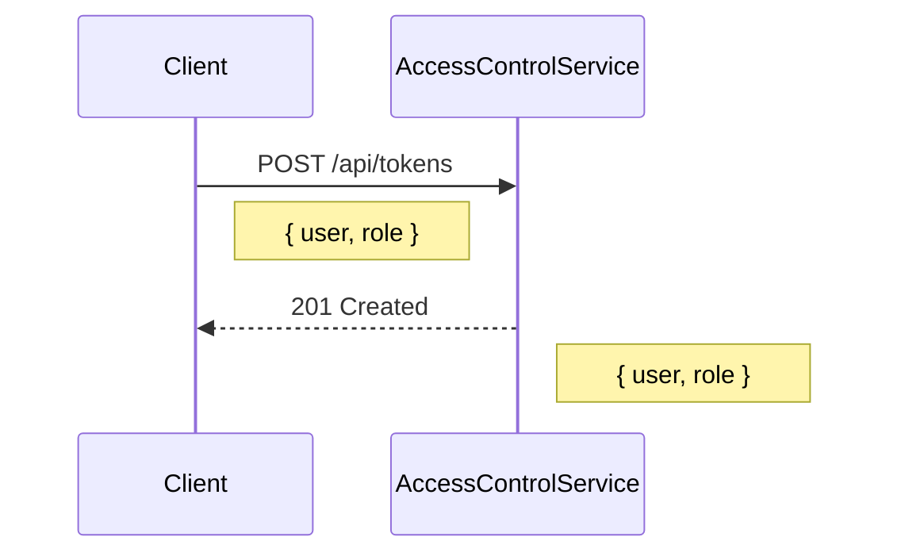
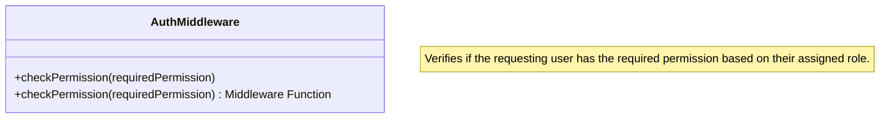
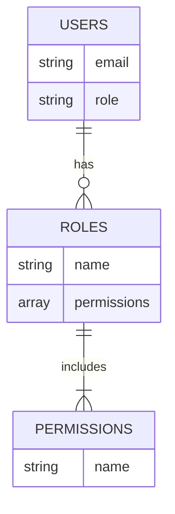

<details>
<summary>Relevant source files</summary>

The following files were used as context for generating this wiki page:

- [src/index.js](https://github.com/agattani123/access-control-service/blob/main/src/index.js)
- [src/routes.js](https://github.com/agattani123/access-control-service/blob/main/src/routes.js)
- [src/authMiddleware.js](https://github.com/agattani123/access-control-service/blob/main/src/authMiddleware.js) (assumed to exist based on import in routes.js)
- [src/db.js](https://github.com/agattani123/access-control-service/blob/main/src/db.js) (assumed to exist based on import in routes.js)

</details>

# Architecture Overview

This wiki page provides an overview of the architecture and components of the Access Control Service, a Node.js Express application responsible for managing user roles, permissions, and access tokens within a larger system.

## Application Entry Point

The main entry point of the application is the `index.js` file, which sets up the Express server and configures the necessary middleware and routes.

```mermaid
graph TD
    A[index.js] -->|imports| B[express]
    A -->|imports| C[dotenv]
    A -->|imports| D[routes.js]
    A -->|uses| E[express.json()]
    A -->|uses| F[app.use('/api', routes)]
    A -->|listens on| G[PORT]
```

Sources: [src/index.js]()

## Routing and Endpoints

The `routes.js` file defines the API endpoints and their corresponding handlers. It imports the `checkPermission` middleware from `authMiddleware.js` and the `db` module for data storage.



Sources: [src/routes.js]()

### User Management

The `/users` endpoint retrieves a list of all registered users and their associated roles.



Sources: [src/routes.js:5-8]()

### Role Management

The `/roles` endpoint allows creating new roles with a set of permissions.



Sources: [src/routes.js:11-17]()

The `/permissions` endpoint retrieves a mapping of all defined roles and their associated permissions.



Sources: [src/routes.js:19-21]()

### Token Management

The `/tokens` endpoint allows creating an access token for a user by associating them with a role.



Sources: [src/routes.js:23-29]()

## Authentication Middleware

The `authMiddleware.js` file (assumed to exist based on the import in `routes.js`) likely contains the implementation of the `checkPermission` middleware function used to enforce role-based access control for certain routes.



Sources: [src/routes.js:3]() (import statement)

## Data Storage

The `db.js` file (assumed to exist based on the import in `routes.js`) likely contains an in-memory data store for managing users, roles, and permissions.



Sources: [src/routes.js:4]() (import statement)

## Conclusion

The Access Control Service provides a RESTful API for managing user roles, permissions, and access tokens within a larger system. It follows a modular architecture with separate components for routing, authentication, and data storage. The service enforces role-based access control by requiring specific permissions for certain routes, ensuring secure and controlled access to sensitive operations.