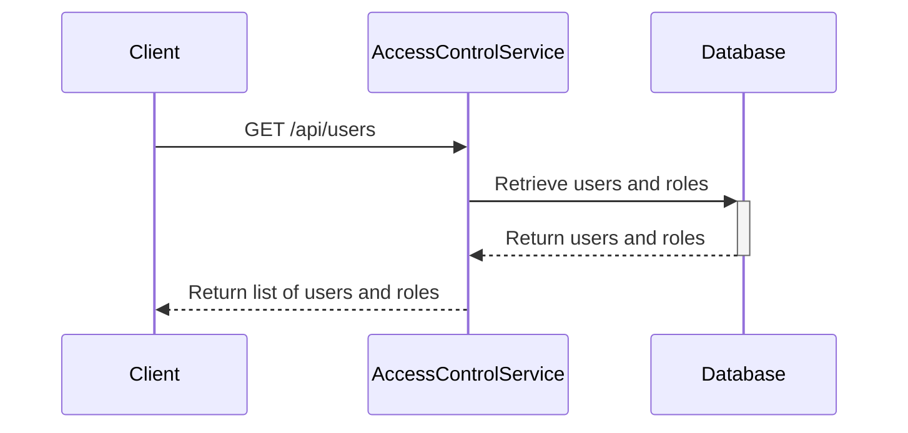
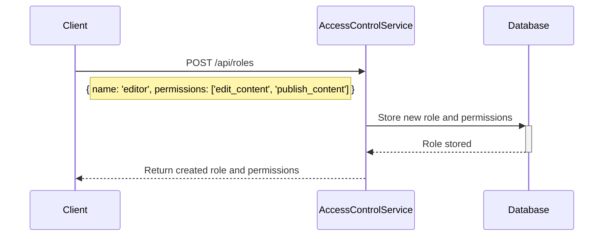
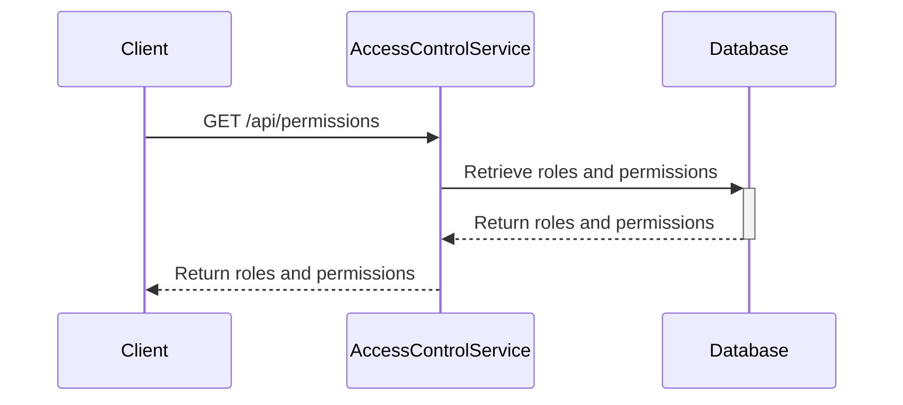
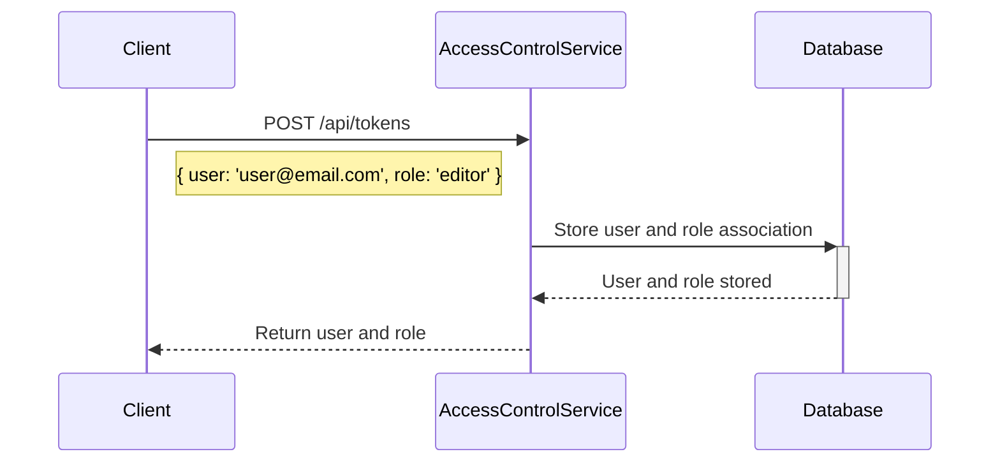

<details>
<summary>Relevant source files</summary>

The following files were used as context for generating this wiki page:

- [src/index.js](https://github.com/agattani123/access-control-service/blob/main/src/index.js)
- [src/routes.js](https://github.com/agattani123/access-control-service/blob/main/src/routes.js)
- [src/authMiddleware.js](https://github.com/agattani123/access-control-service/blob/main/src/authMiddleware.js) (assumed to exist based on import in routes.js)
- [src/db.js](https://github.com/agattani123/access-control-service/blob/main/src/db.js) (assumed to exist based on import in routes.js)
- [package.json](https://github.com/agattani123/access-control-service/blob/main/package.json) (assumed to exist for project dependencies)
</details>

# Architecture Overview

## Introduction

The Access Control Service is a Node.js application built with Express.js that provides a RESTful API for managing user roles, permissions, and authentication tokens. It serves as a centralized access control system for other applications or services within a larger project. The service maintains an in-memory database to store user roles, permissions, and associated users.

The core functionality includes:

- Retrieving a list of users and their assigned roles
- Creating and managing roles with associated permissions
- Viewing available permissions and their assigned roles
- Issuing authentication tokens by associating a user with a role
- Protecting routes with a middleware that checks for required permissions

Sources: [src/index.js](), [src/routes.js](), [src/authMiddleware.js](), [src/db.js]()

## Application Structure

The application follows a modular structure with separate files for different concerns:

- `index.js`: Entry point that sets up the Express app and starts the server.
- `routes.js`: Defines the API routes and their handlers.
- `authMiddleware.js`: Contains the `checkPermission` middleware function for route protection.
- `db.js`: Provides an in-memory data store for users, roles, and permissions.

Sources: [src/index.js](), [src/routes.js](), [src/authMiddleware.js](), [src/db.js]()

## Routing and Middleware

The application uses Express.js for routing and middleware management. The `routes.js` file defines the API endpoints and their corresponding handlers.

```mermaid
graph TD
    A[Express App] -->|app.use('/api', routes)| B[API Routes]
    B --> C[GET /users]
    B --> D[POST /roles]
    B --> E[GET /permissions]
    B --> F[POST /tokens]
    C -->|checkPermission('view_users')| G[Get Users]
    D -->|checkPermission('create_role')| H[Create Role]
    E -->|checkPermission('view_permissions')| I[Get Permissions]
    F -->|No Auth Check| J[Issue Token]
```

The `checkPermission` middleware from `authMiddleware.js` is used to protect certain routes by checking if the requesting user has the required permission.

Sources: [src/routes.js:1-33](), [src/authMiddleware.js]()

## Data Storage

The application uses an in-memory data store defined in `db.js` to store user roles, permissions, and associated users. This data store is a simple JavaScript object with the following structure:

```javascript
const db = {
  users: {
    // 'user@email.com': 'admin',
    // 'another@email.com': 'viewer'
  },
  roles: {
    // 'admin': ['view_users', 'create_role', 'view_permissions'],
    // 'viewer': ['view_users', 'view_permissions']
  }
};
```

The `users` object maps user email addresses to their assigned roles, while the `roles` object maps role names to their associated permissions.

Sources: [src/db.js]()

## User Management

The `/users` endpoint retrieves a list of users and their assigned roles from the in-memory data store.



This route is protected by the `checkPermission('view_users')` middleware, which ensures that only users with the `view_users` permission can access this endpoint.

Sources: [src/routes.js:5-7](), [src/authMiddleware.js]()

## Role Management

The `/roles` endpoint allows creating new roles with associated permissions. It accepts a JSON payload with the role name and an array of permissions.



This route is protected by the `checkPermission('create_role')` middleware, which ensures that only users with the `create_role` permission can create new roles.

Sources: [src/routes.js:9-16](), [src/authMiddleware.js]()

## Permission Management

The `/permissions` endpoint retrieves a list of all available roles and their associated permissions from the in-memory data store.



This route is protected by the `checkPermission('view_permissions')` middleware, which ensures that only users with the `view_permissions` permission can access this endpoint.

Sources: [src/routes.js:18-20](), [src/authMiddleware.js]()

## Token Management

The `/tokens` endpoint allows associating a user with a role, effectively issuing an authentication token for that user.



This route does not require any specific permission, as it is intended for user authentication and role assignment.

Sources: [src/routes.js:22-28]()

## Conclusion

The Access Control Service provides a centralized system for managing user roles, permissions, and authentication tokens within a larger project. It follows a modular structure with separate concerns for routing, middleware, and data storage. The service leverages Express.js for routing and middleware management, and an in-memory data store for storing user roles, permissions, and associated users. The `checkPermission` middleware is used to protect certain routes based on the requesting user's permissions.