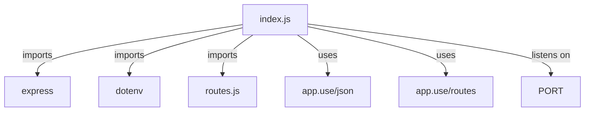
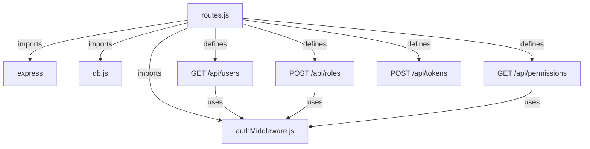
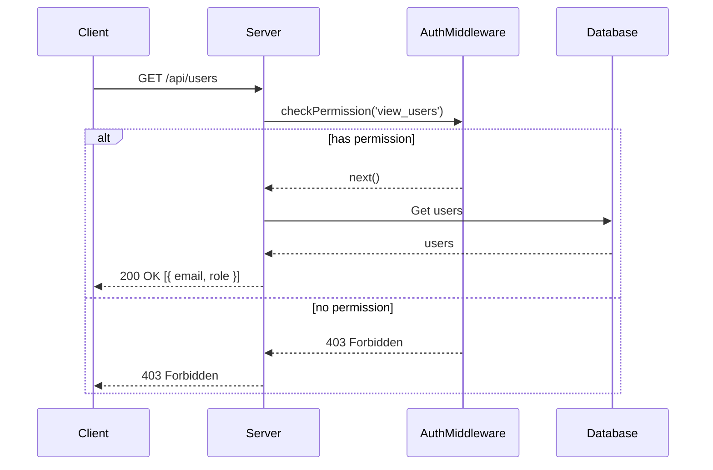
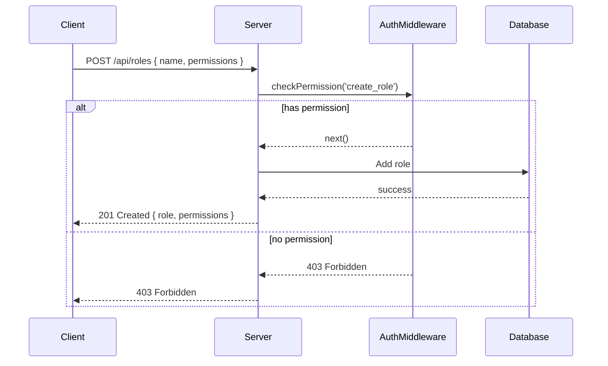
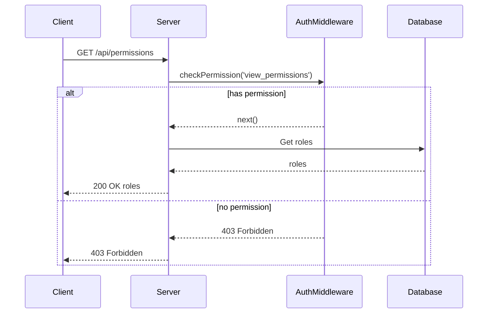
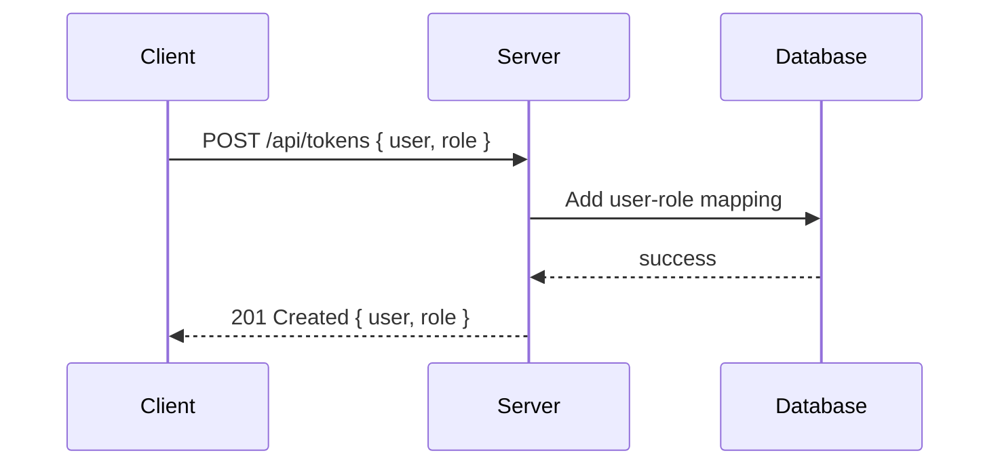
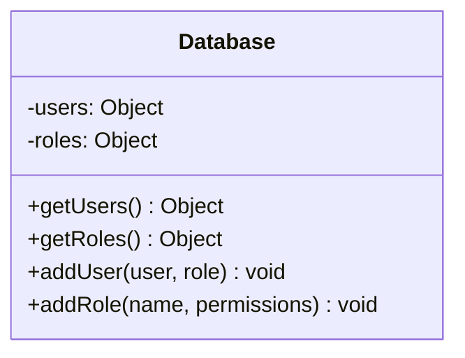
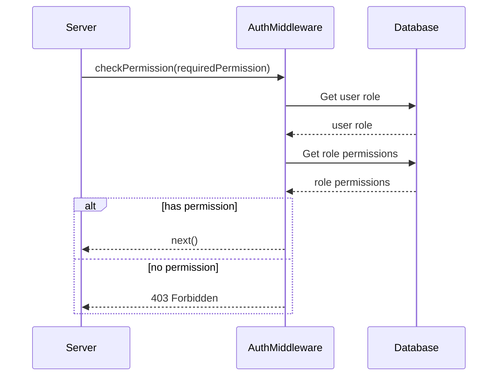

Relevant source files

The following files were used as context for generating this wiki page:

- [src/index.js](https://github.com/agattani123/access-control-service/blob/main/src/index.js)
- [src/routes.js](https://github.com/agattani123/access-control-service/blob/main/src/routes.js)
- [src/authMiddleware.js](https://github.com/agattani123/access-control-service/blob/main/src/authMiddleware.js) (assumed to exist based on import)
- [src/db.js](https://github.com/agattani123/access-control-service/blob/main/src/db.js) (assumed to exist based on import)

# Architecture Overview

The Access Control Service is a Node.js application built with Express.js that provides role-based access control (RBAC) functionality. It allows managing users, roles, permissions, and authentication tokens within the system.

## Application Setup

The application entry point is `src/index.js`, which sets up the Express server and imports the routes defined in `src/routes.js`. The server listens on the configured `PORT` environment variable or defaults to port 8080.

Sources: [src/index.js](https://github.com/agattani123/access-control-service/blob/main/src/index.js)

## Routing and Middleware

The `src/routes.js` file defines the API routes and middleware for the Access Control Service. It imports the `checkPermission` middleware from `src/authMiddleware.js` and the `db` module from `src/db.js`.

Sources: [src/routes.js](https://github.com/agattani123/access-control-service/blob/main/src/routes.js)

### User Management

The `/api/users` route retrieves a list of all users and their associated roles from the `db.users` object. It is protected by the `checkPermission('view_users')` middleware.

Sources: [src/routes.js:5-8](https://github.com/agattani123/access-control-service/blob/main/src/routes.js#L5-L8)

### Role Management

The `/api/roles` route allows creating a new role by providing a `name` and an array of `permissions`. It is protected by the `checkPermission('create_role')` middleware.

Sources: [src/routes.js:11-18](https://github.com/agattani123/access-control-service/blob/main/src/routes.js#L11-L18)

The `/api/permissions` route retrieves a list of all roles and their associated permissions from the `db.roles` object. It is protected by the `checkPermission('view_permissions')` middleware.

Sources: [src/routes.js:20-23](https://github.com/agattani123/access-control-service/blob/main/src/routes.js#L20-L23)

### Token Management

The `/api/tokens` route allows creating a new authentication token by providing a `user` and a `role`. It updates the `db.users` object with the new user-role mapping.

Sources: [src/routes.js:25-30](https://github.com/agattani123/access-control-service/blob/main/src/routes.js#L25-L30)

## Data Storage

The application uses an in-memory data store (`db.js`) to store user-role mappings and role-permission mappings. In a production environment, this would likely be replaced with a persistent database.

Sources: [src/routes.js](https://github.com/agattani123/access-control-service/blob/main/src/routes.js) (based on usage of `db.users` and `db.roles`)

## Authentication Middleware

The `checkPermission` middleware (imported from `src/authMiddleware.js`) is responsible for verifying if a user has the required permission to access a protected route. Its implementation is not provided in the given source files.

Sources: [src/routes.js](https://github.com/agattani123/access-control-service/blob/main/src/routes.js) (based on usage of `checkPermission` middleware)

## Summary

The Access Control Service provides a RESTful API for managing users, roles, permissions, and authentication tokens within a system. It implements role-based access control (RBAC) by associating users with roles and roles with permissions. The application uses an in-memory data store for storing user-role and role-permission mappings, and employs middleware to enforce access control on protected routes.

While the provided source files cover the core functionality of the service, additional components like authentication, authorization, and persistent data storage would be required for a production-ready implementation.