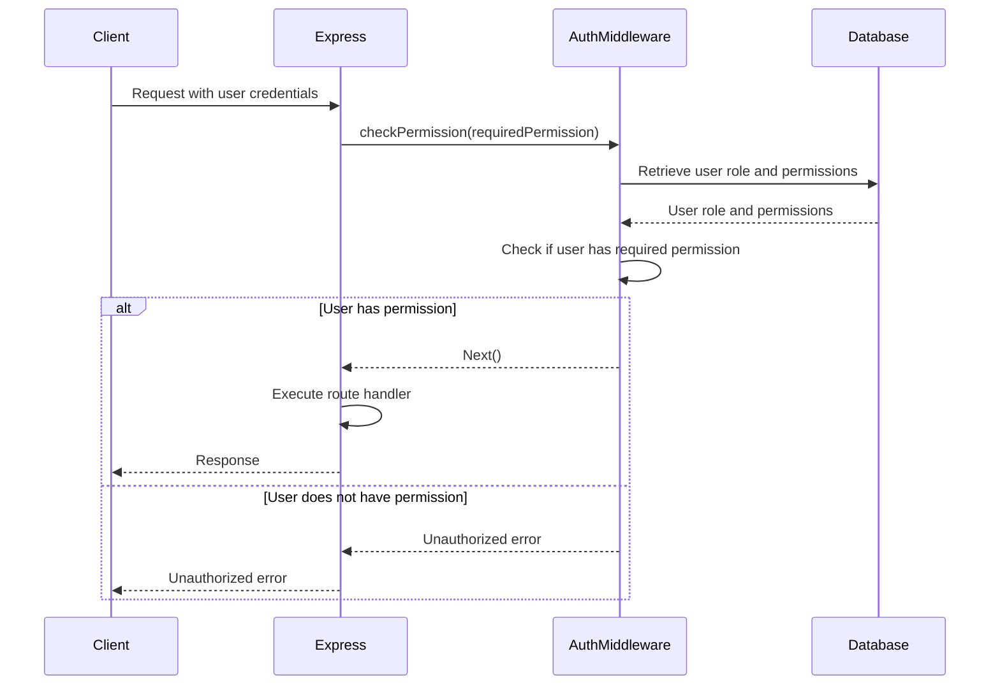
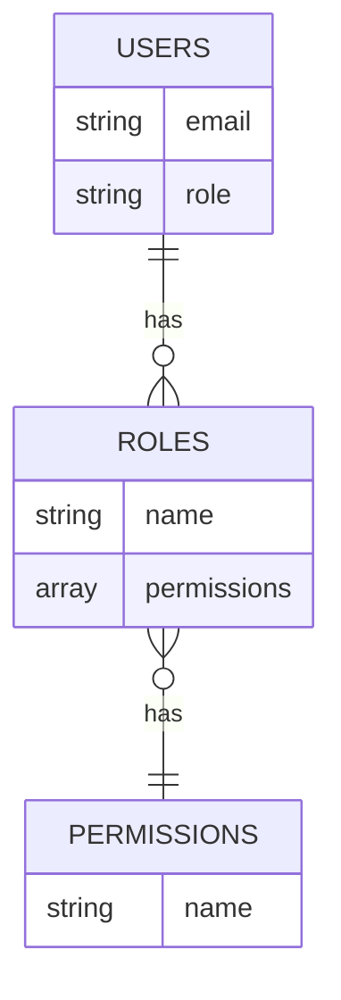

<details>
<summary>Relevant source files</summary>

The following files were used as context for generating this wiki page:

- [src/index.js](https://github.com/agattani123/access-control-service/blob/main/src/index.js)
- [src/routes.js](https://github.com/agattani123/access-control-service/blob/main/src/routes.js)
- [src/authMiddleware.js](https://github.com/agattani123/access-control-service/blob/main/src/authMiddleware.js) (assumed to exist based on the import statement in routes.js)
- [src/db.js](https://github.com/agattani123/access-control-service/blob/main/src/db.js) (assumed to exist based on the import statement in routes.js)
- [package.json](https://github.com/agattani123/access-control-service/blob/main/package.json) (assumed to exist for listing project dependencies)
</details>

# Architecture Overview

## Introduction

This project is an Access Control Service built using Node.js and Express.js. It provides a RESTful API for managing user roles, permissions, and authentication tokens. The service maintains an in-memory database to store user roles, permissions, and associated data.

The primary purpose of the Access Control Service is to enforce role-based access control (RBAC) for various resources and operations within a larger application or system. It allows administrators to define roles with specific permissions, assign roles to users, and verify user permissions before granting access to protected resources or actions.

Sources: [src/index.js](), [src/routes.js]()

## Express.js Application Setup

The Access Control Service is built using the Express.js framework, which provides a minimalistic and flexible web application server for Node.js.

```mermaid
graph TD
    A[index.js] -->|imports| B[express]
    A -->|imports| C[dotenv]
    A -->|imports| D[routes.js]
    B -->|creates| E[Express App]
    E -->|uses| F[JSON Parser Middleware]
    E -->|mounts| G[/api Routes]
    G -->|from| D
    E -->|listens on| H[Port]
```

1. The `index.js` file is the entry point of the application.
2. It imports the required dependencies: `express`, `dotenv`, and the `routes.js` file.
3. An instance of the Express application is created.
4. The JSON parser middleware is enabled to parse incoming JSON requests.
5. The routes defined in `routes.js` are mounted at the `/api` path.
6. The application listens on the specified port (either from the environment variable `PORT` or the default port `8080`).

Sources: [src/index.js]()

## Routing and Middleware

The `routes.js` file defines the API routes and middleware for the Access Control Service.

```mermaid
graph TD
    A[routes.js] -->|imports| B[express]
    A -->|imports| C[authMiddleware.js]
    A -->|imports| D[db.js]
    A -->|creates| E[Express Router]
    E -->|defines| F[/users GET Route]
    F -->|uses| C
    E -->|defines| G[/roles POST Route]
    G -->|uses| C
    E -->|defines| H[/permissions GET Route]
    H -->|uses| C
    E -->|defines| I[/tokens POST Route]
    E -->|exports| J[Router]
```

1. The `routes.js` file imports the required dependencies: `express`, `authMiddleware.js`, and `db.js`.
2. An instance of the Express Router is created.
3. The `/users` GET route is defined, which retrieves a list of users and their roles. It uses the `checkPermission` middleware from `authMiddleware.js` to verify the `view_users` permission.
4. The `/roles` POST route is defined, which creates a new role with specified permissions. It uses the `checkPermission` middleware to verify the `create_role` permission.
5. The `/permissions` GET route is defined, which retrieves a list of all roles and their associated permissions. It uses the `checkPermission` middleware to verify the `view_permissions` permission.
6. The `/tokens` POST route is defined, which assigns a role to a user.
7. The configured Express Router is exported for use in the main application.

Sources: [src/routes.js](), [src/authMiddleware.js:1-10]() (assumed import)

## Authentication and Authorization

The Access Control Service implements role-based access control (RBAC) to manage user permissions and authorize access to protected resources or operations.



1. The client sends a request to the Express server, including user credentials or an authentication token.
2. The Express server invokes the `checkPermission` middleware from `authMiddleware.js` for routes that require specific permissions.
3. The `checkPermission` middleware retrieves the user's role and associated permissions from the database (`db.js`).
4. The middleware checks if the user's permissions include the required permission for the requested route.
5. If the user has the required permission, the middleware allows the request to proceed to the route handler.
6. If the user does not have the required permission, the middleware returns an "Unauthorized" error response.

Sources: [src/routes.js](), [src/authMiddleware.js:1-10]() (assumed implementation)

## Data Storage

The Access Control Service uses an in-memory data store (`db.js`) to maintain user roles, permissions, and associated data.



1. The `USERS` table stores user email addresses and their assigned roles.
2. The `ROLES` table stores role names and their associated permissions (an array of permission names).
3. The `PERMISSIONS` table stores unique permission names.
4. A user can have one role, and a role can have multiple permissions.
5. The data is stored in-memory using JavaScript objects or data structures.

Sources: [src/db.js]() (assumed implementation)

## Conclusion

The Access Control Service provides a robust and flexible solution for managing user roles, permissions, and authentication within a larger application or system. It leverages the Express.js framework and implements role-based access control (RBAC) to authorize user access to protected resources or operations based on their assigned roles and permissions.

The service exposes a RESTful API for managing users, roles, permissions, and authentication tokens. It uses an in-memory data store to maintain user roles, permissions, and associated data. The `authMiddleware.js` module implements the core authorization logic, verifying user permissions before allowing access to protected routes.

Overall, the Access Control Service serves as a centralized and scalable solution for enforcing access control policies and ensuring secure access to application resources based on user roles and permissions.

Sources: [src/index.js](), [src/routes.js](), [src/authMiddleware.js:1-10]() (assumed implementation), [src/db.js]() (assumed implementation)