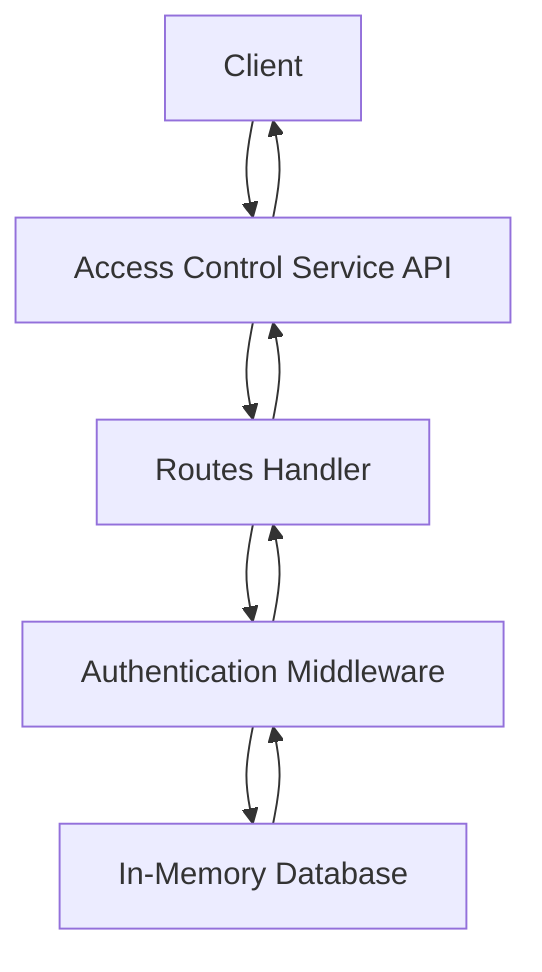
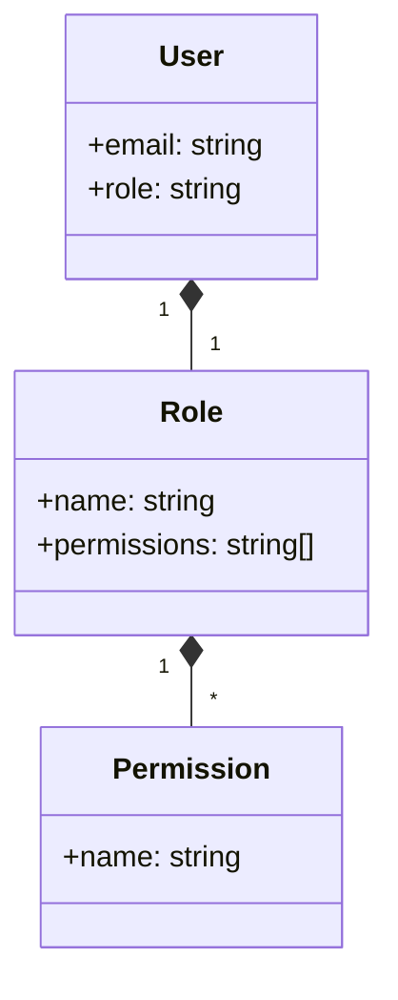

<details>
<summary>Relevant source files</summary>

The following files were used as context for generating this wiki page:

- [src/index.js](https://github.com/agattani123/access-control-service/blob/main/src/index.js)
- [src/routes.js](https://github.com/agattani123/access-control-service/blob/main/src/routes.js)
- [src/authMiddleware.js](https://github.com/agattani123/access-control-service/blob/main/src/authMiddleware.js)
- [src/db.js](https://github.com/agattani123/access-control-service/blob/main/src/db.js)
- [package.json](https://github.com/agattani123/access-control-service/blob/main/package.json)
</details>

# Architecture Overview

The Access Control Service is a Node.js application built with Express.js that provides a RESTful API for managing user roles, permissions, and authentication tokens. It serves as a centralized access control system for other services or applications within the project.

## Application Structure

The application follows a modular structure with separate files for different concerns:

- `index.js`: The entry point that sets up the Express application, configures middleware, and starts the server.
- `routes.js`: Defines the API routes and their corresponding handlers.
- `authMiddleware.js`: Contains middleware functions for checking user permissions.
- `db.js`: Provides an in-memory data store for storing user roles, permissions, and authentication tokens.

Sources: [src/index.js](), [src/routes.js](), [src/authMiddleware.js](), [src/db.js]()

## Data Flow

The application follows a typical request-response cycle for handling API requests:



1. The client sends a request to the Access Control Service API.
2. The API routes handler (`routes.js`) receives the request and invokes the appropriate route handler.
3. If the route requires authentication, the authentication middleware (`authMiddleware.js`) checks the user's permissions against the in-memory database (`db.js`).
4. The database responds with the user's role and permissions.
5. The middleware either allows or denies the request based on the user's permissions.
6. The route handler processes the request and returns the appropriate response.
7. The response is sent back to the client.

Sources: [src/index.js:7-10](), [src/routes.js](), [src/authMiddleware.js](), [src/db.js]()

## API Routes

The application exposes the following API routes:

### GET `/api/users`

Retrieves a list of all registered users and their roles.

- **Permissions Required**: `view_users`

Sources: [src/routes.js:5-7]()

### POST `/api/roles`

Creates a new role with a set of permissions.

- **Permissions Required**: `create_role`
- **Request Body**:
  - `name` (string): The name of the new role.
  - `permissions` (array): An array of permission strings for the new role.

Sources: [src/routes.js:9-15]()

### GET `/api/permissions`

Retrieves a list of all defined roles and their associated permissions.

- **Permissions Required**: `view_permissions`

Sources: [src/routes.js:17-19]()

### POST `/api/tokens`

Assigns a role to a user, effectively creating an authentication token.

- **Request Body**:
  - `user` (string): The user's identifier (e.g., email).
  - `role` (string): The name of the role to assign to the user.

Sources: [src/routes.js:21-27]()

## Authentication and Authorization

The application uses a role-based access control (RBAC) model for authentication and authorization. Users are assigned roles, and roles are associated with specific permissions.



The `authMiddleware.js` module contains a `checkPermission` middleware function that checks if the user has the required permission for a given route. If the user is not authenticated or does not have the required permission, the request is denied with a 403 Forbidden response.

Sources: [src/authMiddleware.js](), [src/routes.js:5,9,17]()

## Data Storage

The application uses an in-memory data store (`db.js`) to store user roles, permissions, and authentication tokens. This data store is a simple JavaScript object with the following structure:

```javascript
const db = {
  users: {
    'user1@example.com': 'admin',
    'user2@example.com': 'viewer',
    // ...
  },
  roles: {
    'admin': ['view_users', 'create_role', 'view_permissions'],
    'viewer': ['view_users', 'view_permissions'],
    // ...
  }
}
```

In a production environment, this data store should be replaced with a more robust and persistent storage solution, such as a database.

Sources: [src/db.js]()

## Dependencies

The application relies on the following third-party dependencies:

| Dependency | Version | Description |
| --- | --- | --- |
| express | ^4.18.2 | Fast, unopinionated, minimalist web framework for Node.js |
| dotenv | ^16.0.3 | Loads environment variables from a `.env` file |

Sources: [package.json]()

## Conclusion

The Access Control Service provides a centralized and extensible solution for managing user roles, permissions, and authentication within the project. It follows a modular architecture and leverages the Express.js framework to expose a RESTful API. The application's use of role-based access control and in-memory data storage simplifies the management of user access and permissions, although a more robust storage solution should be considered for production environments.