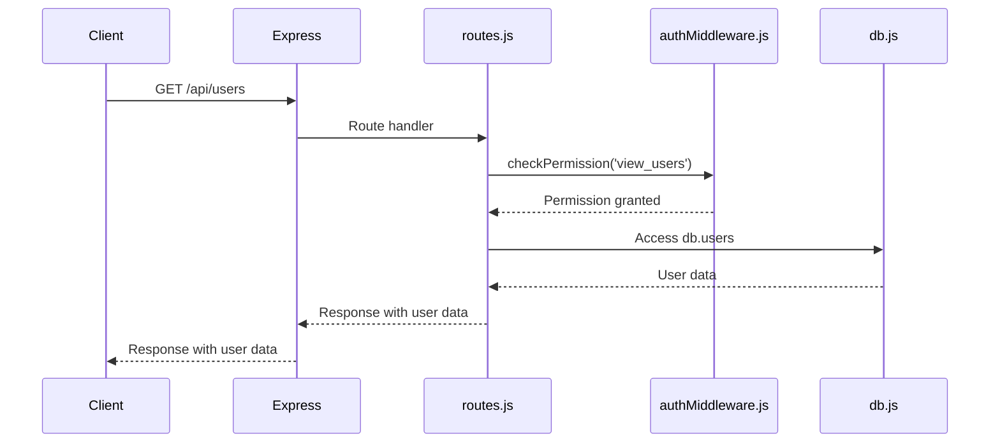
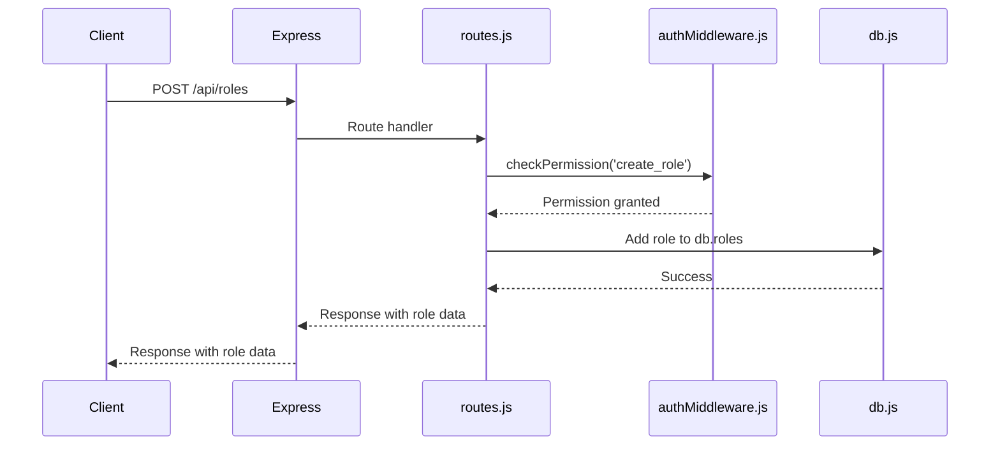
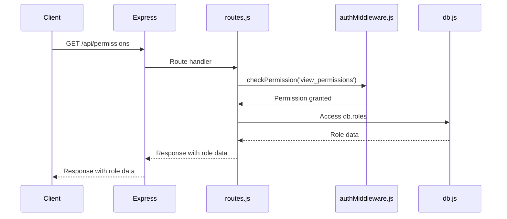
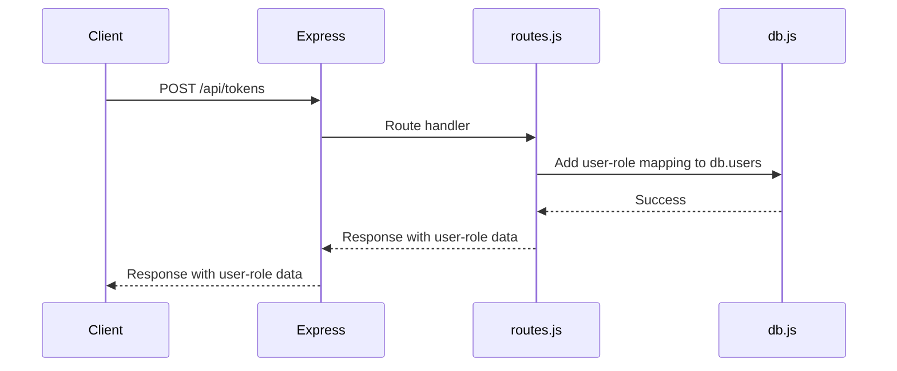
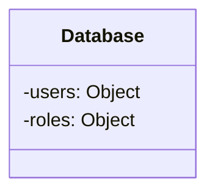
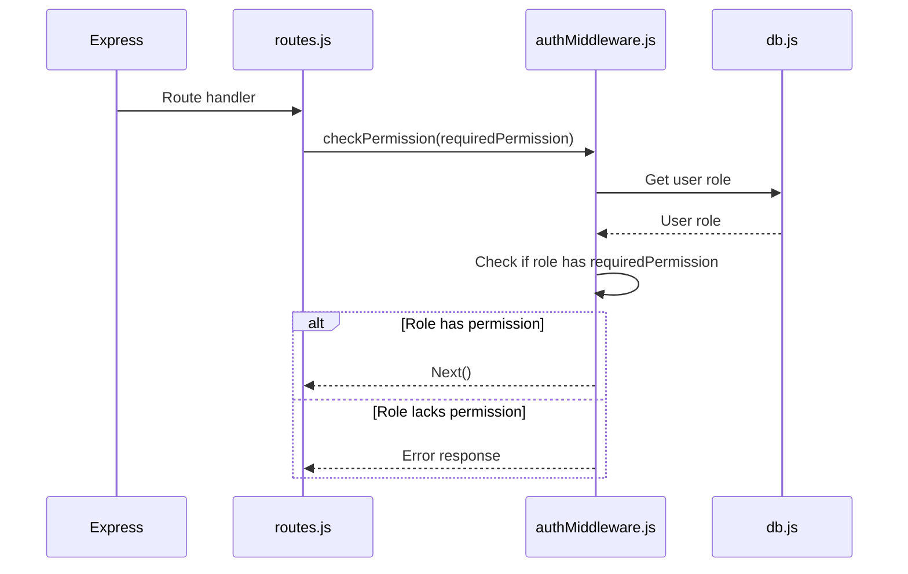

<details>
<summary>Relevant source files</summary>

The following files were used as context for generating this wiki page:

- [src/index.js](https://github.com/agattani123/access-control-service/blob/main/src/index.js)
- [src/routes.js](https://github.com/agattani123/access-control-service/blob/main/src/routes.js)
- [src/authMiddleware.js](https://github.com/agattani123/access-control-service/blob/main/src/authMiddleware.js) (assumed to exist based on import in routes.js)
- [src/db.js](https://github.com/agattani123/access-control-service/blob/main/src/db.js) (assumed to exist based on import in routes.js)

</details>

# Architecture Overview

This wiki page provides an overview of the architecture and components of the Access Control Service, a Node.js application built with Express.js. The service manages user roles, permissions, and authentication tokens within a system.

## Application Structure

The application follows a typical Express.js structure, with the main entry point defined in `src/index.js`. This file sets up the Express application, configures middleware, and mounts the API routes defined in `src/routes.js`.

```mermaid
graph TD
    A[index.js] -->|imports| B[express]
    A -->|imports| C[dotenv]
    A -->|imports| D[routes.js]
    A -->|uses| E[express.json() middleware]
    A -->|mounts| F[/api routes]
    A -->|listens on| G[configured port]
```

Sources: [src/index.js](https://github.com/agattani123/access-control-service/blob/main/src/index.js)

## API Routes

The `src/routes.js` file defines the API routes and their corresponding handlers. It imports the `checkPermission` middleware from `src/authMiddleware.js` and the `db` module from `src/db.js`.

```mermaid
graph TD
    A[routes.js] -->|imports| B[express]
    A -->|imports| C[authMiddleware.js]
    A -->|imports| D[db.js]
    A -->|defines| E[/users GET route]
    A -->|defines| F[/roles POST route]
    A -->|defines| G[/permissions GET route]
    A -->|defines| H[/tokens POST route]
    E -->|uses| C
    F -->|uses| C
    G -->|uses| C
```

Sources: [src/routes.js](https://github.com/agattani123/access-control-service/blob/main/src/routes.js)

### User Management

The `/users` GET route retrieves a list of users and their associated roles from the `db.users` object. It requires the `view_users` permission, which is checked by the `checkPermission` middleware.



Sources: [src/routes.js:5-8](https://github.com/agattani123/access-control-service/blob/main/src/routes.js#L5-L8)

### Role Management

The `/roles` POST route allows creating a new role by providing a name and an array of associated permissions. It requires the `create_role` permission.



Sources: [src/routes.js:11-17](https://github.com/agattani123/access-control-service/blob/main/src/routes.js#L11-L17)

The `/permissions` GET route retrieves the list of roles and their associated permissions from the `db.roles` object. It requires the `view_permissions` permission.



Sources: [src/routes.js:19-22](https://github.com/agattani123/access-control-service/blob/main/src/routes.js#L19-L22)

### Token Management

The `/tokens` POST route associates a user with a role by adding an entry to the `db.users` object. It does not require any specific permission.



Sources: [src/routes.js:24-29](https://github.com/agattani123/access-control-service/blob/main/src/routes.js#L24-L29)

## Data Storage

The application uses an in-memory data store defined in `src/db.js` to store user roles, permissions, and user-role mappings. This is likely a simplified implementation for demonstration purposes and would need to be replaced with a persistent data store in a production environment.



Sources: [src/db.js](https://github.com/agattani123/access-control-service/blob/main/src/db.js) (assumed file based on import in routes.js)

## Authentication Middleware

The `src/authMiddleware.js` file (assumed to exist based on the import in `src/routes.js`) likely contains the implementation of the `checkPermission` middleware function used to verify user permissions for certain routes.



Sources: [src/routes.js](https://github.com/agattani123/access-control-service/blob/main/src/routes.js) (import of authMiddleware.js)

## Summary

The Access Control Service provides a set of API endpoints for managing user roles, permissions, and authentication tokens. It uses an in-memory data store and a middleware function to enforce permission-based access control. The architecture follows a typical Express.js structure, with routes defined in `src/routes.js` and middleware components imported from other files.

While this overview covers the core functionality based on the provided source files, it's important to note that additional features, security considerations, and best practices may be implemented in a production-ready access control system.