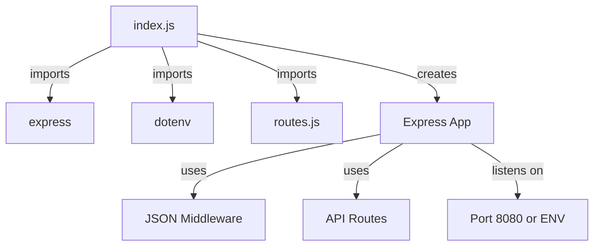
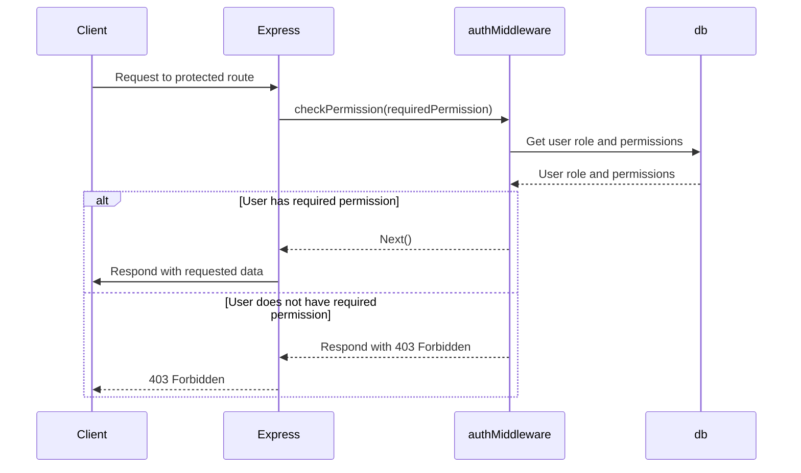
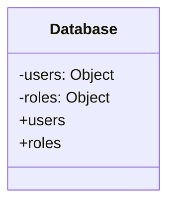
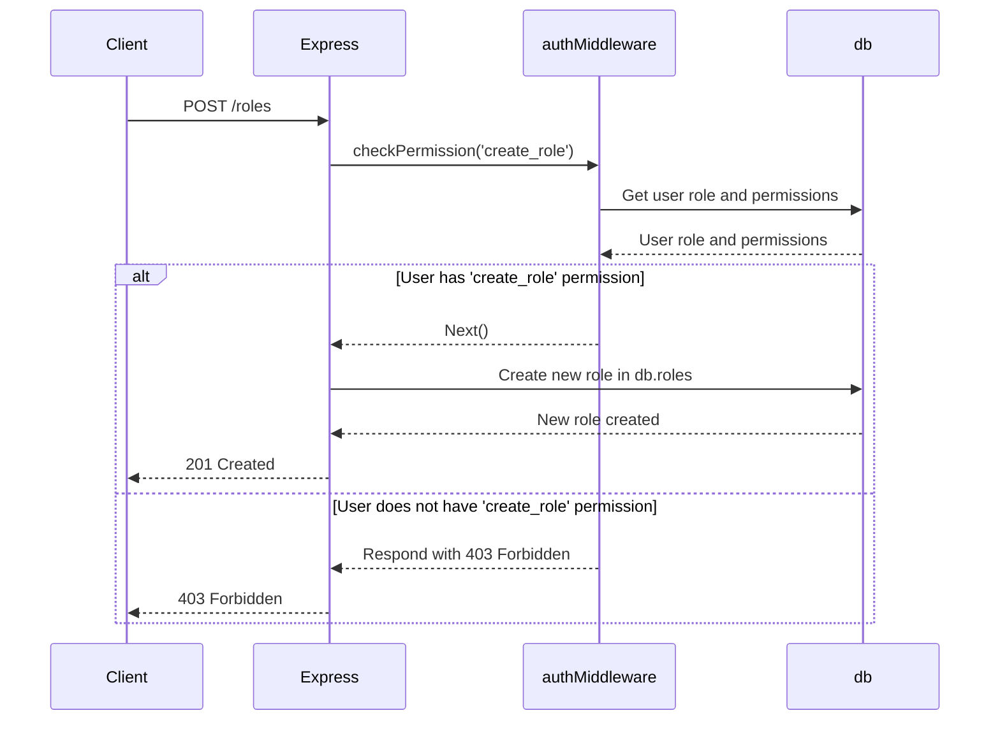
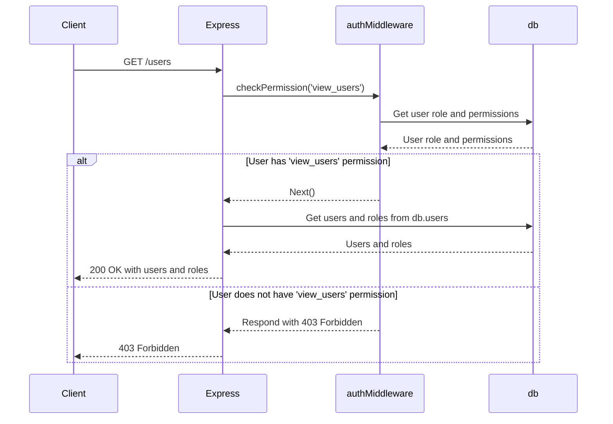
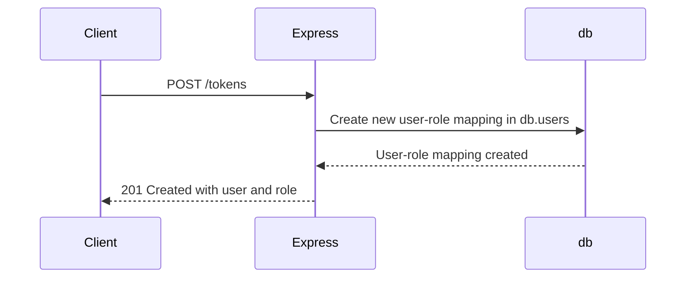

<details>
<summary>Relevant source files</summary>

The following files were used as context for generating this wiki page:

- [src/index.js](https://github.com/agattani123/access-control-service/blob/main/src/index.js)
- [src/routes.js](https://github.com/agattani123/access-control-service/blob/main/src/routes.js)
- [src/authMiddleware.js](https://github.com/agattani123/access-control-service/blob/main/src/authMiddleware.js)
- [src/db.js](https://github.com/agattani123/access-control-service/blob/main/src/db.js)

</details>

# Architecture Overview

The provided source files represent an Access Control Service built with Node.js and Express.js. This service manages user roles, permissions, and authentication tokens within an application or system. It provides a RESTful API for creating roles, assigning permissions to roles, viewing users and their roles, and generating authentication tokens.

## Express.js Application Setup

The main entry point of the application is `index.js`, which sets up the Express.js server and configures the necessary middleware and routes.



Sources: [index.js](https://github.com/agattani123/access-control-service/blob/main/src/index.js)

## API Routes and Endpoints

The `routes.js` file defines the API routes and endpoints for the Access Control Service. It imports the necessary middleware and database modules.

```mermaid
graph TD
    A[routes.js] -->|imports| B[express]
    A -->|imports| C[authMiddleware.js]
    A -->|imports| D[db.js]
    A -->|creates| E[Express Router]
    E -->|GET| F[/users]
    F -->|uses| G[checkPermission('view_users')]
    E -->|POST| H[/roles]
    H -->|uses| I[checkPermission('create_role')]
    E -->|GET| J[/permissions]
    J -->|uses| K[checkPermission('view_permissions')]
    E -->|GET| L[/permission]
    L -->|uses| K
    E -->|POST| M[/tokens]
    E -->|GET| N[/testing]
```

Sources: [routes.js](https://github.com/agattani123/access-control-service/blob/main/src/routes.js)

### Endpoints

| Endpoint | Method | Description | Permission Required |
| --- | --- | --- | --- |
| `/users` | GET | Get a list of users and their roles | `view_users` |
| `/roles` | POST | Create a new role with specified permissions | `create_role` |
| `/permissions` | GET | Get a list of all roles and their permissions | `view_permissions` |
| `/permission` | GET | Get a list of all roles and their permissions (duplicate of `/permissions`) | `view_permissions` |
| `/tokens` | POST | Create a new authentication token for a user with a specified role | None |
| `/testing` | GET | Endpoint for testing purposes (not documented) | None |

Sources: [routes.js](https://github.com/agattani123/access-control-service/blob/main/src/routes.js)

## Authentication Middleware

The `authMiddleware.js` file contains a middleware function `checkPermission` that checks if the authenticated user has the required permission to access a specific route.



Sources: [authMiddleware.js](https://github.com/agattani123/access-control-service/blob/main/src/authMiddleware.js)

## In-Memory Database

The `db.js` file provides an in-memory database for storing user roles, permissions, and authentication tokens. It uses JavaScript objects to represent the data structures.



The `users` object maps user identifiers (e.g., email addresses) to their assigned roles, while the `roles` object maps role names to their associated permissions (an array of permission strings).

Sources: [db.js](https://github.com/agattani123/access-control-service/blob/main/src/db.js)

## Data Flow and Sequence Diagrams

### Creating a New Role



Sources: [routes.js:18-24](https://github.com/agattani123/access-control-service/blob/main/src/routes.js#L18-L24)

### Viewing Users and Roles



Sources: [routes.js:14-16](https://github.com/agattani123/access-control-service/blob/main/src/routes.js#L14-L16)

### Creating an Authentication Token



Sources: [routes.js:28-33](https://github.com/agattani123/access-control-service/blob/main/src/routes.js#L28-L33)

## Conclusion

The Access Control Service provides a RESTful API for managing user roles, permissions, and authentication tokens within an application or system. It leverages Express.js for routing and middleware, and an in-memory database for storing user and role data. The service implements role-based access control (RBAC) by checking user permissions before allowing access to certain routes. While the current implementation uses an in-memory database, it can be extended to integrate with a persistent database solution for production use cases.