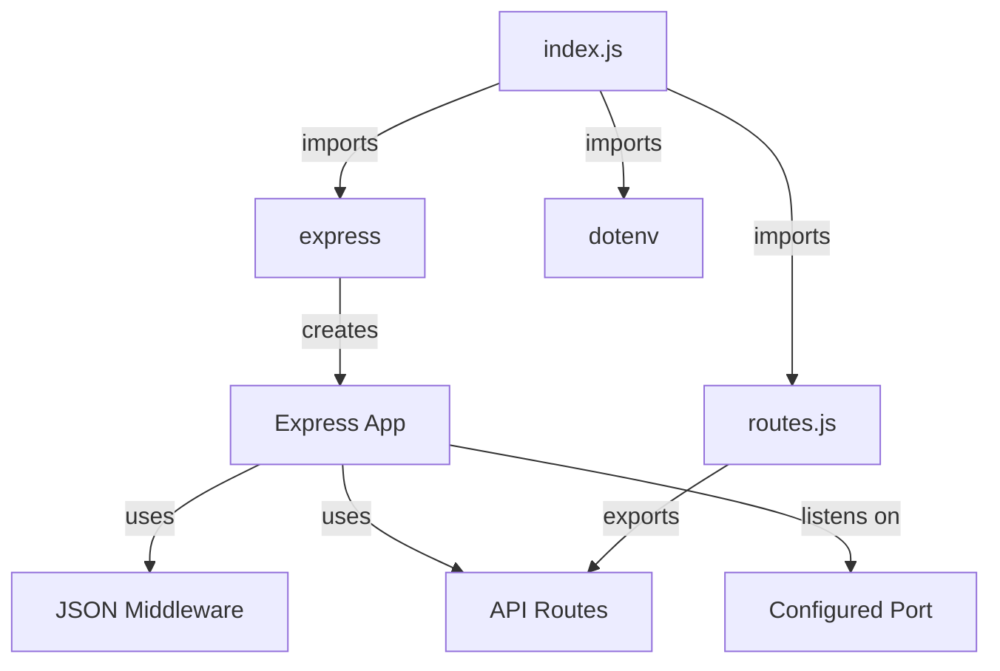
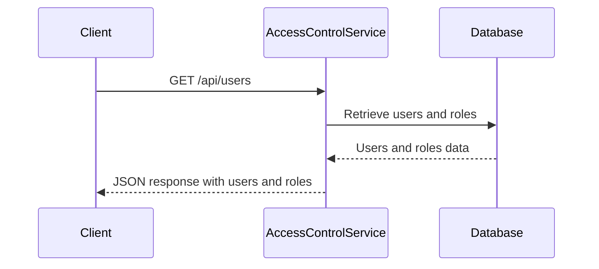
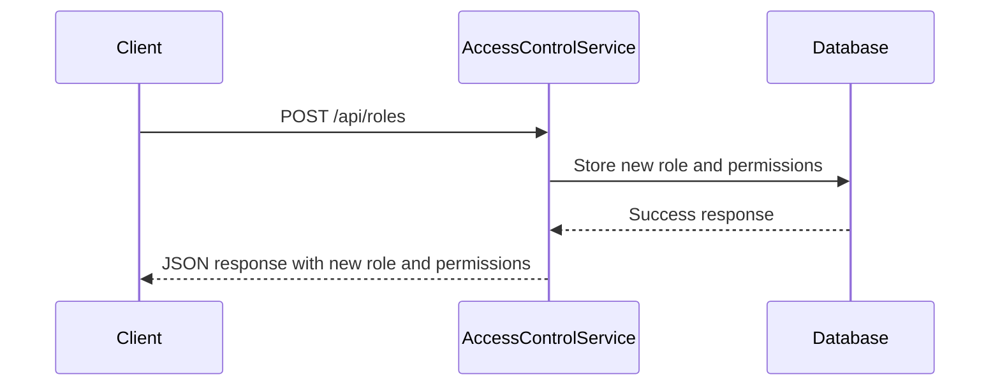
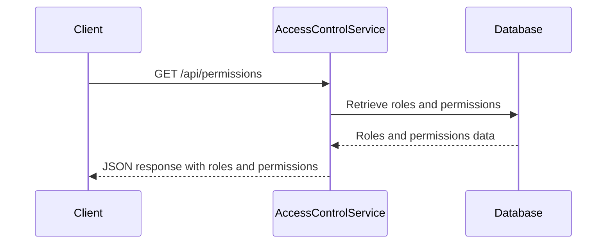
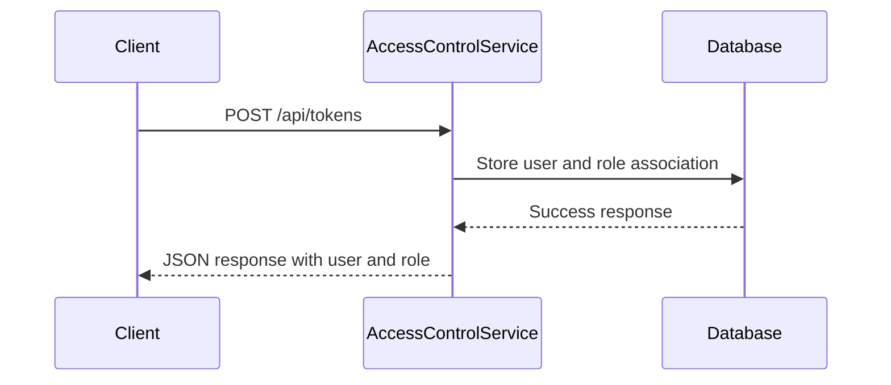
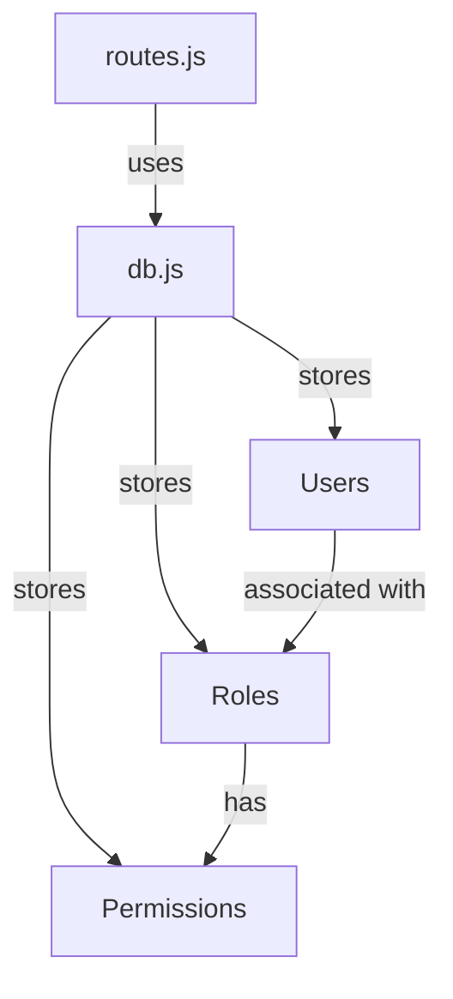

<details>
<summary>Relevant source files</summary>

The following files were used as context for generating this wiki page:

- [src/index.js](https://github.com/agattani123/access-control-service/blob/main/src/index.js)
- [src/routes.js](https://github.com/agattani123/access-control-service/blob/main/src/routes.js)
- [src/authMiddleware.js](https://github.com/agattani123/access-control-service/blob/main/src/authMiddleware.js) (assumed to exist based on import)
- [src/db.js](https://github.com/agattani123/access-control-service/blob/main/src/db.js) (assumed to exist based on import)

</details>

# Architecture Overview

The Access Control Service is a Node.js application built with Express.js that provides a RESTful API for managing user roles, permissions, and authentication tokens. It serves as a centralized access control system for other services or applications within the project.

## Application Setup

The application entry point is defined in `src/index.js`. It sets up the Express.js server, configures middleware, and defines the API routes.



Sources: [src/index.js](https://github.com/agattani123/access-control-service/blob/main/src/index.js)

## API Routes

The API routes are defined in `src/routes.js`. The routes handle various operations related to users, roles, permissions, and authentication tokens.

```mermaid
graph TD
    A[routes.js] -->|imports| B[express]
    A -->|imports| C[authMiddleware]
    A -->|imports| D[db]
    B -->|creates| E[Router]
    E -->|GET| F[/api/users]
    F -->|uses| C
    E -->|POST| G[/api/roles]
    G -->|uses| C
    E -->|GET| H[/api/permissions]
    H -->|uses| C
    E -->|POST| I[/api/tokens]
```

Sources: [src/routes.js](https://github.com/agattani123/access-control-service/blob/main/src/routes.js)

### User Management

The `/api/users` route retrieves a list of all registered users and their associated roles.



Sources: [src/routes.js:4-6](https://github.com/agattani123/access-control-service/blob/main/src/routes.js#L4-L6)

### Role Management

The `/api/roles` route allows creating a new role with a set of permissions.



Sources: [src/routes.js:8-14](https://github.com/agattani123/access-control-service/blob/main/src/routes.js#L8-L14)

### Permission Management

The `/api/permissions` route retrieves a list of all defined roles and their associated permissions.



Sources: [src/routes.js:16-18](https://github.com/agattani123/access-control-service/blob/main/src/routes.js#L16-L18)

### Token Management

The `/api/tokens` route allows creating an authentication token for a user by associating them with a role.



Sources: [src/routes.js:20-26](https://github.com/agattani123/access-control-service/blob/main/src/routes.js#L20-L26)

## Authentication Middleware

The `authMiddleware.js` module (assumed to exist based on the import in `src/routes.js`) likely contains a middleware function `checkPermission` that is used to enforce access control based on user roles and permissions.

```mermaid
graph TD
    A[routes.js] -->|uses| B[authMiddleware.js]
    B -->|exports| C[checkPermission]
    C -->|used by| D[/api/users]
    C -->|used by| E[/api/roles]
    C -->|used by| F[/api/permissions]
```

Sources: [src/routes.js:2](https://github.com/agattani123/access-control-service/blob/main/src/routes.js#L2)

## Data Storage

The `db.js` module (assumed to exist based on the import in `src/routes.js`) likely serves as an in-memory data store for users, roles, and permissions.



Sources: [src/routes.js:3](https://github.com/agattani123/access-control-service/blob/main/src/routes.js#L3)

## Summary

The Access Control Service provides a RESTful API for managing user roles, permissions, and authentication tokens. It allows creating and retrieving roles and permissions, associating users with roles, and enforcing access control based on user roles and permissions. The service uses an in-memory data store for storing user, role, and permission information.