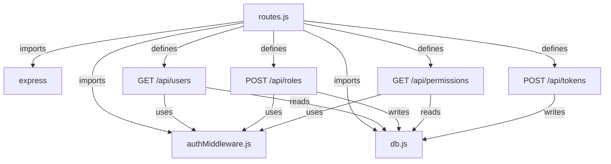
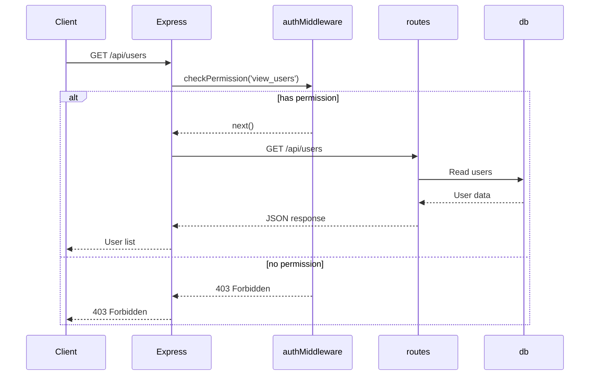
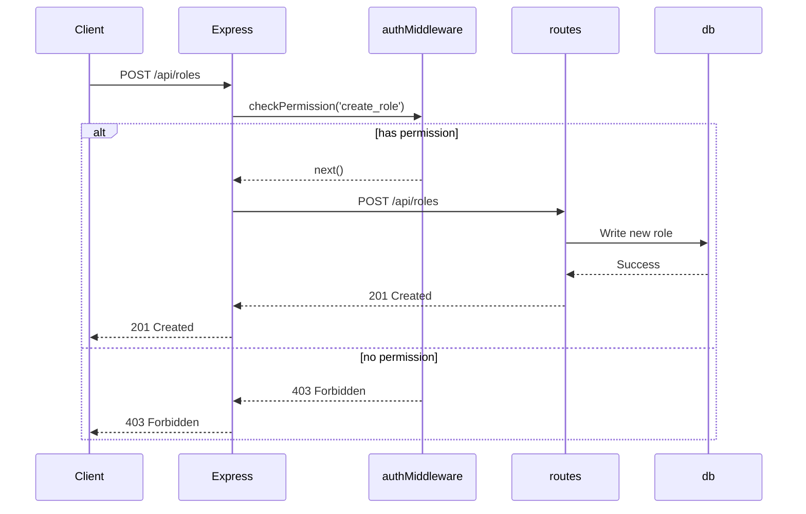
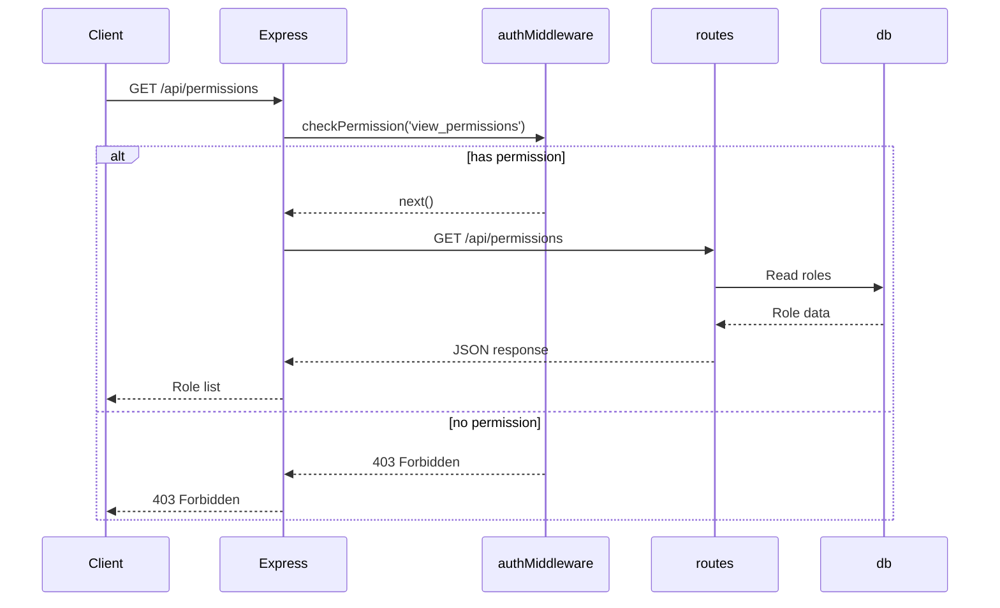
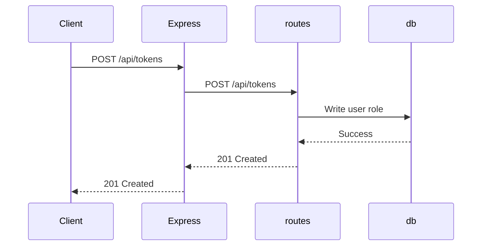
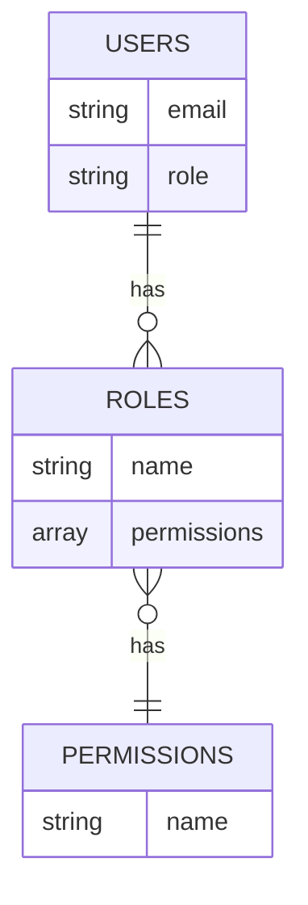

<details>
<summary>Relevant source files</summary>

The following files were used as context for generating this wiki page:

- [src/index.js](https://github.com/agattani123/access-control-service/blob/main/src/index.js)
- [src/routes.js](https://github.com/agattani123/access-control-service/blob/main/src/routes.js)
- [src/authMiddleware.js](https://github.com/agattani123/access-control-service/blob/main/src/authMiddleware.js)
- [src/db.js](https://github.com/agattani123/access-control-service/blob/main/src/db.js)
- [package.json](https://github.com/agattani123/access-control-service/blob/main/package.json)
</details>

# Architecture Overview

The Access Control Service is a Node.js application built with Express.js that provides a RESTful API for managing user roles, permissions, and authentication tokens. It serves as a centralized access control system for other services or applications within a larger project.

## Application Structure

The application follows a modular structure, with the main entry point being `index.js`. This file sets up the Express application, configures middleware, and defines the API routes.

```mermaid
graph TD
    A[index.js] -->|imports| B[express]
    A -->|imports| C[dotenv]
    A -->|imports| D[routes.js]
    A -->|uses| E[express.json()]
    A -->|mounts routes| D
    A -->|listens on port| F[process.env.PORT]
```

Sources: [src/index.js](https://github.com/agattani123/access-control-service/blob/main/src/index.js)

## API Routes

The API routes are defined in `routes.js`, which imports the necessary middleware and database modules. The routes handle various operations related to users, roles, permissions, and authentication tokens.



Sources: [src/routes.js](https://github.com/agattani123/access-control-service/blob/main/src/routes.js)

### GET /api/users

This route retrieves a list of all registered users and their associated roles. It requires the `view_users` permission, which is checked by the `checkPermission` middleware.



Sources: [src/routes.js:5-8](https://github.com/agattani123/access-control-service/blob/main/src/routes.js#L5-L8), [src/authMiddleware.js](https://github.com/agattani123/access-control-service/blob/main/src/authMiddleware.js)

### POST /api/roles

This route creates a new role with a set of permissions. It requires the `create_role` permission, which is checked by the `checkPermission` middleware.



Sources: [src/routes.js:10-17](https://github.com/agattani123/access-control-service/blob/main/src/routes.js#L10-L17), [src/authMiddleware.js](https://github.com/agattani123/access-control-service/blob/main/src/authMiddleware.js)

### GET /api/permissions

This route retrieves a list of all defined roles and their associated permissions. It requires the `view_permissions` permission, which is checked by the `checkPermission` middleware.



Sources: [src/routes.js:19-22](https://github.com/agattani123/access-control-service/blob/main/src/routes.js#L19-L22), [src/authMiddleware.js](https://github.com/agattani123/access-control-service/blob/main/src/authMiddleware.js)

### POST /api/tokens

This route associates a user with a role, effectively granting the user the permissions of that role. It does not require any specific permission.



Sources: [src/routes.js:24-30](https://github.com/agattani123/access-control-service/blob/main/src/routes.js#L24-L30)

## Authentication Middleware

The `authMiddleware.js` module exports a `checkPermission` function, which is used as middleware to verify if the requesting user has the required permission to access a specific route.

```mermaid
classDiagram
    class AuthMiddleware {
        +checkPermission(requiredPermission: string) Function
    }
    AuthMiddleware : +checkPermission(requiredPermission: string) Function
```

Sources: [src/authMiddleware.js](https://github.com/agattani123/access-control-service/blob/main/src/authMiddleware.js)

## Data Storage

The application uses an in-memory data store (`db.js`) to store user roles, permissions, and associations. In a production environment, this would likely be replaced with a persistent database.



Sources: [src/db.js](https://github.com/agattani123/access-control-service/blob/main/src/db.js)

## Dependencies

The application relies on the following main dependencies:

| Dependency | Version | Description |
| ---------- | ------- | ----------- |
| express    | ^4.18.2 | Web application framework for Node.js |
| dotenv     | ^16.0.3 | Loads environment variables from a `.env` file |

Sources: [package.json](https://github.com/agattani123/access-control-service/blob/main/package.json)

In summary, the Access Control Service provides a centralized API for managing user roles, permissions, and authentication tokens. It follows a modular structure with separate concerns for routing, middleware, and data storage. The architecture is designed to be extensible and can be integrated with other services or applications that require access control functionality.