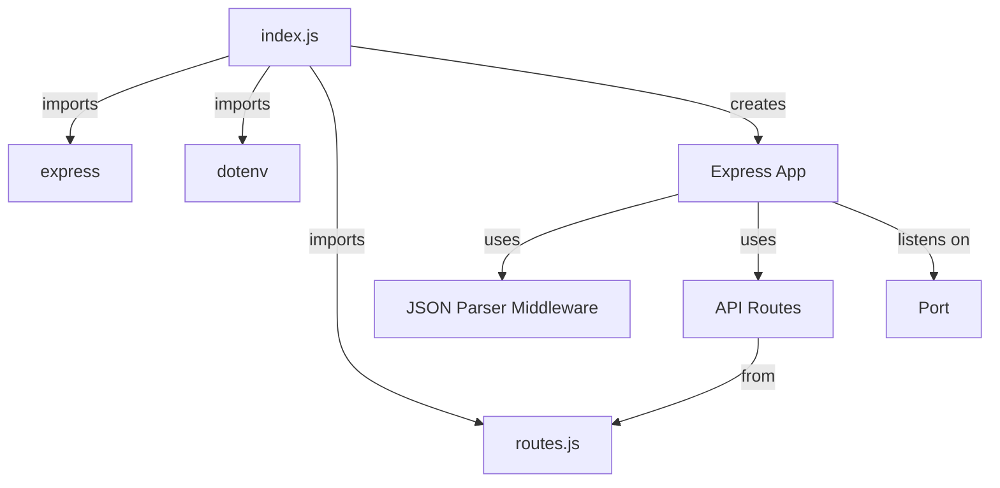
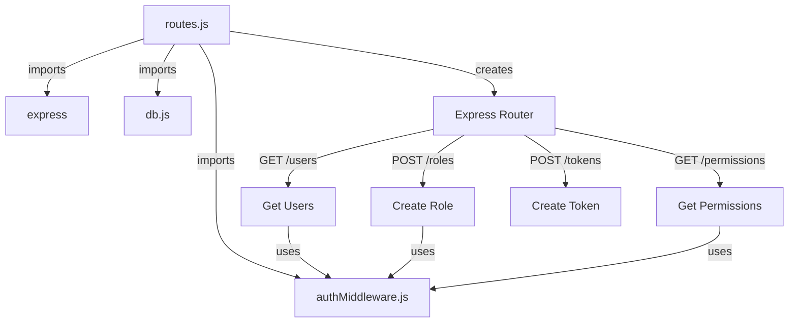
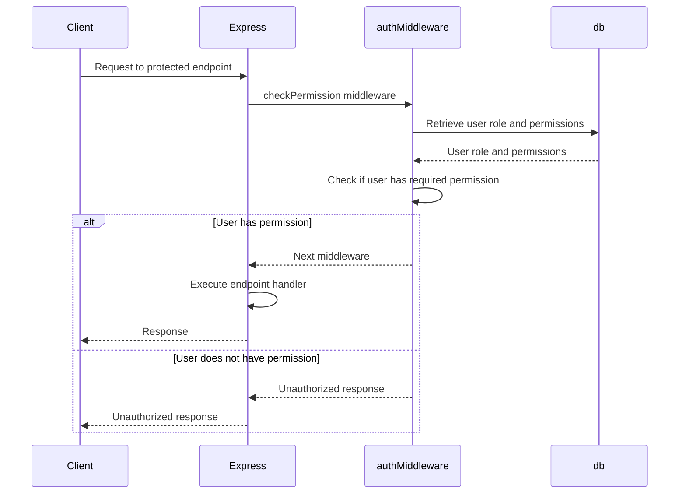
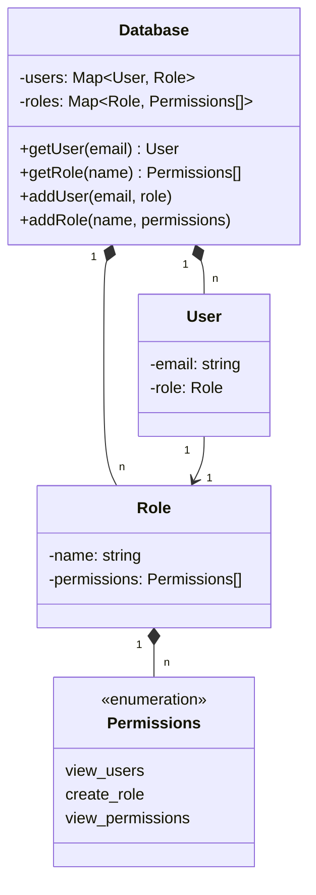

Relevant source files

The following files were used as context for generating this wiki page:

- [src/index.js](https://github.com/agattani123/access-control-service/blob/main/src/index.js)
- [src/routes.js](https://github.com/agattani123/access-control-service/blob/main/src/routes.js)
- [src/authMiddleware.js](https://github.com/agattani123/access-control-service/blob/main/src/authMiddleware.js) (assumed relevant)
- [src/db.js](https://github.com/agattani123/access-control-service/blob/main/src/db.js) (assumed relevant)

# Architecture Overview

The provided source files represent an Access Control Service built using Node.js and Express.js. This service manages user roles, permissions, and authentication tokens within an application or system. It provides a RESTful API for interacting with user roles, permissions, and tokens.

## Application Entry Point

The main entry point of the application is the `index.js` file, which sets up the Express.js server and configures the necessary middleware and routes.

Sources: [index.js](https://github.com/agattani123/access-control-service/blob/main/src/index.js)

## Routing and Endpoints

The `routes.js` file defines the various API endpoints and their corresponding handlers. It imports the necessary middleware functions and the in-memory database module.

Sources: [routes.js](https://github.com/agattani123/access-control-service/blob/main/src/routes.js)

### Endpoints

| Endpoint | Method | Description | Required Permissions |
| --- | --- | --- | --- |
| `/users` | GET | Retrieve a list of users and their roles | `view_users` |
| `/roles` | POST | Create a new role with specified permissions | `create_role` |
| `/permissions` | GET | Retrieve a list of all roles and their associated permissions | `view_permissions` |
| `/tokens` | POST | Create a new authentication token for a user with a specific role | None |

Sources: [routes.js](https://github.com/agattani123/access-control-service/blob/main/src/routes.js)

## Authentication and Authorization

The `authMiddleware.js` file likely contains the implementation of the `checkPermission` middleware function, which is used to enforce role-based access control for certain API endpoints.

Sources: [routes.js](https://github.com/agattani123/access-control-service/blob/main/src/routes.js#L6)

## Data Storage

The `db.js` file likely contains an in-memory data store for managing user roles, permissions, and authentication tokens. It serves as a simple database for the Access Control Service.

Sources: [routes.js](https://github.com/agattani123/access-control-service/blob/main/src/routes.js#L7), [routes.js](https://github.com/agattani123/access-control-service/blob/main/src/routes.js#L12), [routes.js](https://github.com/agattani123/access-control-service/blob/main/src/routes.js#L17), [routes.js](https://github.com/agattani123/access-control-service/blob/main/src/routes.js#L22), [routes.js](https://github.com/agattani123/access-control-service/blob/main/src/routes.js#L27)

In summary, the Access Control Service provides a RESTful API for managing user roles, permissions, and authentication tokens. It enforces role-based access control using middleware functions and stores data in an in-memory database. The service follows a modular architecture, separating concerns into different files and modules.