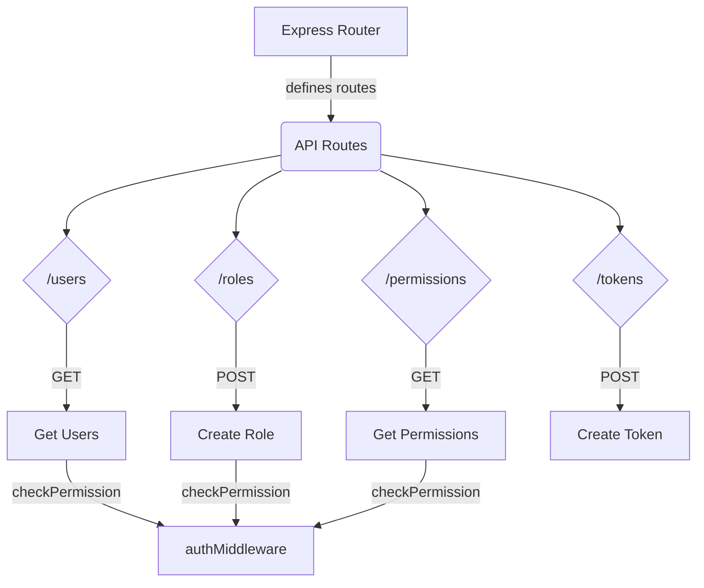
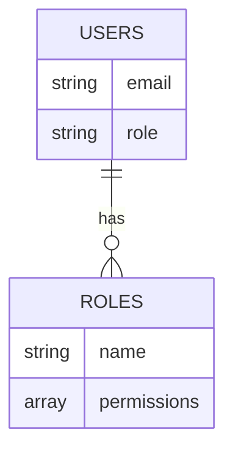
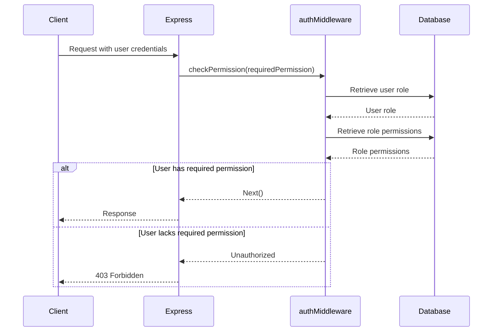
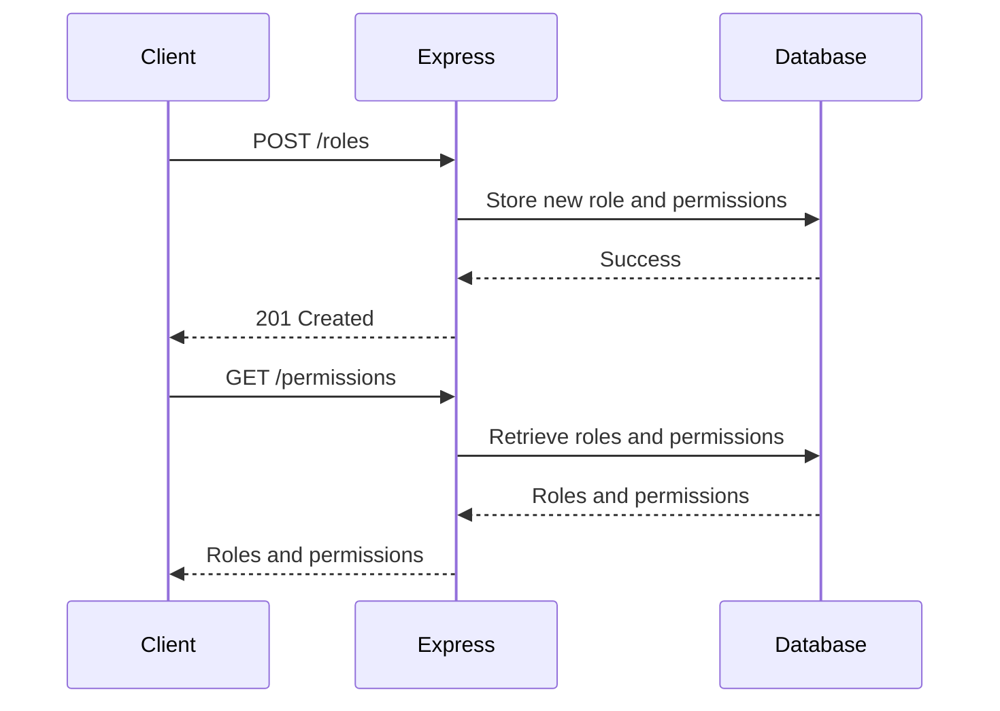
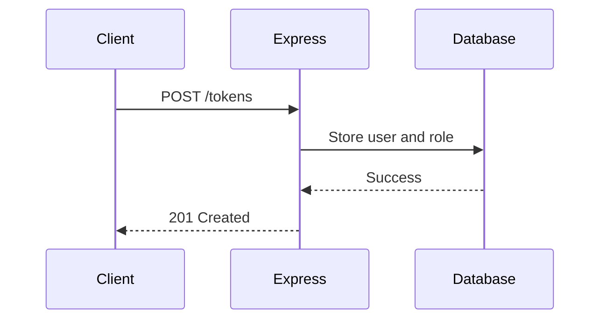

Relevant source files

The following files were used as context for generating this wiki page:

- [src/index.js](https://github.com/agattani123/access-control-service/blob/main/src/index.js)
- [src/routes.js](https://github.com/agattani123/access-control-service/blob/main/src/routes.js)
- [src/authMiddleware.js](https://github.com/agattani123/access-control-service/blob/main/src/authMiddleware.js) (assumed to exist based on import)
- [src/db.js](https://github.com/agattani123/access-control-service/blob/main/src/db.js) (assumed to exist based on import)

# Architecture Overview

The Access Control Service is a Node.js application built with Express.js that provides a RESTful API for managing user roles, permissions, and authentication tokens. It serves as a centralized access control system for other services or applications within the project.

## Application Setup

The main entry point of the application is `src/index.js`. It sets up the Express.js server, loads environment variables using `dotenv`, and imports the routes defined in `src/routes.js`. The server listens on the specified `PORT` or defaults to `8080`.

Sources: [src/index.js]()

## Routing and Middleware

The `src/routes.js` file defines the API routes and their corresponding handlers. It imports the `checkPermission` middleware function from `src/authMiddleware.js` to enforce role-based access control (RBAC) on certain routes.

Sources: [src/routes.js](), [src/authMiddleware.js:1]()

## Data Storage

The application uses an in-memory data store defined in `src/db.js` to store user roles, permissions, and authentication tokens. The `db` object contains two properties:

- `users`: An object mapping user emails to their assigned roles.
- `roles`: An object mapping role names to their associated permissions (an array of strings).

Sources: [src/db.js](), [src/routes.js:4]()

## Authentication and Authorization

The `checkPermission` middleware function from `src/authMiddleware.js` is used to enforce role-based access control on certain routes. It checks if the authenticated user has the required permission based on their assigned role.

Sources: [src/authMiddleware.js](), [src/routes.js:4,6,10,14]()

## API Endpoints

The following table summarizes the API endpoints provided by the Access Control Service:

| Endpoint | Method | Description | Required Permission |
| --- | --- | --- | --- |
| `/users` | GET | Get a list of users and their roles | `view_users` |
| `/roles` | POST | Create a new role with associated permissions | `create_role` |
| `/permissions` | GET | Get a list of all roles and their permissions | `view_permissions` |
| `/tokens` | POST | Create an authentication token for a user with a specific role | None |

Sources: [src/routes.js:6-24]()

## Role and Permission Management

The `/roles` endpoint allows creating new roles with associated permissions. The `/permissions` endpoint retrieves a list of all roles and their permissions.

Sources: [src/routes.js:8-14,16-19]()

## User Authentication

The `/tokens` endpoint allows creating an authentication token for a user with a specific role. The user and role information is stored in the `db.users` object.

Sources: [src/routes.js:21-24]()

## Conclusion

The Access Control Service provides a centralized system for managing user roles, permissions, and authentication tokens within the project. It enforces role-based access control (RBAC) on certain API endpoints, ensuring that only authorized users with the required permissions can perform specific actions. The service uses an in-memory data store for simplicity, but in a production environment, a more robust and persistent data storage solution would be recommended.