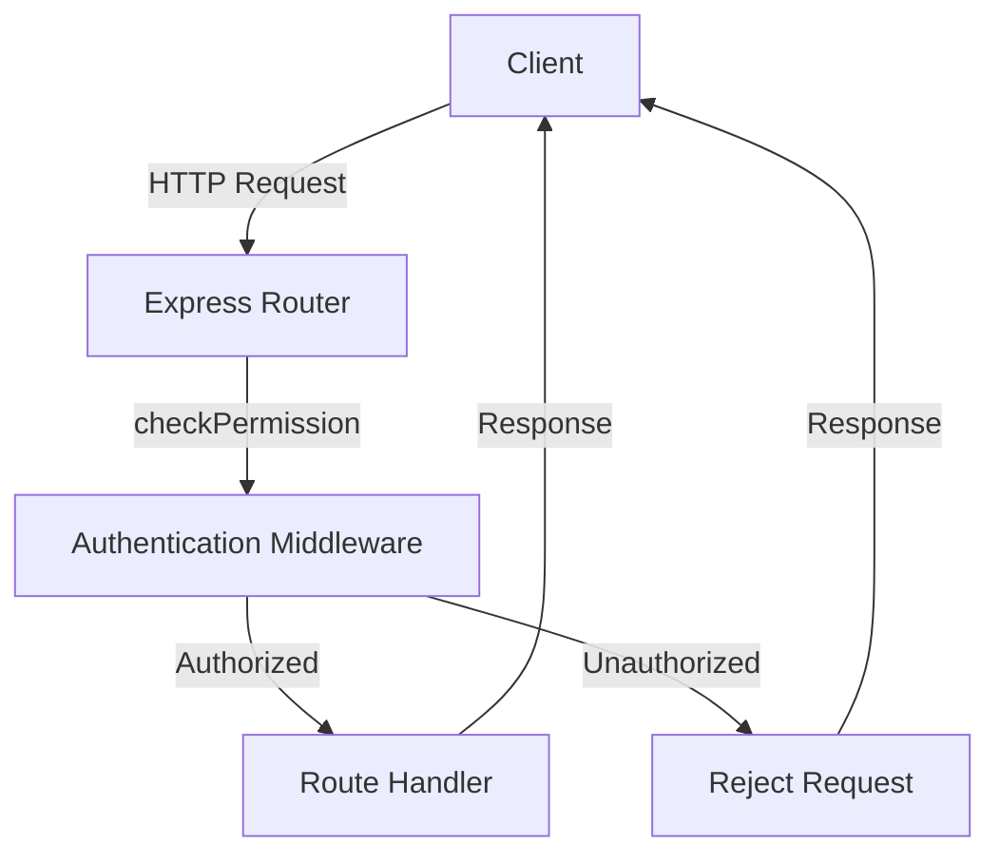
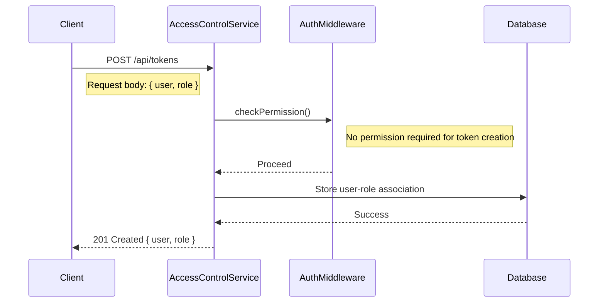
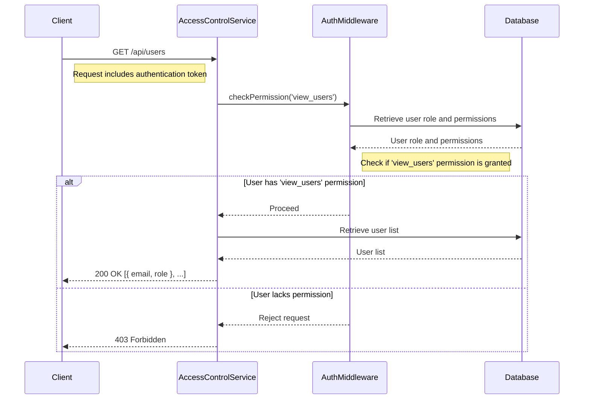

<details>
<summary>Relevant source files</summary>

The following files were used as context for generating this wiki page:

- [src/index.js](https://github.com/agattani123/access-control-service/blob/main/src/index.js)
- [src/routes.js](https://github.com/agattani123/access-control-service/blob/main/src/routes.js)
- [src/authMiddleware.js](https://github.com/agattani123/access-control-service/blob/main/src/authMiddleware.js) (assumed to exist based on import)
- [src/db.js](https://github.com/agattani123/access-control-service/blob/main/src/db.js) (assumed to exist based on import)

</details>

# Architecture Overview

The Access Control Service is a Node.js application built with Express.js that provides role-based access control (RBAC) functionality. It manages user roles, permissions, and token-based authentication for controlling access to protected resources or operations within a larger system or application.

## Application Setup

The entry point of the application is `src/index.js`, which sets up the Express server and configures the necessary middleware and routes.

```javascript
import express from 'express';
import dotenv from 'dotenv';
import routes from './routes.js';

dotenv.config();

const app = express();
app.use(express.json());
app.use('/api', routes);

const port = process.env.PORT || 8080;

app.listen(port, () => {
  console.log(`Access Control Service listening on port ${port}`);
});
```

Sources: [src/index.js](https://github.com/agattani123/access-control-service/blob/main/src/index.js)

## Routing and Endpoints

The `src/routes.js` file defines the API routes and their corresponding handlers. It imports the `checkPermission` middleware function from `src/authMiddleware.js` and the `db` module from `src/db.js`.

### User Management

```javascript
router.get('/users', checkPermission('view_users'), (req, res) => {
  res.json(Object.entries(db.users).map(([email, role]) => ({ email, role })));
});
```

- **Endpoint:** `GET /api/users`
- **Permission Required:** `view_users`
- **Description:** Retrieves a list of users and their associated roles.

Sources: [src/routes.js:4-7](https://github.com/agattani123/access-control-service/blob/main/src/routes.js#L4-L7)

### Role Management

```javascript
router.post('/roles', checkPermission('create_role'), (req, res) => {
  const { name, permissions } = req.body;
  if (!name || !Array.isArray(permissions)) {
    return res.status(400).json({ error: 'Invalid role definition' });
  }
  db.roles[name] = permissions;
  res.status(201).json({ role: name, permissions });
});
```

- **Endpoint:** `POST /api/roles`
- **Permission Required:** `create_role`
- **Description:** Creates a new role with the specified name and permissions.
- **Request Body:**
  - `name` (string): The name of the role.
  - `permissions` (array): An array of permission strings associated with the role.

Sources: [src/routes.js:10-18](https://github.com/agattani123/access-control-service/blob/main/src/routes.js#L10-L18)

```javascript
router.get('/permissions', checkPermission('view_permissions'), (req, res) => {
  res.json(db.roles);
});

router.get('/permission', checkPermission('view_permissions'), (req, res) => {
  res.json(db.roles);
});
```

- **Endpoints:** `GET /api/permissions`, `GET /api/permission`
- **Permission Required:** `view_permissions`
- **Description:** Retrieves the list of defined roles and their associated permissions.

Sources: [src/routes.js:20-24](https://github.com/agattani123/access-control-service/blob/main/src/routes.js#L20-L24)

### Token Management

```javascript
router.post('/tokens', (req, res) => {
  const { user, role } = req.body;
  if (!user || !role) {
    return res.status(400).json({ error: 'Missing user or role' });
  }
  db.users[user] = role;
  res.status(201).json({ user, role });
});
```

- **Endpoint:** `POST /api/tokens`
- **Permission Required:** None
- **Description:** Associates a user with a role, effectively creating or updating a token.
- **Request Body:**
  - `user` (string): The user identifier.
  - `role` (string): The role to assign to the user.

Sources: [src/routes.js:26-33](https://github.com/agattani123/access-control-service/blob/main/src/routes.js#L26-L33)

## Authentication Middleware

The `checkPermission` middleware function is imported from `src/authMiddleware.js` and used to protect routes that require specific permissions.



The middleware likely checks the user's role and associated permissions against the required permission for the requested route. If the user has the necessary permission, the request is allowed to proceed to the route handler. Otherwise, the request is rejected with an appropriate error response.

Sources: [src/routes.js](https://github.com/agattani123/access-control-service/blob/main/src/routes.js) (multiple instances of `checkPermission` usage)

## Data Storage

The application appears to use an in-memory data store (`db` module) to manage user roles, permissions, and associations. In a production environment, this data would typically be stored in a persistent database.

```javascript
import db from './db.js';

// ...

db.roles[name] = permissions;
db.users[user] = role;
```

Sources: [src/routes.js:11,31](https://github.com/agattani123/access-control-service/blob/main/src/routes.js#L11,L31)

## Sequence Diagram: Token Creation



Sources: [src/routes.js:26-33](https://github.com/agattani123/access-control-service/blob/main/src/routes.js#L26-L33)

## Sequence Diagram: Protected Resource Access



Sources: [src/routes.js:4-7](https://github.com/agattani123/access-control-service/blob/main/src/routes.js#L4-L7), [src/authMiddleware.js](https://github.com/agattani123/access-control-service/blob/main/src/authMiddleware.js) (assumed implementation)

## Summary

The Access Control Service provides a role-based access control system for managing user roles, permissions, and token-based authentication. It allows creating and retrieving roles, associating users with roles (token creation), and protecting routes based on required permissions. The service uses an in-memory data store for storing user-role associations and role definitions, but in a production environment, a persistent database would be more suitable.