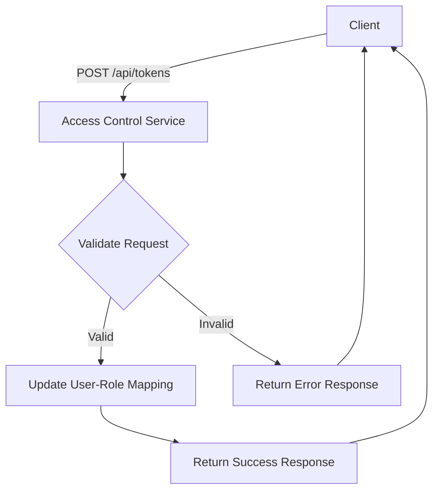
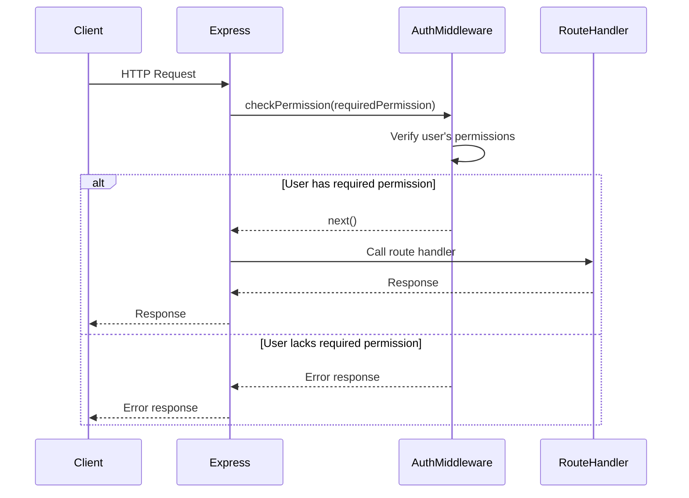

<details>
<summary>Relevant source files</summary>

The following files were used as context for generating this wiki page:

- [src/index.js](https://github.com/agattani123/access-control-service/blob/main/src/index.js)
- [src/routes.js](https://github.com/agattani123/access-control-service/blob/main/src/routes.js)
- [src/authMiddleware.js](https://github.com/agattani123/access-control-service/blob/main/src/authMiddleware.js) (assumed to exist based on import in routes.js)
- [src/db.js](https://github.com/agattani123/access-control-service/blob/main/src/db.js) (assumed to exist based on import in routes.js)
</details>

# Architecture Overview

## Introduction

This wiki page provides an overview of the architecture and key components of an Access Control Service, which is responsible for managing user roles, permissions, and authentication within a larger application or system. The service exposes a RESTful API for various operations related to user management, role creation, and permission handling.

The Access Control Service is built using Node.js and the Express.js framework. It utilizes an in-memory data store (`db.js`) to persist user roles, permissions, and user-role mappings. The service also includes an authentication middleware (`authMiddleware.js`) to enforce permission-based access control for certain API endpoints.

## API Routes and Endpoints

The service exposes the following API routes and endpoints, defined in `src/routes.js`:

### User Management

- `GET /api/users`: Retrieves a list of all registered users and their associated roles. Requires the `view_users` permission.

### Role Management

- `POST /api/roles`: Creates a new role with a specified name and set of permissions. Requires the `create_role` permission.
- `GET /api/permissions`: Retrieves a list of all defined roles and their associated permissions. Requires the `view_permissions` permission.

### Authentication

- `POST /api/tokens`: Assigns a role to a user, effectively authenticating the user for that role.



Sources: [src/routes.js:28-36]()

### Other Routes

The `src/routes.js` file also defines several other routes (`/permission`, `/advice`, `/delete`, `/testing`) that all require the `view_permissions` permission and return the list of defined roles. These routes may be placeholders or serve specific purposes not evident from the provided source files.

## Authentication Middleware

The `authMiddleware.js` module (not provided but assumed to exist based on the import in `src/routes.js`) likely contains a `checkPermission` function that is used as a middleware to enforce permission-based access control for certain API endpoints.



Sources: [src/routes.js:5]() (import of `checkPermission` function)

## Data Storage

The service uses an in-memory data store (`db.js`) to persist user roles, permissions, and user-role mappings. The data store likely has the following structure:

```javascript
const db = {
  users: {
    // user email: assigned role
    'user1@example.com': 'admin',
    'user2@example.com': 'viewer',
    // ...
  },
  roles: {
    // role name: array of permissions
    'admin': ['view_users', 'create_role', 'view_permissions'],
    'viewer': ['view_permissions'],
    // ...
  }
}
```

Sources: [src/routes.js:6]() (import of `db` module), [src/routes.js:5-7]() (usage of `db.users` and `db.roles`)

## Potential Improvements

Based on the provided source files, the following potential improvements could be considered:

- **Persistent Storage**: Replace the in-memory data store with a more robust and persistent storage solution, such as a relational database or a document-oriented database, to ensure data durability and scalability.
- **Authentication and Authorization**: Implement a more secure authentication and authorization mechanism, such as JSON Web Tokens (JWT) or OAuth, instead of relying on the simple user-role mapping approach.
- **Error Handling**: Enhance error handling and logging mechanisms to improve debugging and troubleshooting capabilities.
- **Input Validation**: Implement comprehensive input validation for API requests to prevent potential security vulnerabilities and ensure data integrity.
- **Documentation**: Provide comprehensive API documentation, either as part of the codebase or as a separate resource, to facilitate easier integration and usage by other developers.
- **Testing**: Implement unit tests and integration tests to ensure the correctness and reliability of the service's functionality.

Sources: [src/index.js](), [src/routes.js]() (based on the overall structure and functionality of the provided source files)

## Summary

The Access Control Service provides a RESTful API for managing user roles, permissions, and authentication within a larger application or system. It utilizes an in-memory data store and an authentication middleware to enforce permission-based access control. While functional, the service could benefit from improvements in areas such as persistent storage, authentication and authorization mechanisms, error handling, input validation, documentation, and testing.