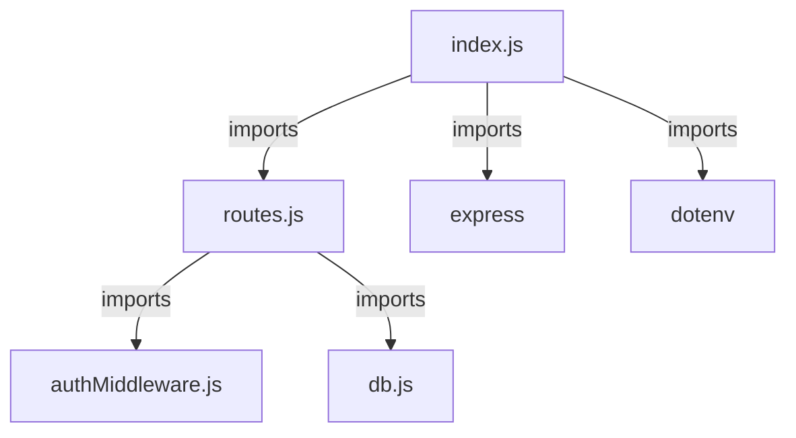
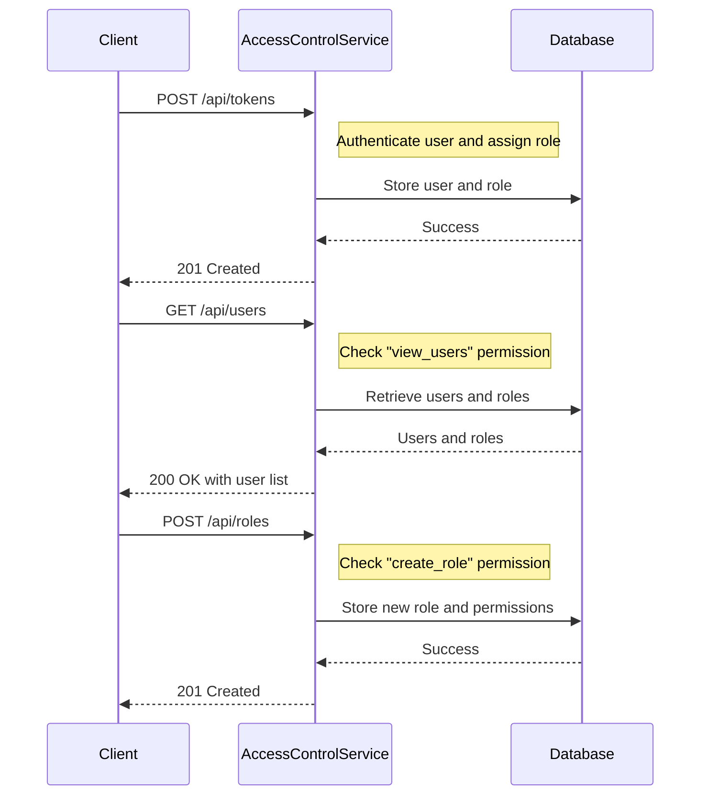
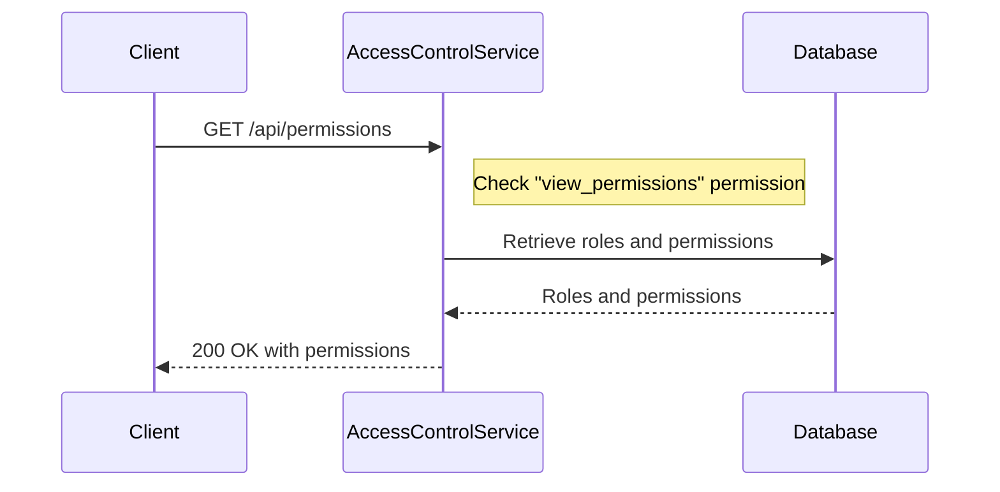
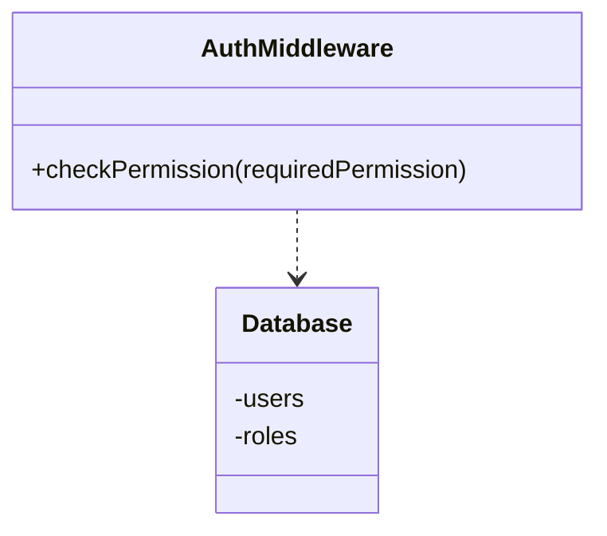
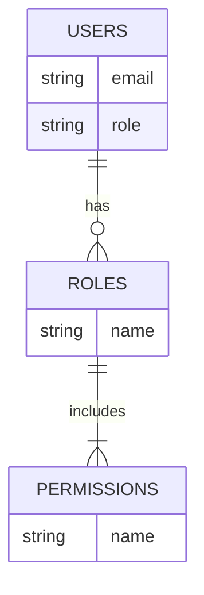

Relevant source files

The following files were used as context for generating this wiki page:

- [src/index.js](https://github.com/agattani123/access-control-service/blob/main/src/index.js)
- [src/routes.js](https://github.com/agattani123/access-control-service/blob/main/src/routes.js)
- [src/authMiddleware.js](https://github.com/agattani123/access-control-service/blob/main/src/authMiddleware.js) (assumed to exist based on import in routes.js)
- [src/db.js](https://github.com/agattani123/access-control-service/blob/main/src/db.js) (assumed to exist based on import in routes.js)
- [package.json](https://github.com/agattani123/access-control-service/blob/main/package.json) (assumed to exist for project dependencies)

# Architecture Overview

This wiki page provides an overview of the architecture and components of the Access Control Service, a Node.js application built with Express.js. The service manages user roles, permissions, and authentication tokens within a system.

## Application Structure

The Access Control Service follows a typical Express.js application structure:

- `index.js` is the entry point that sets up the Express app, loads environment variables, and starts the server. Sources: [src/index.js]()
- `routes.js` defines the API routes and handles HTTP requests. Sources: [src/routes.js]()
- `authMiddleware.js` (assumed) contains middleware functions for authentication and authorization. Sources: [src/routes.js:3]()
- `db.js` (assumed) provides an in-memory data store for users, roles, and permissions. Sources: [src/routes.js:4]()

## API Endpoints

The Access Control Service exposes the following API endpoints:

| Endpoint | Method | Description | Permission Required |
| --- | --- | --- | --- |
| `/api/users` | GET | Retrieve a list of users and their roles | `view_users` |
| `/api/roles` | POST | Create a new role with associated permissions | `create_role` |
| `/api/permissions` | GET | Retrieve a list of all roles and their permissions | `view_permissions` |
| `/api/tokens` | POST | Create a new authentication token for a user with a specific role | None |

Sources: [src/routes.js:6-32]()

### User and Role Management

The service allows creating authentication tokens for users with specific roles (`/api/tokens`). It also supports retrieving a list of users and their roles (`/api/users`) if the client has the `view_users` permission, and creating new roles with associated permissions (`/api/roles`) if the client has the `create_role` permission.

Sources: [src/routes.js:6-14, 18-26]()

### Permission Management

The service provides an endpoint (`/api/permissions`) to retrieve a list of all roles and their associated permissions, but only if the client has the `view_permissions` permission.

Sources: [src/routes.js:27-30]()

## Authentication and Authorization

The Access Control Service likely uses middleware functions from `authMiddleware.js` to handle authentication and authorization. The `checkPermission` middleware function (assumed) verifies if the authenticated user has the required permission based on their assigned role. It likely interacts with the `db.js` module to retrieve user roles and associated permissions from the in-memory data store.

Sources: [src/routes.js:3, 6, 18, 27]()

## Data Storage

The Access Control Service uses an in-memory data store (assumed to be in `db.js`) to manage users, roles, and permissions. The data model consists of:

- `users`: Stores user email addresses and their assigned role.
- `roles`: Stores role names and their associated permissions.
- `permissions`: Stores permission names.

A user has a single role, and a role can have multiple permissions.

Sources: [src/routes.js:4, 7, 21-24, 28]()

## Dependencies

The Access Control Service relies on the following key dependencies:

| Dependency | Description |
| --- | --- |
| `express` | Fast, minimalist web application framework for Node.js |
| `dotenv` | Loads environment variables from a `.env` file |

Additional dependencies may be listed in the project's `package.json` file.

Sources: [src/index.js:2-3](), [package.json]()

## Conclusion

The Access Control Service provides a simple yet extensible architecture for managing user roles, permissions, and authentication tokens within a system. It leverages Express.js for handling API requests and an in-memory data store for storing user, role, and permission data. The service implements authentication and authorization mechanisms to control access to various API endpoints based on the user's assigned role and permissions.