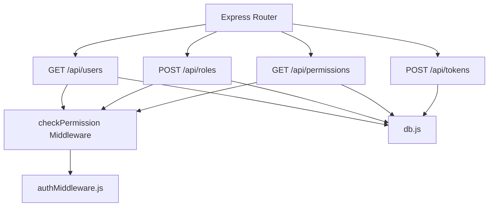
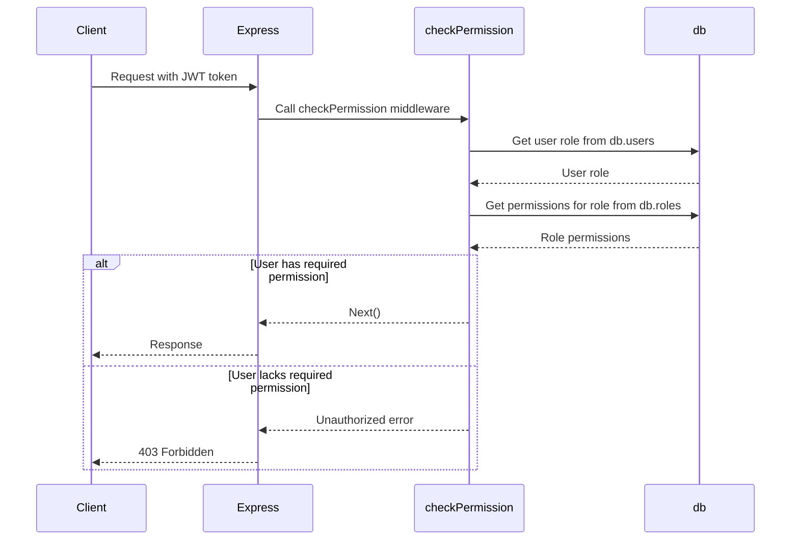
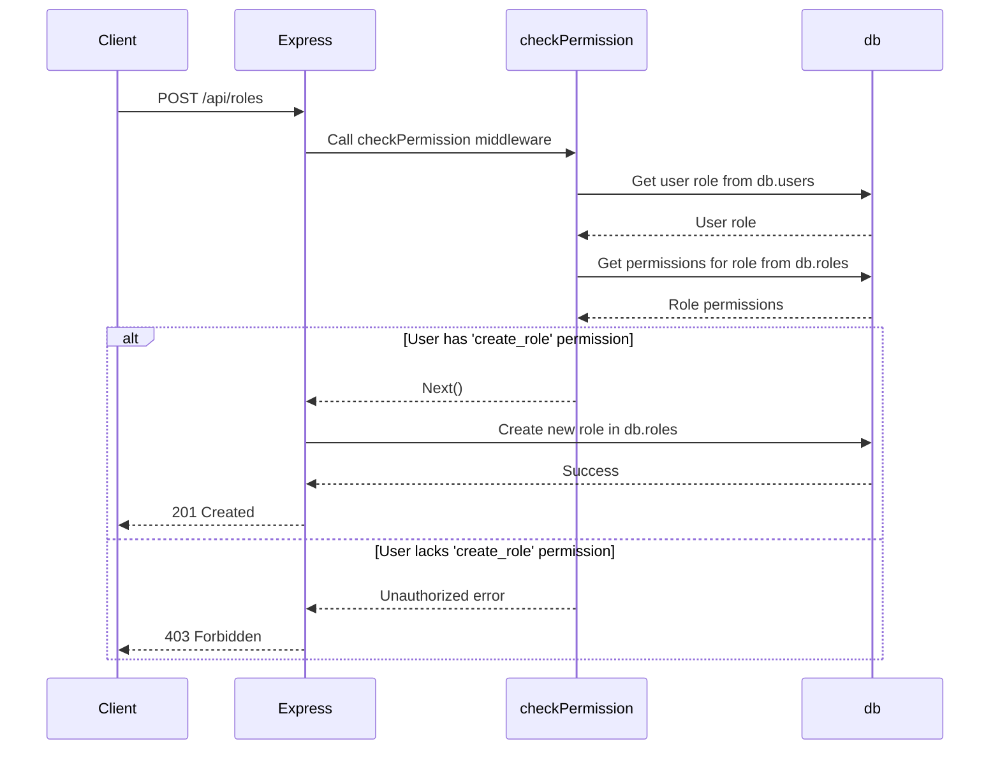
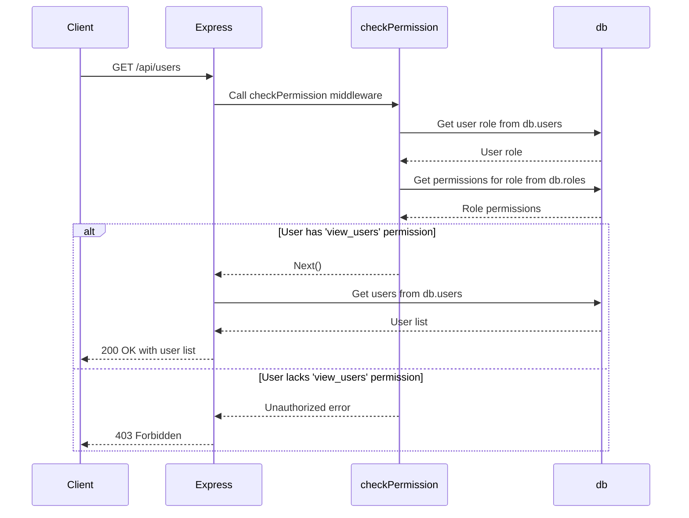

<details>
<summary>Relevant source files</summary>

The following files were used as context for generating this wiki page:

- [src/index.js](https://github.com/agattani123/access-control-service/blob/main/src/index.js)
- [src/routes.js](https://github.com/agattani123/access-control-service/blob/main/src/routes.js)
- [src/authMiddleware.js](https://github.com/agattani123/access-control-service/blob/main/src/authMiddleware.js)
- [src/db.js](https://github.com/agattani123/access-control-service/blob/main/src/db.js)
- [package.json](https://github.com/agattani123/access-control-service/blob/main/package.json)
</details>

# System Architecture

## Introduction

The Access Control Service is a Node.js application built with Express.js that provides a RESTful API for managing user roles, permissions, and authentication tokens. It serves as a centralized system for controlling access to resources within a larger application or system. The service maintains an in-memory database to store user roles, permissions, and user-role mappings.

Sources: [src/index.js](), [src/routes.js](), [package.json]()

## Application Structure

### Entry Point

The `src/index.js` file serves as the entry point for the application. It sets up the Express.js server, loads environment variables using `dotenv`, and mounts the API routes defined in `src/routes.js`.

```javascript
import express from 'express';
import dotenv from 'dotenv';
import routes from './routes.js';

dotenv.config();

const app = express();
app.use(express.json());
app.use('/api', routes);

const port = process.env.PORT || 8080;

app.listen(port, () => {
  console.log(`Access Control Service listening on port ${port}`);
});
```

Sources: [src/index.js]()

### API Routes

The `src/routes.js` file defines the API routes for the Access Control Service. It imports the `checkPermission` middleware function from `src/authMiddleware.js` and the in-memory database from `src/db.js`.



Sources: [src/routes.js]()

#### GET /api/users

This route retrieves a list of all users and their associated roles from the in-memory database. It requires the `view_users` permission, which is checked by the `checkPermission` middleware.

```javascript
router.get('/users', checkPermission('view_users'), (req, res) => {
  res.json(Object.entries(db.users).map(([email, role]) => ({ email, role })));
});
```

Sources: [src/routes.js:5-8]()

#### POST /api/roles

This route creates a new role in the in-memory database. It requires the `create_role` permission, which is checked by the `checkPermission` middleware. The request body must contain a `name` and an array of `permissions` for the new role.

```javascript
router.post('/roles', checkPermission('create_role'), (req, res) => {
  const { name, permissions } = req.body;
  if (!name || !Array.isArray(permissions)) {
    return res.status(400).json({ error: 'Invalid role definition' });
  }
  db.roles[name] = permissions;
  res.status(201).json({ role: name, permissions });
});
```

Sources: [src/routes.js:10-17]()

#### GET /api/permissions

This route retrieves a list of all roles and their associated permissions from the in-memory database. It requires the `view_permissions` permission, which is checked by the `checkPermission` middleware.

```javascript
router.get('/permissions', checkPermission('view_permissions'), (req, res) => {
  res.json(db.roles);
});
```

Sources: [src/routes.js:19-21]()

#### POST /api/tokens

This route creates a new user-role mapping in the in-memory database. It does not require any specific permission. The request body must contain a `user` (email) and a `role` to associate with the user.

```javascript
router.post('/tokens', (req, res) => {
  const { user, role } = req.body;
  if (!user || !role) {
    return res.status(400).json({ error: 'Missing user or role' });
  }
  db.users[user] = role;
  res.status(201).json({ user, role });
});
```

Sources: [src/routes.js:23-30]()

### Authentication Middleware

The `src/authMiddleware.js` file exports a `checkPermission` middleware function that checks if the authenticated user has the required permission to access a specific route.



Sources: [src/authMiddleware.js]()

### In-Memory Database

The `src/db.js` file exports an in-memory database object that stores user-role mappings and role-permission mappings.

```javascript
const db = {
  users: {
    // 'user@example.com': 'admin',
    // 'other@example.com': 'viewer'
  },
  roles: {
    // 'admin': ['view_users', 'create_role', 'view_permissions'],
    // 'viewer': ['view_users', 'view_permissions']
  }
};

export default db;
```

Sources: [src/db.js]()

## Data Models

### User

The `users` object in the in-memory database maps user emails (keys) to their associated role names (values).

| Field | Type   | Description                  |
|-------|--------|------------------------------|
| email | string | The user's email address     |
| role  | string | The name of the user's role  |

Sources: [src/db.js:2-5]()

### Role

The `roles` object in the in-memory database maps role names (keys) to arrays of associated permissions (values).

| Field       | Type     | Description                        |
|-------------|----------|-------------------------------------|
| name        | string   | The name of the role               |
| permissions | string[] | The permissions granted to the role|

Sources: [src/db.js:6-9]()

## Sequence Diagrams

### Creating a New Role



Sources: [src/routes.js:10-17](), [src/authMiddleware.js]()

### Retrieving User Roles



Sources: [src/routes.js:5-8](), [src/authMiddleware.js]()

## Conclusion

The Access Control Service provides a centralized system for managing user roles, permissions, and authentication tokens within a larger application or system. It follows a RESTful API design and leverages Express.js for routing and middleware. The service maintains an in-memory database to store user-role mappings and role-permission mappings, allowing for dynamic configuration and management of access control policies.

While the current implementation uses an in-memory database for simplicity, a production-ready system would likely integrate with a more robust and persistent data storage solution, such as a relational database or a dedicated authentication and authorization service.

Sources: [src/index.js](), [src/routes.js](), [src/authMiddleware.js](), [src/db.js]()